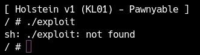

カーネルの起動方法、デバッグ方法、そしてセキュリティなど、Kernel Exploitを始めるのに必要な知識は完璧に習得しました。ここからは、実際にexploitをどのように書いていくのかと、書いたexploitをどうやってqemu上で動かすかを学びます。

<div class="column" title="目次">
<!-- toc --><br>
</div>

## qemu上での実行
qemuの上でexploitを書いてビルド、実行すると、カーネルがクラッシュする度にやり直す必要があるので大変です。そのため、C言語で書いたexploitを手元でビルドしてから、それをqemuに送る必要があります。
この流れを毎回コマンド入力するのは大変なので、シェルスクリプトなどでテンプレートとして用意しておきましょう。例えば次のような`transfer.sh`を用意してみます。
```bash
#!/bin/sh
gcc exploit.c -o exploit
mv exploit root
cd root; find . -print0 | cpio -o --null --format=newc > ../debugfs.cpio
cd ../

qemu-system-x86_64 \
    -m 64M \
    -nographic \
    -kernel bzImage \
    -append "console=ttyS0 loglevel=3 oops=panic panic=-1 nopti nokaslr" \
    -no-reboot \
    -cpu qemu64 \
    -gdb tcp::12345 \
    -smp 1 \
    -monitor /dev/null \
    -initrd debugfs.cpio \
    -net nic,model=virtio \
    -net user
```
説明するまでもありませんが、単にGCCで`exploit.c`をコンパイルしてcpioに追加し、qemuを起動しているだけです。元の`rootfs.cpio`を壊さないように`debugfs.cpio`という名前のディスクを使っていますが、お好みで変更しても構いません。
また、cpioを作る際はroot権限でないとファイルの権限が変わるので、`transfer.sh`はroot権限で実行するよう注意してください。

さて、`exploit.c`に次のようなコードを入れて`transfer.sh`を実行してみましょう。
```c
#include <stdio.h>

int main() {
  puts("Hello, World!");
  return 0;
}
```
すると、次のようにエラーが出てしまいます。なぜでしょうか。

<center>
  
</center>

実は今回配布したイメージは通常のlibcではなく、uClibcというコンパクトなライブラリを使っています。当然exploitをコンパイルしたみなさんの環境ではGCC、すなわちlibcを使っているので、動的リンクに失敗してexploitは動きません。
したがって、qemu上でexploitを動かす際はstaticリンクするように注意しましょう。
```bash
gcc exploit.c -o exploit -static
```
このように変更して実行すれば、プログラムが動くはずです。

<center>
  
</center>

## リモートマシンでの実行：musl-gccの利用
ここまでで、無事exploitをqemu上で実行できました。今回配布した環境はネットワーク接続できるように設定してあるため、リモートで実行したい場合はqemu上でwgetコマンドなどを利用してexploitを転送できます。
しかし、CTFなど一部の小さい環境ではネットワークが利用できません。このような場合、busyboxに存在するコマンドを利用してリモートからバイナリを転送する必要があります。一般的にはbase64が使われるのですが、GCCでビルドしたファイルは数百KBから数十MBにもなるため、転送に非常に時間がかかります。サイズが大きくなるのは外部ライブラリ(libc)の関数をstaticリンクしているのが原因です。
GCCでサイズを小さくしたければ、libcを使わないようにし、readやwriteなどはシステムコール(インラインアセンブリ)を使って自分で定義する必要があります。もちろんこれは非常に大変です。
そこで、多くのCTFerはKernel Exploitの目的でmusl-gccと呼ばれるCのコンパイラを利用しています。以下のリンクからダウンロードし、ビルドしてインストールを完了させてください。

https://www.musl-libc.org/

インストールが完了したら、次のように`transfer.sh`のコンパイル箇所を書き換えてみましょう。musl-gccのパスは各自インストールした先のディレクトリを指定してください。
```bash
/usr/local/musl/bin/musl-gcc exploit.c -o exploit -static
```
著者の環境では先ほどのHello, Worldプログラムは、gccの場合851KB、musl-gccの場合18KBでした。さらに小さくしたい場合はstripなどでデバッグシンボルを削除しても構いません。

<div class="balloon_l">
  <div class="faceicon"></div>
  <p class="says">
    一部のヘッダファイル（Linuxカーネル系）はmusl-gccにはないから、インクルードパスを設定するかgccでコンパイルする必要があるよ。そういうときは一度アセンブリを経由してビルドすれば、gccの機能を使いつつファイルサイズを抑えられるね。<br>
    <code>
    $ gcc -S sample.c -o sample.S<br>
    $ musl-gcc sample.S -o sample.elf
    </code>
  </p>
</div>

ここまで完了したら、リモートに(nc経由で)base64を使ってバイナリを転送するスクリプトを書きましょう。このアップローダはCTFの場合は毎回使いますので、テンプレートとして自分用のものを作っておくことをおすすめします。
```python
from ptrlib import *
import time
import base64
import os

def run(cmd):
    sock.sendlineafter("$ ", cmd)
    sock.recvline()

with open("./root/exploit", "rb") as f:
    payload = bytes2str(base64.b64encode(f.read()))

#sock = Socket("HOST", PORT) # remote
sock = Process("./run.sh")

run('cd /tmp')

logger.info("Uploading...")
for i in range(0, len(payload), 512):
    print(f"Uploading... {i:x} / {len(payload):x}")
    run('echo "{}" >> b64exp'.format(payload[i:i+512]))
run('base64 -d b64exp > exploit')
run('rm b64exp')
run('chmod +x exploit')

sock.interactive()
```
実行してしばらくすると次のようにアップロードが完了するはずです。

<center>
  
</center>

このサイトではみなさんが手元で試すだけなのでアップロードは不要ですが、CTFなどで実践する際はこれを思い出して使いましょう。
