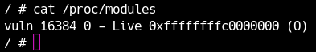

カーネルexploitに入門しにくい大きな原因が、デバッグ方法がよく分からないという点です。
この節ではgdbを使ってqemu上で動くLinuxカーネルをデバッグする方法を学びます。

まず[練習問題LK01](../LK01/distfiles/LK01.tar.gz)のファイルをダウンロードしてください。

<div class="column" title="目次">
<!-- toc --><br>
</div>

## root権限の取得
手元でKernel Exploitをデバッグする際、一般ユーザー権限だと不自由なことが多いです。特にカーネルやカーネルドライバの処理にブレークポイントを設定したり、リークしたアドレスが何の関数のアドレスかを調べたりする際、root権限がないとカーネル空間のアドレス情報を取得できません。
Kernel Exploitをデバッグする際はまずroot権限を取得しましょう。この節の内容は前章の例題の(2)と同じですので、既に解いた方は確認程度に読み流してください。

カーネルが起動すると最初に1つのプログラムが実行されます。このプログラムは設定によりパスは様々ですが、多くの場合`/init`や`/sbin/init`等に存在します。LK01の`rootfs.cpio`を展開すると、`/init`が存在します。
```sh
#!/bin/sh
# devtmpfs does not get automounted for initramfs
/bin/mount -t devtmpfs devtmpfs /dev

# use the /dev/console device node from devtmpfs if possible to not
# confuse glibc's ttyname_r().
# This may fail (E.G. booted with console=), and errors from exec will
# terminate the shell, so use a subshell for the test
if (exec 0</dev/console) 2>/dev/null; then
    exec 0</dev/console
    exec 1>/dev/console
    exec 2>/dev/console
fi

exec /sbin/init "$@"
```
ここには特に重要な処理は書かれていませんが、`/sbin/init`を実行しています。なお、CTFなどで配布されるような小さい環境では`/init`に直接、ドライバをインストールしたりシェルを起動したりといった処理が書かれている場合があります。実際、最後の`exec`の行の前に`/bin/sh`と書けばカーネル起動時にroot権限でシェルを起動できます。ただし、ドライバのインストールなど他の必要な初期化処理が実行されませんので、今回はこのファイルは書き換えません。
さて、`/sbin/init`から最終的には`/etc/init.d/rcS`というシェルスクリプトが実行されます。このスクリプトは、`/etc/init.d`内にある`S`から始まる名前のファイルを実行していきます。今回は`S99pawnyable`というスクリプトが存在します。このスクリプトには様々な初期化処理が書かれていますが、終盤の次の行に注目してください。
```bash
setsid cttyhack setuidgid 1337 sh
```
この行が今回のカーネルで起動時にユーザー権限でシェルを起動しているコードになります。`cttyhack`はCtrl+Cなどの入力を使えるようにしてくれるコマンドです。そして`setuidgid`コマンドを使ってユーザーIDとグループIDを1337に設定し、`/bin/sh`を起動しています。この数字を0(=rootユーザー)に変えます。
```bash
setsid cttyhack setuidgid 0 sh
```
また、詳細は[次章](security.html)で説明しますが、一部のセキュリティ機構を無効化するために、次の行もコメントアウトして消しておいてください。
```diff
-echo 2 > /proc/sys/kernel/kptr_restrict    # 変更前
+#echo 2 > /proc/sys/kernel/kptr_restrict   # 変更後
```
変更したらcpioに再びパックして、`run.sh`を実行すれば下のスクリーンショットのようにroot権限でシェルが使えるようになっているはずです。（パックの方法は[前章](introduction.html#%E3%83%87%E3%82%A3%E3%82%B9%E3%82%AF%E3%82%A4%E3%83%A1%E3%83%BC%E3%82%B8)を参照）

<center>
  
</center>

## qemuへのアタッチ
qemuはgdbでデバッグするための機能を搭載しています。qemuに`-gdb`オプションを渡し、プロトコル、ホスト、ポート番号を指定してlistenできます。`run.sh`を編集して、例えば次のオプションを追加するとローカルホストでTCPの12345番ポートでgdbを待ち受けられます。
```
-gdb tcp::12345
```
今後の演習では断りなく12345番ポートを利用してデバッグしますが、自分の好きな番号を利用して問題ありません。

gdbでアタッチするには`target`コマンドでターゲットを設定します。
```
pwndbg> target remote localhost:12345
```
これで接続が完了すれば成功です。あとは通常のgdbコマンドを利用してレジスタやメモリの読み書き、ブレークポイントの設定などが可能です。メモリアドレスは「そのブレークポイントを付けたコンテキストでの仮想アドレス」になります。つまり、カーネルドライバやユーザー空間のプログラムが使っている馴染みあるアドレスにそのままブレークポイントを設定して構いません。

今回は対象がx86-64です。もし皆さんのgdbが標準でデバッグ対象のアーキテクチャを認識しない場合、次のようにアーキテクチャを設定できます。（通常は自動で認識してくれます。）
```
pwndbg> set arch i386:x86-64:intel
```

## カーネルのデバック
`/proc/kallsyms`というprocfsを通して、Linuxカーネル中で定義されたアドレスとシンボルの一覧を見られます。[次章のKADRの節](security.html#kadr-kernel-address-display-restriction)でも説明しますが、セキュリティ機構によりカーネルのアドレスはroot権限でも見えないことがあります。
[root権限取得の節](#root権限の取得)で既にやりましたが、初期化スクリプトの以下の行をコメントアウトするのを忘れないでください。これをしないとカーネル空間のポインタが見えなくなります。
```bash
echo 2 > /proc/sys/kernel/kptr_restrict     # 変更前
#echo 2 > /proc/sys/kernel/kptr_restrict    # 変更後
```
さて、では実際に`kallsyms`を見てみましょう。量が膨大なのでheadなどで先頭だけ見てみます。

<center>
  
</center>

このように、シンボルのアドレス、アドレスの位置するセクション、シンボル名の順に並んで出力されます。セクションは例えば"T"ならtextセクション、"D"ならdataセクションのように表され、大文字はグローバルにエクスポートされたシンボルを表します。これらの文字の詳細な仕様は`man nm`で確認できます。
例えば上の図だと0xffffffff81000000が`_stext`というシンボルのアドレスであることが分かります。これはカーネルがロードされたベースアドレスにあたります。

では、次に`commit_creds`という名前の関数のアドレスをgrepで探してください。見つかったら0xffffffff8106e390がヒットするはずです。gdbでこの関数にブレークポイントを付けて続行します。
```
pwndbg> break *0xffffffff8106e390
pwndbg> conti
```
この関数は実は新しくプロセスが作られる時などに呼ばれる関数です。シェルでlsコマンドなどを叩くとブレークポイントでgdbが反応するはずです。

<center>
  
</center>

第一引数RDIにはカーネル空間のポインタが入っています。このポインタの指すメモリを見てみましょう。

<center>
  
</center>

このように、カーネル空間でもユーザー空間と同じようにgdbのコマンドが利用可能です。pwndbg等の拡張機能も使えますが、もちろんカーネル空間向けに書かれた拡張機能でなければうまく動かないので注意してください。
カーネルのデバッグ用の機能が[搭載されたデバッガ](https://github.com/bata24/gef)などもあるので、みなさんが好みのデバッガを使ってください。

## ドライバのデバッグ
次にカーネルモジュールをデバッグしてみましょう。
LK01にはvulnという名前のカーネルモジュールがロードされています。ロードされているモジュールの一覧と、そのベースアドレスは`/proc/modules`から確認できます。

<center>
  
</center>

これを見ると、`vuln`というモジュールが0xffffffffc0000000にロードされていることが分かります。なお、このモジュールのソースコードとバイナリは配布ファイルの`src`ディレクトリに存在します。ソースコードの詳細解析は別の章でやりますが、このモジュールの関数にブレークポイントを付けてみましょう。
IDAなどで`src/vuln.ko`を開くといくつかの関数が見えます。例えば`module_close`を見ると、相対アドレスは0x20fであることが分かります。

<center>
  
</center>

したがって、現在カーネル上では0xffffffffc0000000 + 0x20fにこの関数の先頭が存在するはずです。ここにブレークポイントを付けてみましょう

<center>
  
</center>

詳しくは先の章で解析しますが、このモジュールは`/dev/holstein`というファイルにマップされています。`cat`コマンドを使えば`module_close`を呼び出せます。ブレークポイントで止まることを確認しましょう。

<div class="balloon_l">
  <div class="faceicon"></div>
  <p class="says">
    ドライバのシンボル情報が欲しい場合はadd-symbol-file命令を使って、第一引数に手持ちのドライバ、第二引数にベースアドレスを渡すとシンボル情報を読み込んでくれるよ。関数名を使ってブレークポイントを設定できるね。
  </p>
</div>

```
# cat /dev/holstein
```

`stepi`や`nexti`といったコマンドも利用できます。このように、カーネル空間のデバッグはアタッチの方法が違うだけで、使えるコマンドやデバッグ方法はユーザー空間と何ら変わりません。

----

<div class="column" title="例題">
  本章では<code>commit_creds</code>にブレークポイントを止めてRDIレジスタの指すメモリ領域を確認しました。同じことを今度はユーザー権限のシェル（cttyhackでuidを1337にした場合）でgdbを使って確認してみましょう。<br>また、root権限(uid=0)の場合と一般ユーザー権限(uid=1337等)の場合を比べて、<code>commit_creds</code>の第一引数に渡されるデータにどのような違いがあるかを確認してください。
</div>
